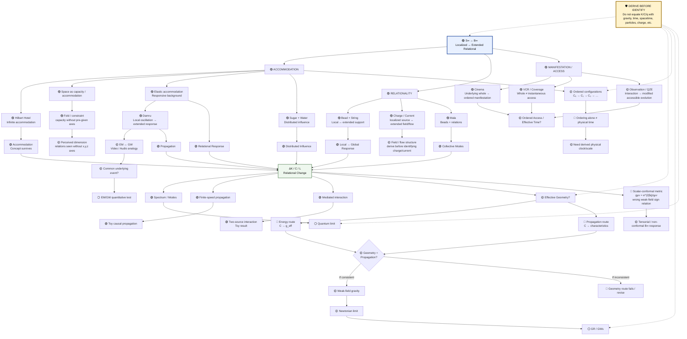

# S∞ ↔ B∞ Research Tree Map + Analogy Audit

**Status:** ACTIVE RESEARCH MAP  
**Parent line:** S∞ ↔ B∞  
**Purpose:** Keep the original analogy-driven line of thought connected to mathematical experiments, while preventing the research from drifting into a conventional model that no longer tests the original intuition.

## 1. Research Tree — Master Map

```text
                              S∞ ↔ B∞
                    Localized ↔ Extended Relational
                               │
        ┌──────────────────────┼────────────────────────┐
        │                      │                        │
        ▼                      ▼                        ▼
  ACCOMMODATION          RELATIONALITY              MANIFESTATION
        │                      │                        │
  Hilbert Hotel          Bead + String              Cinema / VCR
        │                 Mala / Network                  │
        │                 Charge / Current                 │
        ▼                      ▼                         ▼
  existing structure    local element +          underlying whole
  accommodates new      relational support       → ordered access?
        │                      │                         │
        └──────────────┬───────┴──────────────┬──────────┘
                       │                      │
                       ▼                      │
              SPACE / CAPACITY              │
                       │                      │
              FOLD / CONSTRAINT              │
                       │                      │
              PERCEIVED DIMENSION            │
                       ▼                      ▼
                 B∞ RESPONSE             ORDER / ACCESS
                       │                      │
          ┌────────────┼───────────┐          │
          │            │           │          ▼
          ▼            ▼           ▼      QZE / Observation
      Elasticity    Sugar/Water   Damru
          │            │           │
          └────────────┼───────────┘
                       │
                       ▼
               RELATIONAL CHANGE
                    ΔK / C / L
                       │
       ┌───────────────┼────────────────┐
       │               │                │
       ▼               ▼                ▼
  Collective       Propagation       Mediated
    Modes                              Interaction
       │               │                │
       ▼               ▼                ▼
   spectrum        finite-speed      Green-function
   response           test            response
       │               │                │
       └───────────────┼────────────────┘
                       ▼
                EFFECTIVE GEOMETRY?
                       │
             ┌─────────┴─────────┐
             │                   │
             ▼                   ▼
       Energy route        Propagation route
        C → g_eff             C → characteristics
             │                   │
             └─────────┬─────────┘
                       ▼
              g_geometry ?= g_propagation
                       │
                       ▼
              WEAK-FIELD GRAVITY?
                       │
                       ▼
                Newtonian limit
                       │
                       ▼
                    GR / GWs

Parallel branch: Damru / oscillation → EM ↔ GW video/audio analogy → common underlying event? → requires independent derivation.

Parallel branch: Cinema / VCR → sequential access → effective time? → quantum/observation branch. NOT established.

Protection boundary around all branches:
DERIVE BEFORE IDENTIFY
```


## 1A. Visual Mermaid Research Map

> **Legend:** 🟢 PASS / survives as tested structure · 🟡 OPEN / hypothesis · 🔴 FAIL / mechanism rejected · 🔵 KNOWN/MATH · 🟣 ANALOGY · ⚪ DEFERRED



### Visual status key

- 🟢 **PASS / SURVIVES:** tested structural result at toy/mathematical level.
- 🟡 **OPEN:** hypothesis or unresolved test.
- 🔴 **FAIL:** a specific proposed mechanism failed its stated target; the parent S∞ ↔ B∞ hypothesis is not thereby killed.
- 🔵 **KNOWN / MATH:** established mathematics or a mathematical construction, not physical validation.
- 🟣 **ANALOGY:** original conceptual source.
- ⚪ **DEFERRED:** deliberately not yet claimed/tested.
- 🛡️ **PROTECTION:** prevents analogy from silently becoming identification.

## 1B. Analogy → Test → Status Matrix

| Original analogy | Structural idea | Mathematical/test branch | Status | What it contributes |
|---|---|---|---|---|
| 🏨 Hilbert Hotel | Accommodation/reconfiguration | (C_0\to C_1\to...\), finite response | 🟢/🟡 | Starting point for S∞ ↔ B∞ |
| 📿 Bead + String | Local ↔ extended relation | (B_N=(V,E,K)), (L_Kx=J) | 🟢 | Local → global response |
| 📿 Mala | Relations organize collective behavior | Graph Laplacian / spectrum | 🟢 | Collective modes; also illustrates structure perceived from relations |\n| 🧬 DNA / Double Helix | Ordered relations produce an apparent organized geometry | Relational reconstruction / structure-from-relations | 🟣 ANALOGY | Shows how geometry/shape can be perceived from constituent relations without assigning primitive helix axes |
| 🥛 Sugar + Water | Local identity + distributed influence | Green-function/source response | 🟢/🟡 | Distributed influence |\n| ⚡ Charge / Current | Localized source ↔ extended field/flow | Source-field / gauge-like relational branch | 🟡 OPEN | Test whether charge/current-like structures can arise; no identification allowed |
| 🪢 Elasticity | Background accommodates disturbance | (\delta x=-K^{-1}J) | 🟢 | Responsive B∞ |
| 🥁 Damru | Local oscillation → extended wave | (M\ddot x+Kx=J(t)) | 🟢/🟡 | Propagation |
| 🎬 Cinema | Whole → ordered manifestation | Configuration sequence | 🟡 | Time/access question |
| 📼 VCR | Whole ≠ instantaneous access | Projection/access idea | 🟡 | Observation/access |
| 👁️ QZE | Interaction changes accessible evolution | Quantum branch | 🟡 | Possible QM connection |
| 🎥🔊 EM/GW | Multiple channels from one event | Coupled-field model needed | 🟡 | Potential unification branch |

## 1C. Perceived 3D Geometry — Dimension as Fold / Relational Appearance

This branch must be preserved as a **distinct historical idea**, because it is different from the conventional statement that the underlying substrate is physically embedded in ordinary 3D Euclidean space with primitive coordinates \((x,y,z)\).

### Original observation

The research question was:

> **Do we necessarily have to assume that an underlying structure is intrinsically 3-dimensional with primitive x, y, z axes, if what we actually observe is only the relationships among its elements?**

The proposed alternative is:

\[
x^0,x^1,x^2,\ldots,x^n
\]

may denote elements, states, degrees of freedom, or ordered relational positions rather than pre-existing Cartesian coordinates.

What an observer calls **3D geometry** may then be a reconstruction or perception of the relations among those elements.

### Core distinction

\[
\boxed{
\text{underlying relational structure}
\neq
\text{necessarily an embedded Cartesian space}
}
\]

and potentially:

\[
\boxed{
\text{observed 3D geometry}
=
\text{reconstruction of relational structure}
}
\]

This is the **perceived/emergent 3D geometry** hypothesis. It must not be silently upgraded into the claim that physical space is proven to be emergent.

### The fold idea

A central intuition was that a **dimension can be thought of as a fold/constraint in relational organization**.

A fold does not necessarily add a new Cartesian axis. It can create additional effective capacity or a new apparent direction of separation by changing how relationships are organized.

This connects directly to the existing **A008 Space as Capacity / Accommodation** analogy, whose mapping explicitly includes:

- accommodation capacity,
- fold / constraint,
- dimensionality as independent accommodations/relations.

A008 remains OPEN and does not yet derive physical dimension. The present S∞ ↔ B∞ branch should therefore treat the fold idea as a hypothesis to be tested, not as an established result.

### DNA example

DNA is a useful conceptual example because we normally describe the molecule as a **double helix**, but the microscopic constituents are atoms/bonds/chemical relations. The double-helical shape is a structural organization reconstructed from those relationships; the molecular description does not require us to regard an abstract list of constituent elements as already carrying a primitive "helix coordinate system".

The analogy is therefore:

\[
\text{elements + relations}
\rightarrow
\text{organized structure}
\rightarrow
\text{perceived geometry}
\]

not:

\[
\text{DNA proves emergent physical space}.
\]

This remains an analogy.

### Mala example

The same idea appears in the mala analogy:

\[
\text{beads} + \text{thread relations}
\rightarrow
\text{mala structure}.
\]

The beads themselves are discrete elements. The **mala** is the perceived organized structure arising from their arrangement and connectivity.

Again, the point is not that a mala proves emergent dimension. The point is that **structure can be perceived from relations without separately assigning a geometric coordinate system to every relational element**.

### Why this matters for S∞ ↔ B∞

This gives the S∞ ↔ B∞ branch an important alternative to the assumption:

\[
B_\infty \equiv \mathbb R^3.
\]

Instead, we can investigate:

\[
B_\infty
=
\text{relational structure}
\]

and ask whether:

\[
\mathcal R(B_\infty)
\rightarrow
\text{effective / perceived geometry}.
\]

The existing geometry experiments therefore become tests of **reconstruction from relations**, rather than evidence that the underlying B∞ was originally a 3D manifold.

### Historical status

- **Conceptual insight:** survives as a research premise.
- **A008 space-as-capacity:** OPEN.
- **Generic relational networks:** already tested; they do not automatically select 3D.
- **Geometry reconstruction:** already tested in several toy forms.
- **Physical emergence of exactly 3 dimensions:** NOT established.
- **DNA / mala examples:** analogy only.
- **Next requirement:** identify a non-arbitrary relational principle that selects the observed dimensionality or effective 3D behaviour.

### Critical protection

We must keep three statements separate:

1. **A relational structure can be represented without primitive Cartesian coordinates.**
2. **An observer can reconstruct an effective geometry from relations.**
3. **Physical 3D space itself emerges from S∞ ↔ B∞.**

The first is a modelling choice, the second is testable in toy models, and the third remains an open physical hypothesis.

## 1C. Pass / Fail / Open Inventory

### 🟢 PASS / SURVIVES
- Localized forcing can create distributed relational response.
- Relational changes can shift collective spectra.
- A shared responsive background can mediate effective interaction in the toy model.
- A dynamic relational field can support finite-speed propagation.
- A relational coupling tensor can be used to construct a candidate spatial metric.
- The original accommodation → relational response intuition remains mathematically productive.

### 🔴 FAIL / CLOSED MECHANISM
- Hilbert Hotel does **not** derive physical time by itself.
- A single scalar conformal metric (g_{mu
u}=e^{2\beta q}\eta_{mu
u}) does **not** reproduce the required GR weak-field temporal/spatial sign relationship.
- K is **not** established as gravity.
- A network is **not** established as spacetime.
- Sequential manifestation is **not** established as physical time.
- Damru is **not** established as a photon/gravity mechanism.
- EM/GW video/audio is **not** established physics.

### 🟡 OPEN / NEXT TESTS
- Derive the minimum non-conformal/tensorial relational response.
- Establish whether temporal and spatial response can arise from the same B∞ mechanism.
- Test (g_{
m geometry}=g_{
m propagation}).
- Determine whether an unscreened (lambda=0) regime is structurally motivated.
- Derive, rather than identify, (g_{00}) and the Newtonian limit.
- Build a controlled quantum version.
- Return to cinema/VCR/observation and formulate a falsifiable access/ordering model.
- Return to Damru/EM/GW only after a quantitative common-field mechanism exists.

## 1D. Charge / Current Branch\n\nThe charge/current analogy is retained as a separate branch rather than being folded into generic "field" language. The historical research program asks whether a relational theory can **derive** conserved charge-like or gauge-like structures. Current repository status is **DEFERRED / OPEN**. It must not be assumed that any source variable J, relational deformation, or flow is physical electric charge/current.\n\nThe structural question is:\n\n\\[\n\\text{localized relational source} \\leftrightarrow \\text{extended field/flow} \\]\n\nwith the stronger target:\n\n\\[\n\\text{relational symmetry} \\rightarrow \\text{conservation law} \\rightarrow \\text{charge/current-like observable?}\n\\]\n\nThis connects naturally to the existing Branch B8 — Electromagnetism / Charge / Current, but remains unproved.\n\n## 1E. Research-Control Rule

**Every future PGA experiment must carry an analogy tag.**

Recommended record format:

`[ANALOGY: Hilbert]`  
`[ANALOGY: Bead/String]`  
`[ANALOGY: Mala]`  
`[ANALOGY: Sugar/Water]`  
`[ANALOGY: Elasticity]`  
`[ANALOGY: Damru]`  
`[ANALOGY: Cinema]`  
`[ANALOGY: VCR]`  
`[ANALOGY: QZE]`  
`[ANALOGY: EM/GW]`

If a proposed experiment has **no analogy tag**, it must be marked:

> **NEW MODEL EXTENSION — not yet justified by the original analogy set.**


## 2. Common Structural Hypothesis

The analogies are not separate theories. Their common candidate structure is:

$$S∞ \longleftrightarrow B∞ \longrightarrow \text{accommodation / relational response} \longrightarrow \text{changed relations} \longrightarrow \text{collective consequences}$$

Possible consequences under investigation are:

$$\{\text{modes, propagation, interaction, effective geometry, ordered manifestation}\}$$

This is a research hypothesis, not an established physical result.

## 3. Analogy Audit

Each analogy is audited using the same ten questions.

### A1. Hilbert Hotel / Infinite Accommodation

**1. Original observation:** A countably infinite set can be rearranged to accommodate additional countably infinite occupants. The research question was what physical accommodation might mean if an already-full infinite structure had to respond to a new/local structure. **[ANALOGY / KNOWN mathematics]**

**2. Common structural idea:** existing infinite structure + new structure → reconfiguration/accommodation.

**3. Mathematical representation:** configuration sequence C0 → C1 → C2 → ...; later finite relational structures B_N=(V,E,K).

**4. Experiment:** conceptual Hilbert-hotel audit plus finite response models asking what physical accommodation would look like.

**5. Survived:** accommodation as a conceptual starting point for S∞ ↔ B∞.

**6. Failed:** Hilbert-hotel mathematics does not itself derive physical duration or time.

**7. Unexplained:** what physical principle turns abstract accommodation into a dynamical process with a physical scale.

**8. Connections:** bead/string, mala, elasticity, ordered configurations, relational networks.

**9. Contribution to unification:** YES, foundational conceptual role.

**10. Illustrative or falsifiable:** primarily illustrative; falsifiability begins only after a physical accommodation model is specified.

### A2. Bead + String

**1. Original observation:** a bead attached to a string is not fully described independently of the relational structure connecting it to the rest.

**2. Common structural idea:** localized entity + extended relational support.

**3. Mathematical representation:** B_N=(V,E,K), relational energy E_B=1/2 Σ K_ij(x_i-x_j)^2, source equation L_K x=J.

**4. Experiment:** finite networks showed localized forcing can produce distributed response.

**5. Survived:** local disturbance → global relational response at toy level.

**6. Failed:** the string cannot simply be identified with spacetime or gravity.

**7. Unexplained:** physical ontology of S∞ and B∞.

**8. Connections:** mala, elasticity, Damru, relational network, mediated interaction.

**9. Contribution:** YES, strong conceptual contributor.

**10. Illustrative or falsifiable:** analogy illustrative; its structural claim generated falsifiable toy experiments.

### A3. Mala / Beads-on-a-String

**1. Original observation:** individually distinguishable beads form a collective organization through their connecting string and relations.

**2. Common structural idea:** individuals + relations + global organization.

**3. Mathematical representation:** weighted graph B_N=(V,E,K), graph Laplacian L_K, energy E_B=1/2 Σ K_ij(x_i-x_j)^2.

**4. Experiment:** 7×7 and 15×15 network eigenvalue tests; 1D chain normal-mode response.

**5. Survived:** local relational modification can change collective modes.

**6. Failed:** the network does not by itself produce QM, spacetime, gravity, or particles.

**7. Unexplained:** whether a physical B∞ really has such an underlying relational network and what its continuum limit means.

**8. Connections:** bead/string, accommodation, modes, propagation, geometry.

**9. Contribution:** YES, directly motivated the network representation.

**10. Illustrative or falsifiable:** analogy illustrative; network formulation is falsifiable.

### A4. Sugar Dissolving in Water

**1. Original observation:** a localized substance can become distributed through an extended medium while changing the state of that medium.

**2. Common structural idea:** local identity + distributed influence.

**3. Mathematical representation:** localized source coupled to distributed response, L_K x=J_S, and continuum response equations.

**4. Experiment:** network Green-function response and two-source effective-energy tests.

**5. Survived:** distributed influence through a responsive background at toy level.

**6. Failed:** no basis for saying S∞ literally dissolves into B∞; ordinary diffusion is not gravity.

**7. Unexplained:** how localized identity is maintained while influence becomes distributed and what conservation law applies.

**8. Connections:** bead/string, mala, Green functions, mediated interaction, Damru.

**9. Contribution:** YES, conceptual contributor to local-to-global response.

**10. Illustrative or falsifiable:** analogy illustrative; associated response model is falsifiable.

### A5. Elasticity / Accommodation

**1. Original observation:** an extended structure may respond or deform rather than merely provide empty room.

**2. Common structural idea:** S∞ → δB∞ → relational deformation.

**3. Mathematical representation:** E_B=1/2 δxᵀKδx; E_int=Jᵀδx; equilibrium δx=-K⁻¹J; dynamics Mx¨+Γx˙+Kx=-J.

**4. Experiment:** finite response and network simulations.

**5. Survived:** responsive-background concept at toy level.

**6. Failed:** K has not been established as gravity, curvature, or physical spacetime elasticity.

**7. Unexplained:** physical nature and derivation of response coefficients.

**8. Connections:** Hilbert accommodation, bead/string, mala, Damru, geometry.

**9. Contribution:** YES, central conceptual contributor.

**10. Illustrative or falsifiable:** analogy illustrative; response equations falsifiable.

### A6. Damru / Bead Striking an Extended Fabric

**1. Original observation:** localized oscillation interacting with an extended fabric can launch a disturbance in that fabric.

**2. Common structural idea:** localized oscillation → extended response; possibly one event → multiple observable manifestations.

**3. Mathematical representation:** Mx¨+Kx=J(t), normal modes L_K u_n=λ_nu_n, and continuum wave equation A∂t²K-B∇²K+λK=J.

**4. Experiment:** normal-mode, finite-speed propagation, and localized-disturbance tests.

**5. Survived:** localized excitation can launch collective propagation in toy models.

**6. Failed:** no evidence that Damru oscillation produces gravity plus photons.

**7. Unexplained:** any physical relationship to EM or GW fields.

**8. Connections:** bead/string, elasticity, propagation, EM/GW analogy, quantum modes.

**9. Contribution:** YES, conceptual contributor to propagation.

**10. Illustrative or falsifiable:** Damru is illustrative; its wave model generates falsifiable predictions.

### A7. EM / GW as Video + Audio

**1. Original observation:** EM and GW were compared to synchronized channels of an event, with EM as a visual/frame-like component and GW as an audio/structural component.

**2. Common structural idea:** different observables may be manifestations of a common underlying event.

**3. Mathematical representation:** no complete unified EM/GW mathematical model was derived from this analogy.

**4. Experiment:** no decisive S∞/B∞ test has tested the proposed EM/GW coupling mechanism.

**5. Survived:** methodological question that distinct observables might arise from a common underlying state.

**6. Failed:** no evidence that EM and GW are literally video/audio components of one field.

**7. Unexplained:** common field equations, propagation, polarization, source coupling, and conservation laws.

**8. Connections:** Damru, oscillation, manifestation, quantum/classical branches.

**9. Contribution:** potentially important conceptually, currently unestablished.

**10. Illustrative or falsifiable:** currently illustrative; becomes falsifiable only after a quantitative coupled-field model.

### A8. Cinema / Sequential Frames

**1. Original observation:** a film contains an underlying sequence while an observer experiences an ordered stream.

**2. Common structural idea:** underlying structure → ordered manifestation/access.

**3. Mathematical representation:** configuration sequences C0 → C1 → C2 → ... and separation of ordering/access from the underlying configuration set.

**4. Experiment:** no decisive physical experiment has tested the cinema analogy.

**5. Survived:** useful conceptual distinction between underlying state, ordering, and observation/access.

**6. Failed:** sequential observation does not establish that time is merely an illusion.

**7. Unexplained:** whether observer-independent dynamics can generate effective temporal ordering.

**8. Connections:** VCR, Hilbert/configuration sequence, observation, QZE, emergent time.

**9. Contribution:** potential contributor to manifestation/time branch.

**10. Illustrative or falsifiable:** currently illustrative.

### A9. VCR / Coverage / Access

**1. Original observation:** a recording may contain a larger structure while playback exposes only a sequence of portions.

**2. Common structural idea:** whole structure ≠ instantaneous accessible manifestation.

**3. Mathematical representation:** no complete physical representation; closest formal objects are configuration sequences, projection/access mappings, and mode decompositions.

**4. Experiment:** none decisive.

**5. Survived:** conceptual distinction between underlying state and accessible manifestation.

**6. Failed:** no evidence that physical time is a VCR-like playback process.

**7. Unexplained:** whether access/observation can emerge from S∞ ↔ B∞ dynamics.

**8. Connections:** cinema, observation, QZE, ordered configuration, quantum branch.

**9. Contribution:** conceptual only at present.

**10. Illustrative or falsifiable:** currently illustrative.

### A10. Quantum Observation / Zeno Analogy

**1. Original observation:** repeated observation or interaction can affect accessible quantum evolution, motivating a possible S∞/B∞ connection.

**2. Common structural idea:** interaction/observation → modified accessible evolution.

**3. Mathematical representation:** no new QZE equation derived from S∞/B∞; remains a proposed connection to quantum measurement dynamics.

**4. Experiment:** no S∞/B∞ experiment has derived or reproduced the Quantum Zeno Effect.

**5. Survived:** methodological question of whether background interaction can affect accessible states/transitions.

**6. Failed:** no claim that S∞/B∞ explains quantum measurement has been established.

**7. Unexplained:** Hilbert-space dynamics, observables, measurement, Born probabilities, and classical limit.

**8. Connections:** cinema/VCR, manifestation, observation, collective modes.

**9. Contribution:** potential conceptual contributor, currently weakly connected to the tested core.

**10. Illustrative or falsifiable:** currently illustrative; requires a quantum S∞/B∞ model to become falsifiable.

## 4. Cross-Analogy Synthesis

The analogies repeatedly point toward four common primitives:

1. **Accommodation** — an existing structure responds to a new/local element.
2. **Relation / connectivity** — local elements are defined partly by relationships.
3. **Response / propagation** — a local change can produce distributed consequences.
4. **Ordering / manifestation** — an underlying structure may be experienced through ordered access or evolution.

These can be represented as:

```text
                         B∞
                          │
             ┌────────────┼────────────┐
             │            │            │
      accommodation     relation     ordering
             │            │            │
             └──────┬─────┴─────┬──────┘
                    │           │
                    ▼           ▼
                 response   manifestation
                    │           │
             ┌──────┼──────┐    │
             ▼      ▼      ▼    ▼
           modes propagation interaction / access
                    │
                    ▼
             effective geometry?
```

These common primitives are more fundamental to this branch than any individual K, C, q, or metric construction.

## 5. What Has Actually Been Supported

### R1 — Local → global response
Localized forcing produces distributed response in finite relational networks. **TOY.**

### R2 — Relational changes alter collective modes
δK changes network eigenvalues/modes. **MATH/TOY.**

### R3 — Shared responsive background mediates interaction
E_cross = -J1ᵀ L_K⁻¹ J2 in the tested conventions. **MATH/TOY.**

### R4 — Dynamic relational response can propagate at finite speed
A wave equation of the form ∂t²K-c_B²∇²K=0 supports finite-speed propagation. **TOY/MATH.**

### R5 — Relational coupling can be mapped to a candidate spatial metric
C^{ij}=√g g^{ij} gives a candidate mathematical construction. **MATH, not physical derivation.**

### R6 — Minimal scalar-conformal gravity mechanism fails its GR weak-field target
The test g_μν=e^{2βq}η_μν does not reproduce the required opposite-sign temporal/spatial weak-field perturbations. **FAIL for that mechanism.**

## 6. What Has NOT Been Established

- S∞ → physical spacetime.
- S∞ → physical time.
- S∞ → gravity.
- S∞ → quantum mechanics.
- S∞ → electromagnetism.
- One mechanism → QM + GR + EM.

## 7. Protection Rule

Every future mathematical experiment must identify which original analogy it is testing.

Each new extension must state:

1. Which analogy motivated it?
2. What structural claim is being formalized?
3. What new assumption was added?
4. What prediction follows?
5. What would falsify it?
6. Does it preserve the original S∞ ↔ B∞ concept?
7. Does it accidentally insert the desired physics?

If there is no answer to item 1, label the work **NEW MODEL EXTENSION** rather than presenting it as a consequence of the original line of thought.

## 8. Current Research Priority

The preferred workflow is:

**Analogy → structural claim → minimal mathematical representation → experiment → audit → cross-analogy consistency.**

Only after that should we ask whether one mathematical structure can simultaneously support quantum modes, propagation, geometry, and manifestation/order.

## 9. Decision Gate

The ultimate question for this line of thought is:

$$\boxed{\text{Can the same minimal S∞ ↔ B∞ relational mechanism explain multiple independently tested phenomena without adding a separate mechanism for each one?}}$$

A successful branch should increasingly require fewer independent assumptions, not more.

**This map is a research control document. It does not claim physical validation of the S∞ ↔ B∞ hypothesis.**