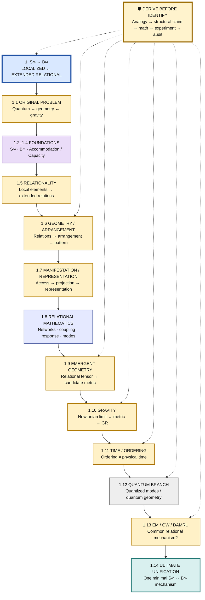
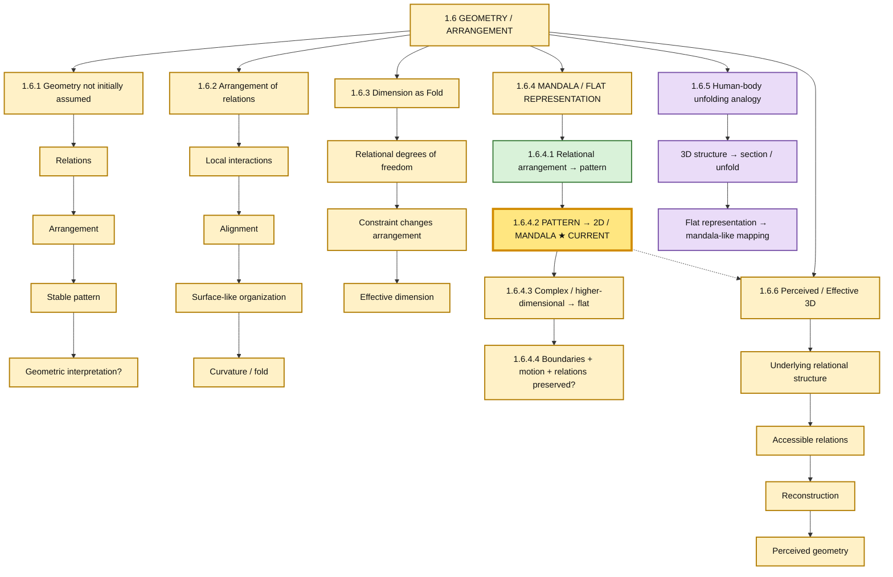
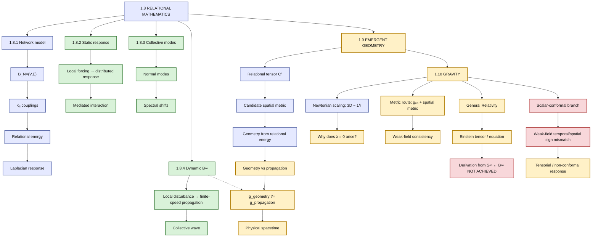
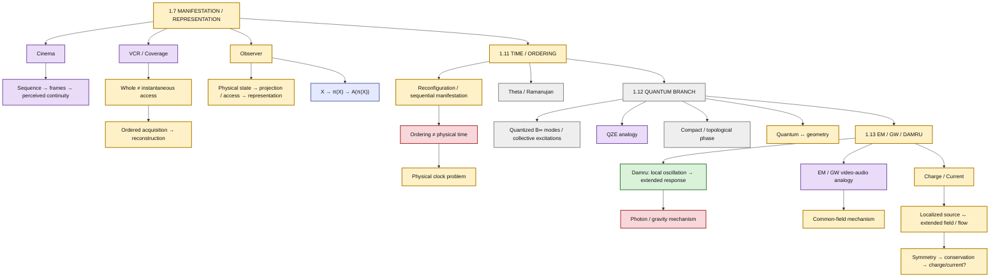
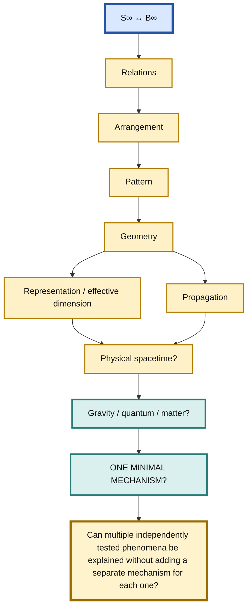

# S∞ ↔ B∞ — Visual Master Research Tree

**Canonical visual map:** RT-001  
**Current node:** 🟡 **1.12.1 — Quantized B∞ Modes**

## Legend

- 🟢 **PASS / SURVIVES** — supported at toy/mathematical level
- 🟡 **OPEN / HYPOTHESIS** — requires experiment or derivation
- 🔴 **FAIL / CLOSED MECHANISM** — specific mechanism failed its stated target
- 🔵 **KNOWN / MATH** — established mathematics/construction, not physical validation
- 🟣 **ANALOGY** — conceptual source only
- ⚪ **DEFERRED** — intentionally not yet pursued
- 🛡️ **PROTECTION** — prevents analogy from becoming identification

# Mermaid Master Tree — RT-002

**Why this version:** the previous graph attached too many branches directly to the root, creating extreme horizontal expansion. This version uses a **vertical research spine** plus smaller vertical detail maps.

## 1. Vertical Master Spine

Follow this diagram from top to bottom. The detailed branches are separated below so the GitHub preview remains readable.



## 2. Quantum / Current Research Position

**Current research coordinate: `1.12.1`**

```text
1.12 Quantum Branch
  ↓
1.12.1 Quantized B∞ modes  ← ★ CURRENT
  ↓
PGA 1.12.1.1 — canonical quantization boundary test
  ↓
1.12.1.2 Pre-quantization quantum-like structure?
  ↓
1.12.2 Collective excitations
  ↓
1.12.3 QZE analogy
  ↓
1.12.4 Compact / topological phase
  ↓
1.12.5 Quantum ↔ geometry
```

### Current quantum test

> **Can the relational B∞ dynamics itself generate quantum structure, rather than merely supplying classical normal modes that are subsequently quantized?**

PGA 1.12.1.1 found a useful boundary: the relational operator produces a discrete collective-mode spectrum, but Hilbert-space structure and canonical commutation relations were added by the standard quantization procedure. Therefore the experiment supports compatibility with quantum mechanics, not emergence of quantum mechanics.

**Next node:** `1.12.1.2` — test whether any pre-quantization relational mechanism can generate quantum-like state structure, interference, or nonclassical correlations without inserting quantum postulates.

## 2. Geometry / Current Research Position

**Preserved historical research coordinate: `1.6.4.2`**

```text
1.6 Geometry
  ↓
1.6.1 Geometry not initially assumed
  ↓
1.6.2 Arrangement of relations
  ↓
1.6.3 Dimension as Fold
  ↓
1.6.4 Mandala / Flat Representation
  ↓
★ 1.6.4.2 Pattern → 2D / Mandala  ← CURRENT
  ↓
1.6.4.3 Complex / higher-dimensional structure → flat representation
  ↓
1.6.4.4 Boundaries + motion + relations preserved?
  ↓
1.6.6 Perceived / Effective 3D
```

### Geometry detail map



### Current test

> **Can an organized relational structure be represented as a 2D pattern without losing the relations that matter?**

The immediate test is not whether a mandala proves physical space. The test is whether flattening/unfolding preserves identifiable relational information, boundaries, connectivity, ordering, symmetry, or other invariants.

## 3. Relational Mathematics → Emergent Geometry → Gravity



## 4. Manifestation → Time → Quantum → EM/GW



## 5. Ultimate Research Gate



## RT-003 Change Record

- **Research focus moved:** from historical geometry test `1.6.4.2` to strategic quantum node `1.12.1`.
- **Reason:** the current strategic objective is to determine whether S∞ ↔ B∞ can produce quantum structure before attempting particle/atom/chemistry-level identification.
- **PGA recorded:** `PGA 1.12.1.1` — quantized B∞ modes; result is a partial/boundary result, not a quantum derivation.
- **Historical branches preserved:** the geometry/mandala branch remains in the tree and is not deleted or overwritten.

## RT-002 Change Record

- **Presentation:** one wide graph → one vertical master spine + four focused vertical maps.
- **Readability:** major branches now expand downward instead of spreading across the screen.
- **Research status:** unchanged; no pass/fail/open result was altered.
- **Historical coordinate at RT-002:** **1.6.4.2 — Pattern → 2D / Mandala Representation**.
- **Current coordinate after RT-003:** **1.12.1 — Quantized B∞ Modes**.

## Pass / Fail / Open Dashboard

### 🟢 PASS / SURVIVES
- Localized forcing → distributed relational response.
- Relational changes → collective spectral changes.
- Responsive background → toy mediated interaction.
- Dynamic relational response → finite-speed propagation.
- Relational tensor → candidate spatial metric construction.
- Geometry can be reconstructed when relational data already contains geometric structure.

### 🔴 FAIL / CLOSED MECHANISM
- Hilbert Hotel alone → physical time.
- Scalar-conformal metric → required GR weak-field temporal/spatial relation.
- K → established gravity.
- Network → established spacetime.
- Sequential manifestation → established physical time.
- Damru → established photon/gravity mechanism.
- EM/GW video/audio → established physical mechanism.

### 🟡 OPEN / NEXT TESTS
- Relational arrangement → geometry without primitive geometric scaffolding.
- Pattern → flat / mandala representation.
- Fold / constraint → geometric change.
- Non-arbitrary selection of effective 3D.
- g_geometry ?= g_propagation.
- Derivation of g₀₀ and Newtonian limit.
- Tensorial/non-conformal B∞ response.
- Quantum S∞↔B∞ model.
- Pre-quantization derivation of quantum state structure.
- Quantitative EM/GW common-field mechanism.
- Charge/current derivation.

### 🟣 ANALOGY SOURCES
Hilbert Hotel · Bead/String · Mala · DNA/Double Helix · Sugar/Water · Elasticity · Damru · Cinema · VCR · QZE · EM/GW.

### 🛡️ Research protection
**Analogy → structural claim → minimal mathematics → experiment → audit → cross-analogy consistency.**

No analogy is allowed to silently become a physical identification.

---

## PGA Numbering Rule — Permanent

Every substantive **PGA (Proceed / Go Ahead)** must carry a **hierarchical Research Tree number**.

### Convention

- The PGA inherits the Research Tree position where the work is being performed.
- A concrete research action beneath that node receives the next hierarchical level.
- Example:
  - Current node: **1.6.4.2**
  - First PGA under it: **PGA 1.6.4.2.1**
  - Next sibling PGA: **PGA 1.6.4.2.2**
  - A deeper experiment under PGA 1.6.4.2.1: **1.6.4.2.1.1**
- A new research branch becomes a new sibling rather than overwriting an earlier PGA.
- Failed branches remain permanently recorded.

### Mandatory PGA record

Every substantive PGA should identify:

**PGA:** hierarchical number
**Research Tree Node:** parent node
**Objective:** what this PGA is testing or developing
**Expected outcome:** what would count as progress / failure / inconclusive
**Result:** recorded after the work
**Next node:** where the research goes next

**Current example:**
**PGA 1.6.4.2.1** — Test whether a relational pattern can be represented in 2D while preserving the relevant relational invariants.

This numbering is part of the research-control system and should be used consistently in future research records, experiments, audits, prompts, and chat exports.