# S∞ ↔ B∞ — Visual Master Research Tree

**Canonical visual map:** RT-001  
**Current node:** 🟡 **1.6.4.2 — Pattern → 2D / Mandala Representation**

## Legend

- 🟢 **PASS / SURVIVES** — supported at toy/mathematical level
- 🟡 **OPEN / HYPOTHESIS** — requires experiment or derivation
- 🔴 **FAIL / CLOSED MECHANISM** — specific mechanism failed its stated target
- 🔵 **KNOWN / MATH** — established mathematics/construction, not physical validation
- 🟣 **ANALOGY** — conceptual source only
- ⚪ **DEFERRED** — intentionally not yet pursued
- 🛡️ **PROTECTION** — prevents analogy from becoming identification

## Mermaid Master Tree

```mermaid
flowchart TD

    ROOT["1. S∞ ↔ B∞<br/>LOCALIZED ↔ EXTENDED RELATIONAL"]:::root

    ROOT --> P1["1.1 Original Problem"]:::open
    ROOT --> S["1.2 S∞<br/>Small Infinity"]:::analogy
    ROOT --> B["1.3 B∞<br/>Big Infinity"]:::analogy
    ROOT --> A["1.4 Accommodation / Capacity"]:::analogy
    ROOT --> R["1.5 Relationality"]:::analogy
    ROOT --> G["1.6 Geometry / Arrangement"]:::open
    ROOT --> M["1.7 Manifestation / Representation"]:::open
    ROOT --> RM["1.8 Relational Mathematics"]:::math
    ROOT --> EG["1.9 Emergent Geometry"]:::open
    ROOT --> GR["1.10 Gravity"]:::open
    ROOT --> TIME["1.11 Time / Ordering"]:::open
    ROOT --> QM["1.12 Quantum Branch"]:::deferred
    ROOT --> EM["1.13 EM / GW / Damru"]:::open
    ROOT --> UNI["1.14 Ultimate Unification"]:::ultimate

    %% 1.1
    P1 --> P11["1.1.1 Quantum ↔ macroscopic geometry"]:::open
    P1 --> P12["1.1.2 Localized structure ↔ extended context"]:::open
    P1 --> P13["1.1.3 One underlying mechanism?"]:::open
    P1 --> P14["1.1.4 Quantum ↔ gravity"]:::ultimate

    %% 1.4
    A --> H["1.4.1 Hilbert Hotel"]:::analogy
    H --> H1["1.4.1.1 Accommodation"]:::pass
    H --> H2["1.4.1.2 Reconfiguration"]:::pass
    H --> H3["1.4.1.3 Does not derive physical time"]:::fail

    A --> EL["1.4.2 Elastic accommodation"]:::analogy
    EL --> EL1["1.4.2.1 Local disturbance"]:::pass
    EL --> EL2["1.4.2.2 Extended response"]:::pass
    EL --> EL3["1.4.2.3 Deformation / critical response"]:::open

    A --> CAP["1.4.3 Space as Capacity"]:::open
    CAP --> CAP1["1.4.3.1 Space not assumed as container"]:::open
    CAP --> CAP2["1.4.3.2 Capacity for relations"]:::open
    CAP --> CAP3["1.4.3.3 Physical space emergence"]:::open

    %% 1.5
    R --> BS["1.5.1 Bead + String"]:::analogy
    BS --> BS1["Local element ↔ extended support"]:::pass

    R --> MA["1.5.2 Mala"]:::analogy
    MA --> MA1["Beads + thread relations"]:::pass
    MA --> MA2["Collective organization"]:::pass

    R --> DNA["1.5.3 DNA / Double Helix"]:::analogy
    DNA --> DNA1["Constituents + bonds"]:::analogy
    DNA --> DNA2["Stable arrangement"]:::analogy
    DNA --> DNA3["Organized geometry"]:::analogy

    R --> RA["1.5.4 Relational arrangement → geometry"]:::open
    RA --> RA1["Relations"]:::open
    RA --> RA2["Arrangement"]:::open
    RA --> RA3["Stable pattern"]:::open
    RA --> RA4["Geometric interpretation"]:::open

    %% 1.6
    G --> G1["1.6.1 Geometry is not initially assumed"]:::open
    G --> G2["1.6.2 Arrangement of relations"]:::open
    G2 --> G21["1.6.2.1 Local interactions"]:::open
    G2 --> G22["1.6.2.2 Alignment"]:::open
    G2 --> G23["1.6.2.3 Surface-like organization"]:::open
    G2 --> G24["1.6.2.4 Curvature / fold"]:::open

    G --> FOLD["1.6.3 Dimension as Fold"]:::open
    FOLD --> F1["1.6.3.1 x⁰,x¹,...,xⁿ need not be Cartesian axes"]:::open
    FOLD --> F2["1.6.3.2 Relational degrees of freedom"]:::open
    FOLD --> F3["1.6.3.3 Constraint changes arrangement"]:::open
    FOLD --> F4["1.6.3.4 Effective dimension"]:::open

    G --> MAN["1.6.4 Mandala / Flat Representation"]:::open
    MAN --> C41["1.6.4.1 Relational arrangement → pattern<br/>CURRENT WORKING DIRECTION"]:::pass
    MAN --> C42["1.6.4.2 Pattern → 2D / Mandala<br/>★ CURRENT POSITION"]:::current
    MAN --> C43["1.6.4.3 Complex/higher-dimensional structure → flat representation"]:::open
    MAN --> C44["1.6.4.4 Boundaries + motion + relations preserved?"]:::open

    G --> BODY["1.6.5 Human-body unfolding analogy"]:::analogy
    BODY --> BODY1["3D organized structure"]:::analogy
    BODY --> BODY2["Section / unfold"]:::analogy
    BODY --> BODY3["Flat representation"]:::analogy
    BODY --> BODY4["Mandala-like mapping"]:::analogy

    G --> P3D["1.6.6 Perceived / Effective 3D"]:::open
    P3D --> P31["Underlying relational structure"]:::open
    P3D --> P32["Accessible relations"]:::open
    P3D --> P33["Reconstruction"]:::open
    P3D --> P34["Perceived geometry"]:::open

    %% 1.7
    M --> CIN["1.7.1 Cinema"]:::analogy
    CIN --> CIN1["Underlying sequence"]:::analogy
    CIN --> CIN2["Frames"]:::analogy
    CIN --> CIN3["Perceived continuity"]:::analogy

    M --> VCR["1.7.2 VCR / Coverage"]:::analogy
    VCR --> V1["Whole ≠ instantaneous access"]:::open
    VCR --> V2["Ordered acquisition"]:::open
    VCR --> V3["Reconstruction"]:::open

    M --> OBS["1.7.3 Observer"]:::open
    OBS --> OBS1["Physical state"]:::open
    OBS --> OBS2["Projection / access"]:::open
    OBS --> OBS3["Representation"]:::open
    OBS --> FORM["1.7.4 X → π(X) → A(π(X))"]:::math

    %% 1.8
    RM --> NET["1.8.1 Network model"]:::math
    NET --> N1["B_N=(V,E)"]:::math
    NET --> N2["K_ij couplings"]:::math
    NET --> N3["Relational energy"]:::math
    NET --> N4["Laplacian response"]:::math

    RM --> STAT["1.8.2 Static response"]:::pass
    STAT --> ST1["Local forcing → global response"]:::pass
    STAT --> ST2["Mediated interaction"]:::pass

    RM --> MODES["1.8.3 Collective modes"]:::pass
    MODES --> MO1["Normal modes"]:::pass
    MODES --> MO2["Spectral shifts"]:::pass

    RM --> DYN["1.8.4 Dynamic B∞"]:::pass
    DYN --> DY1["Local disturbance"]:::pass
    DYN --> DY2["Finite-speed propagation"]:::pass
    DYN --> DY3["Collective wave"]:::pass

    %% 1.9
    EG --> EG1["1.9.1 Relational tensor Cⁱʲ"]:::math
    EG --> EG2["1.9.2 Candidate spatial metric"]:::math
    EG --> EG3["1.9.3 Geometry from relational energy"]:::math
    EG --> EG4["1.9.4 Geometry vs propagation"]:::open
    EG4 --> TESTG["1.9.4.1 g_geometry ?= g_propagation"]:::open
    EG --> EG5["1.9.5 Physical spacetime"]:::open

    %% 1.10
    GR --> NEWT["1.10.1 Newtonian scaling"]:::math
    NEWT --> NR1["1D"]:::math
    NEWT --> NR2["2D"]:::math
    NEWT --> NR3["3D ~ 1/r"]:::math

    GR --> SCALAR["1.10.2 Scalar-field route"]:::open
    SCALAR --> YUK["1.10.2.1 Yukawa"]:::open
    SCALAR --> L0["1.10.2.2 λ=0"]:::open
    SCALAR --> L0Q["1.10.2.3 Why λ=0?"]:::open

    GR --> MET["1.10.3 Metric route"]:::open
    MET --> G00["g₀₀"]:::open
    MET --> GSP["Spatial metric"]:::open
    MET --> WF["Weak-field consistency"]:::open

    GR --> GRMAIN["1.10.4 General Relativity"]:::open
    GRMAIN --> EIN["Einstein tensor"]:::open
    GRMAIN --> EINEQ["Einstein equation"]:::open
    GRMAIN --> EINFAIL["Derivation from S∞↔B∞ NOT ACHIEVED"]:::fail

    GR --> SCFAIL["1.10.5 Scalar-conformal branch"]:::fail
    SCFAIL --> SCFAIL1["Weak-field temporal/spatial sign mismatch"]:::fail
    SCFAIL --> TENSOR["Tensorial / non-conformal response"]:::open

    %% 1.11
    TIME --> T1["1.11.1 Hilbert / reconfiguration"]:::open
    TIME --> T2["1.11.2 Sequential manifestation"]:::open
    TIME --> T3["1.11.3 VCR ordered coverage"]:::open
    TIME --> T4["1.11.4 Physical clock problem"]:::open
    TIME --> T5["1.11.5 Theta / Ramanujan"]:::deferred
    TIME --> T6["1.11.6 Effective temporal ordering"]:::open

    %% 1.12
    QM --> Q1["1.12.1 Quantized B∞ modes"]:::deferred
    QM --> Q2["1.12.2 Collective excitations"]:::deferred
    QM --> Q3["1.12.3 QZE analogy"]:::analogy
    QM --> Q4["1.12.4 Compact / topological phase"]:::deferred
    QM --> Q5["1.12.5 Quantum ↔ geometry"]:::open

    %% 1.13
    EM --> DAM["1.13.1 Damru"]:::analogy
    DAM --> DAM1["Local oscillation → extended response"]:::pass
    DAM --> DAM2["Photon / gravity mechanism"]:::fail

    EM --> EMGW["1.13.2 EM / GW video-audio analogy"]:::analogy
    EMGW --> E1["EM = video analogy"]:::analogy
    EMGW --> E2["GW = audio analogy"]:::analogy
    EMGW --> E3["Common-field mechanism"]:::open

    EM --> CH["1.13.3 Charge / Current"]:::open
    CH --> CH1["Localized source ↔ extended field/flow"]:::open
    CH --> CH2["Symmetry → conservation → charge/current?"]:::open

    %% 1.14
    UNI --> U1["One relational substrate"]:::ultimate
    UNI --> U2["Quantum manifestation"]:::ultimate
    UNI --> U3["Geometric manifestation"]:::ultimate
    UNI --> U4["Propagation / causality"]:::ultimate
    UNI --> U5["Gravity"]:::ultimate
    UNI --> U6["Matter / particles"]:::ultimate
    UNI --> U7["Quantum + gravity from one mechanism"]:::ultimate

    %% Cross-links
    C42 -.-> P3D
    C43 -.-> P3D
    RA -.-> EG
    EG -.-> TESTG
    DYN -.-> TESTG
    FORM -.-> P3D
    A -.-> R
    R -.-> G
    G -.-> EG
    EG -.-> GR

    %% Protection
    PROT["🛡️ DERIVE BEFORE IDENTIFY<br/>Do not equate K/C/q with gravity, time, spacetime, particles, charge, etc."]:::guard
    PROT -.-> ROOT
    PROT -.-> G
    PROT -.-> EG
    PROT -.-> GR
    PROT -.-> TIME
    PROT -.-> QM
    PROT -.-> EM

    classDef root fill:#d9e8ff,stroke:#2454a6,stroke-width:4px,color:#111;
    classDef current fill:#ffe680,stroke:#d18b00,stroke-width:4px,color:#111;
    classDef pass fill:#d9f2d9,stroke:#3b7d3b,stroke-width:2px,color:#111;
    classDef fail fill:#f8d7da,stroke:#a33,stroke-width:2px,color:#111;
    classDef open fill:#fff1c7,stroke:#b07b00,stroke-width:2px,color:#111;
    classDef math fill:#e5e9ff,stroke:#5969a8,stroke-width:2px,color:#111;
    classDef analogy fill:#eadcf8,stroke:#7952a8,stroke-width:2px,color:#111;
    classDef deferred fill:#eeeeee,stroke:#888,stroke-width:2px,color:#111;
    classDef ultimate fill:#d9f0ef,stroke:#287c78,stroke-width:3px,color:#111;
    classDef guard fill:#fff3cd,stroke:#9a6b00,stroke-width:4px,color:#111;
```

## Pass / Fail / Open Dashboard

### 🟢 PASS / SURVIVES
- Localized forcing → distributed relational response.
- Relational changes → collective spectral changes.
- Responsive background → toy mediated interaction.
- Dynamic relational response → finite-speed propagation.
- Relational tensor → candidate spatial metric construction.
- Geometry can be reconstructed when relational data already contains geometric structure.

### 🔴 FAIL / CLOSED MECHANISM
- Hilbert Hotel alone → physical time.
- Scalar-conformal metric → required GR weak-field temporal/spatial relation.
- K → established gravity.
- Network → established spacetime.
- Sequential manifestation → established physical time.
- Damru → established photon/gravity mechanism.
- EM/GW video/audio → established physical mechanism.

### 🟡 OPEN / NEXT TESTS
- Relational arrangement → geometry without primitive geometric scaffolding.
- Pattern → flat / mandala representation.
- Fold / constraint → geometric change.
- Non-arbitrary selection of effective 3D.
- g_geometry ?= g_propagation.
- Derivation of g₀₀ and Newtonian limit.
- Tensorial/non-conformal B∞ response.
- Quantum S∞↔B∞ model.
- Quantitative EM/GW common-field mechanism.
- Charge/current derivation.

### 🟣 ANALOGY SOURCES
Hilbert Hotel · Bead/String · Mala · DNA/Double Helix · Sugar/Water · Elasticity · Damru · Cinema · VCR · QZE · EM/GW.

### 🛡️ Research protection
**Analogy → structural claim → minimal mathematics → experiment → audit → cross-analogy consistency.**

No analogy is allowed to silently become a physical identification.
