# S∞ ↔ B∞ — Visual Master Research Tree

**Canonical visual map:** RT-001  
**Current integrated research position:** 🟡 **PGA 1.12.6.1-J completed — emergent relational identity + self-recovery candidate; next gate is 1.12.6.1-K propagation of persistent organization**

## Legend

- 🟢 **PASS / SURVIVES** — supported at toy/mathematical level
- 🟡 **OPEN / HYPOTHESIS** — requires experiment or derivation
- 🔴 **FAIL / CLOSED MECHANISM** — specific mechanism failed its stated target
- 🔵 **KNOWN / MATH** — established mathematics/construction, not physical validation
- 🟣 **ANALOGY** — conceptual source only
- ⚪ **DEFERRED** — intentionally not yet pursued
- 🛡️ **PROTECTION** — prevents analogy from becoming identification

# Mermaid Master Tree — RT-002

**Why this version:** the previous graph attached too many branches directly to the root, creating extreme horizontal expansion. This version uses a **vertical research spine** plus smaller vertical detail maps.

## 1. Vertical Master Spine

Follow this diagram from top to bottom. The detailed branches are separated below so the GitHub preview remains readable.

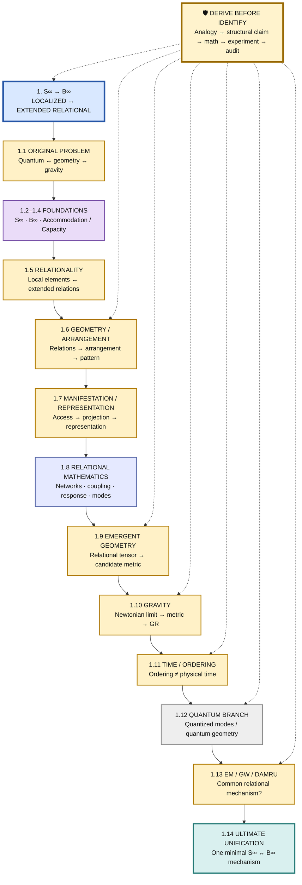

## 2. Individual Top-Level Branch Maps — 1.1 to 1.14

The **top-level master spine above remains unchanged**. This section deliberately gives each top-level branch its own Mermaid diagram so that each branch can be read independently without navigating a large combined graph.

The diagrams are structural navigation maps, not new experimental claims. Existing research status and detailed results remain in the sections below.

### 2.1 — Branch 1.1: Original Problem

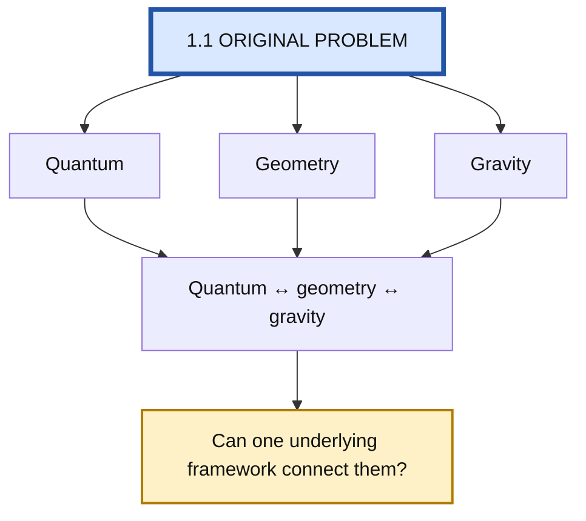

### 2.2 — Branch 1.2: S∞

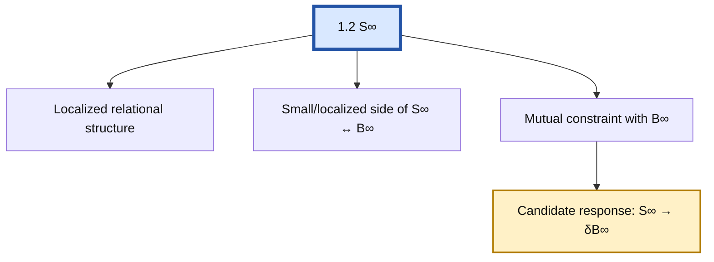

### 2.3 — Branch 1.3: B∞

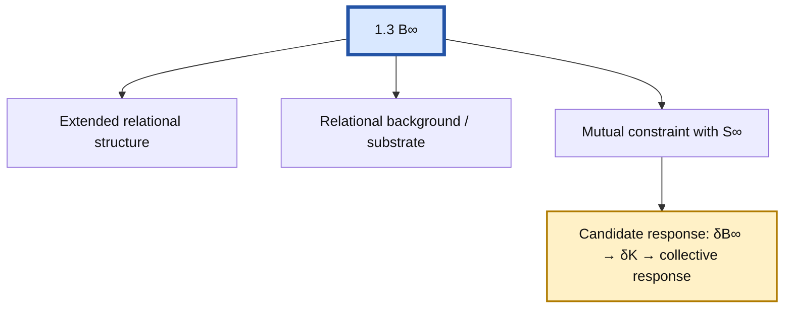

### 2.4 — Branch 1.4: Accommodation / Capacity

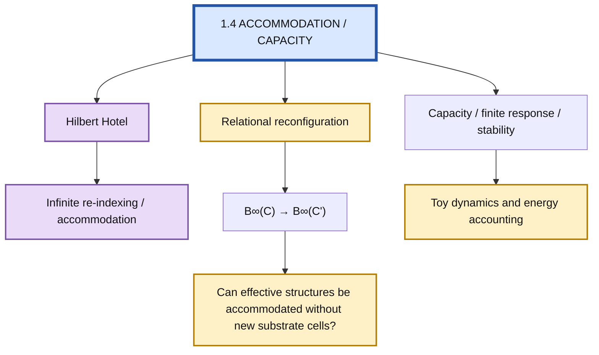

**Protection:** Hilbert-Hotel rooms are a mathematical analogy only. RT-009 explicitly redirects the physical question toward relational reconfiguration.

### 2.5 — Branch 1.5: Relationality

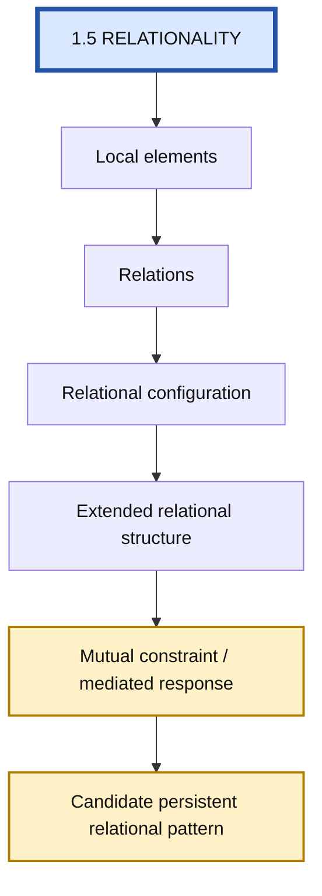

### 2.6 — Branch 1.6: Geometry / Arrangement

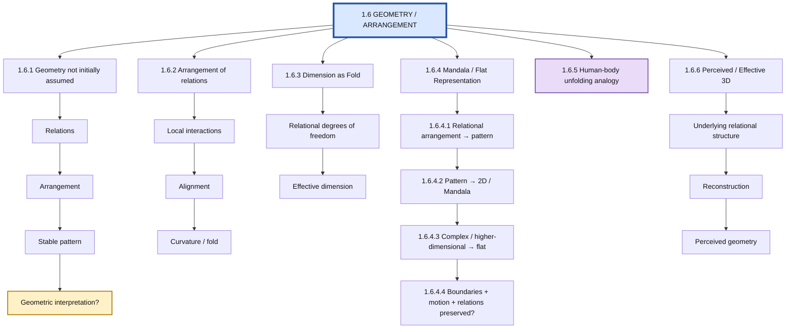

### 2.7 — Branch 1.7: Manifestation / Representation

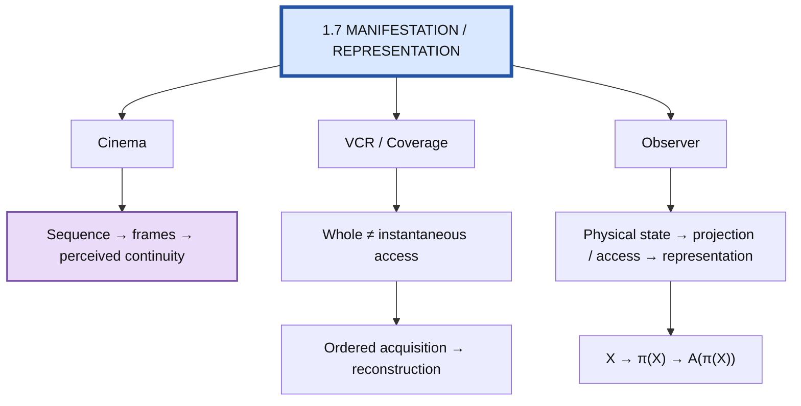

### 2.8 — Branch 1.8: Relational Mathematics

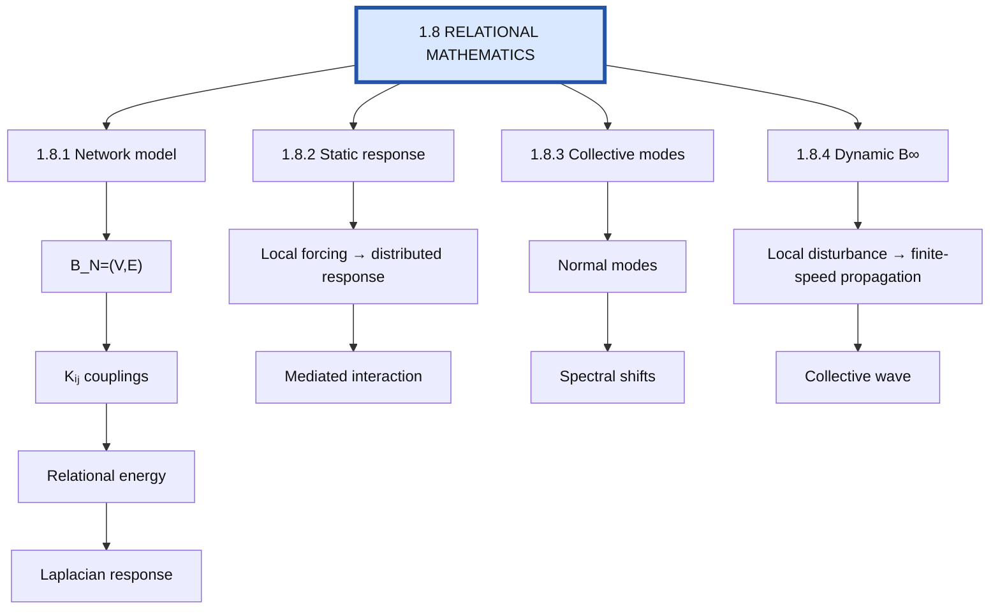

### 2.9 — Branch 1.9: Emergent Geometry

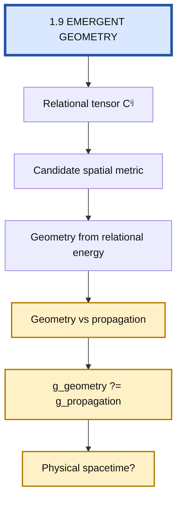

### 2.10 — Branch 1.10: Gravity

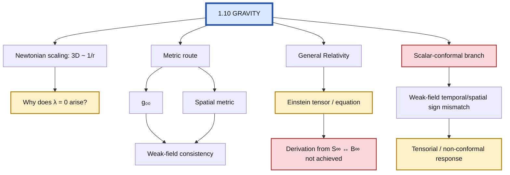

### 2.11 — Branch 1.11: Time / Ordering

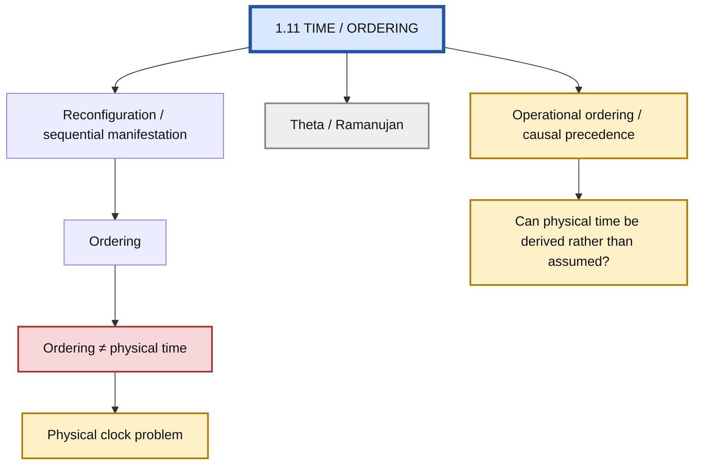

### 2.12 — Branch 1.12: Quantum

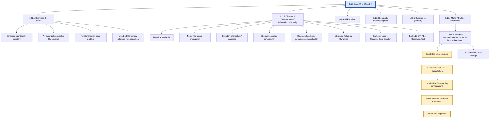

### 2.13 — Branch 1.13: EM / GW / Damru

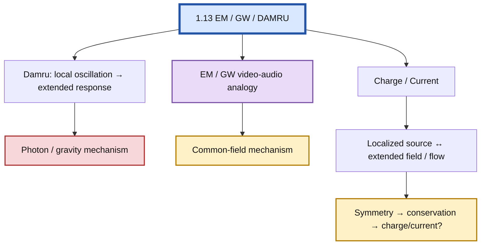

### 2.14 — Branch 1.14: Ultimate Unification

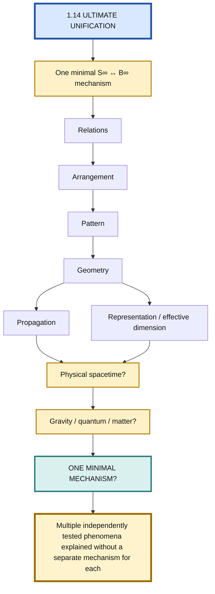

### Navigation rule

Read the repository tree in this order:

**1 → 1.1 → 1.2 → 1.3 → 1.4 → 1.5 → 1.6 → 1.7 → 1.8 → 1.9 → 1.10 → 1.11 → 1.12 → 1.13 → 1.14.**

Then use the existing detailed experiment/status sections below the diagrams for the branch-specific evidence, failures, audits, and PGAs.

---

## 2. Quantum / Current Research Position

**Current research coordinate: `1.12.1`**

```text
1.12 Quantum Branch
  ↓
1.12.1 Quantized B∞ modes  ← ★ CURRENT
  ↓
PGA 1.12.1.1 — canonical quantization boundary test
  ↓
1.12.1.2 Pre-quantization quantum-like structure?
  ↓
1.12.2 Collective excitations
  ↓
1.12.3 QZE analogy
  ↓
1.12.4 Compact / topological phase
  ↓
1.12.5 Quantum ↔ geometry
  ↓
1.12.6 Matter / Particle Excitations  ← NEW MASTER-TREE NODE
```

### Current quantum test

> **Can the relational B∞ dynamics itself generate quantum structure, rather than merely supplying classical normal modes that are subsequently quantized?**

PGA 1.12.1.1 found a useful boundary: the relational operator produces a discrete collective-mode spectrum, but Hilbert-space structure and canonical commutation relations were added by the standard quantization procedure. Therefore the experiment supports compatibility with quantum mechanics, not emergence of quantum mechanics.

**Next node:** `1.12.1.2` — test whether any pre-quantization relational mechanism can generate quantum-like state structure, interference, or nonclassical correlations without inserting quantum postulates.

## 2A. Matter / Particle Excitations — Newly Numbered Node

**New master-tree node:** `1.12.6`  
**Source:** existing Research Program Branch B9 — Matter / Particle Excitations.  
**Reason for numbering:** this substantive branch already existed in the Research Program but had no numbered home in the visual master tree.

### Research question

> **Can stable localized relational excitations reproduce particle-like properties without inserting a particle as a primitive object?**

Working dependency:

[
S_\infty \leftrightarrow B_\infty
\rightarrow \text{elementary relational reconfiguration}
\rightarrow \text{collective / local excitation}
\rightarrow \text{stability / persistence}
\rightarrow \text{localized relational pattern}
\rightarrow \text{particle-like properties}.
]

### Protection

Do not identify any of the following with a particle without a separate derivation:

- spectral cluster = particle;
- collective mode = particle;
- localized disturbance = particle;
- coarse-grained reconstruction = particle;
- persistent pattern = particle.

The working hypothesis is:

> **A particle-like object may be an emergent persistent relational pattern whose identity is maintained by relational structure.**

This remains a hypothesis.

### Initial status

🟡 **OPEN / NOT YET TESTED AS A DEDICATED MASTER-TREE BRANCH**

PGA 1.12.2.8 demonstrates common relational structure plus finite propagation in a toy model, but its protection states that the effective regional structure was encoded in the microscopic coupling pattern. It therefore does not establish spontaneous particle formation.

PGA 1.12.1.13 demonstrates elementary relational reconfiguration in a controlled local toy model with an assumed conservative update law. It supports the reconfiguration mechanism at toy level but does not derive the fundamental update law.

### PGA 1.12.6.1 — Research-First Progress Record (A–J)

The following PGAs were worked through before the documentation checkpoint. They refine the matter question without yet claiming a physical particle derivation.

| PGA | Result | Status |
|---|---|---|
| 1.12.6.1-A | Defined the starting point as distributed relational activity rather than a pre-existing particle. “Energy” remains an uncalibrated relational energy-like quantity. | 🟢 structural / 🟡 physical calibration open |
| 1.12.6.1-B | Identified relational coupling, nonlinearity, and configuration-dependent reconfiguration as candidate localization mechanisms. External traps are excluded from the fundamental test. | 🟡 hypothesis |
| 1.12.6.1-C | Human social organization supplied the structural analogy of distributed elements + needs/constraints + interaction → organization. “Need” is not imported as a physical primitive; compatibility is abstracted structurally. | 🟢 analogy → structural claim |
| 1.12.6.1-D | Relational compatibility can be interpreted provisionally as dynamical coherence under allowed transitions, potentially using existing K_ij and T rather than a new force. | 🟡 hypothesis |
| 1.12.6.1-E | Shifted focus from localization alone to emergence of hierarchy: relations → organization → higher-order organization. | 🟢 structural hypothesis |
| 1.12.6.1-F | Defined an effective unit by internal coherence, relational boundary, collective response, persistence, identity/invariant, and effective higher-level dynamics. | 🟢 criteria defined |
| 1.12.6.1-G | Proposed recursive organization: the same relational rule should operate on emergent effective units to produce higher organizational levels, without a new rule at each level. | 🟡 hypothesis |
| 1.12.6.1-H | Identified possible genuinely higher-level effective properties arising from organization; mass/charge/etc. remain un-derived and must not be identified prematurely. | 🟡 hypothesis |
| 1.12.6.1-I | Proposed emergent identity: microscopic configuration may change while a relational invariant/organizational pattern persists. Propagation could then be transport of persistent relational identity. | 🟡 hypothesis |
| 1.12.6.1-J | Strengthened persistence to self-recovery under perturbation. A genuine object candidate should restore its defining relational organization without external forcing, ideally over a nonzero perturbation basin. | 🟡 hypothesis / experiment pending |

### Consolidated result of the PGA set

The matter hypothesis is now expressed as:

**distributed relational activity → interaction/reconfiguration → compatible organization → effective unit → persistent relational identity → possible higher-order hierarchy → possible propagation.**

This is a stronger and more general target than “localized energy becomes a particle.” Localization is now treated as one possible emergent property, not the definition of objecthood.

### Protection rules added by this PGA set

- distributed activity ≠ particle;
- localized activity ≠ particle;
- collective mode ≠ particle;
- organization ≠ particle;
- effective unit ≠ automatically a physical particle;
- persistent pattern ≠ automatically a particle;
- human organizational hierarchy is an analogy for relational emergence, not a physical identification;
- plasma ≠ B∞;
- wick ≠ spacetime;
- relational energy-like quantity ≠ calibrated physical energy.

### Next decisive gate

**PGA 1.12.6.1-K — Propagation of Persistent Relational Organization**

Test whether a self-maintaining organization can move/reconfigure through the underlying relational system while preserving its defining identity:

O(x,t) → O(x+Δx,t+Δt), with I[O(x,t)] ≈ I[O(x+Δx,t+Δt)].

A successful toy result would establish propagation of a persistent relational organization, not yet a physical particle. It would directly revisit the earlier question: “what is the something that propagates?”

### First proposed gate

**PGA 1.12.6.1 — Energetic Relational Medium → Stable Localized Excitation Test**

**Analogy input:** A020 — Plasma / Wick: Distributed Energetic Flow → Localized Manifestation.

The analogy is used only to sharpen the mechanism question. It does **not** assert that B∞ is a physical plasma, that particles are cooled plasma, or that spacetime behaves like a wick.

Test whether an initially distributed, dynamically active relational state can, under explicitly stated relational constraints and energy redistribution, produce a localized excitation that:

1. forms from the relational dynamics rather than being manually inserted;
2. remains localized for a sustained interval;
3. preserves an identifiable invariant or identity under evolution;
4. propagates or interacts without losing its defining relational structure;
5. survives changes in representation and coarse-graining;
6. can be distinguished from an ordinary transient wave packet.

The first experiment should remain dimensionless/toy-level unless a physical scale is independently derived.

**This node does not yet claim to derive mass, charge, spin, quantum statistics, or known elementary particles.**


## 2B. A020 — Energetic Relational Medium / Plasma / Wick Analogy

The new analogy is attached to **1.12.6.1**, not promoted to a new top-level branch.

### Structural proposition

The two physical analogies suggest a common structural pattern:

```text
distributed energetic activity
        ↓
local constraints / coupling structure
        ↓
redistribution + binding + stabilization
        ↓
localized persistent configuration
        ↓
localized manifestation / interaction
```

The **plasma analogy** contributes the idea that a highly energetic many-body state can contain interacting charged constituents whose state changes as energy is transferred, radiated, or redistributed; cooling and recombination can change the organization of the state. NASA describes plasma as an ionized state and documents recombination and heating/cooling processes in plasma models. This is established physics used only as an analogy source, not as evidence for S∞/B∞.

The **wick analogy** contributes a different structural feature: a distributed reservoir is transported through a constrained porous pathway and reaches a localized reaction/manifestation region. In candle/wick physics, liquid fuel is transported through capillary action and then vaporizes and burns near the flame; the flame location and survival depend on coupled transport and reaction processes. This is established physics used only as an analogy source.

### S∞ ↔ B∞ reinterpretation

A useful hypothesis is:

[
B_infty approx 	ext{distributed relational activity}
]

[
S_infty approx 	ext{localized relational organization}
]

[
S_infty leftrightarrow B_infty
approx
	ext{continuous exchange between local organization and extended relational response}.
]

The stronger matter hypothesis is therefore:

[
oxed{
	ext{particle-like object}
=
	ext{stable localized relational configuration}
}
]

with the important qualifier that the configuration must **emerge dynamically** rather than being inserted as a particle by hand.

### What the analogy actually adds

It adds a more precise question to the existing matter branch:

> **Can distributed relational energy/activity become locally organized because the relational constraints redistribute the available degrees of freedom, and can that organization maintain itself without an externally imposed particle boundary?**

This is stronger than the earlier generic "localized disturbance" question because it explicitly separates:

- **reservoir / distributed activity**;
- **transport or relational coupling**;
- **constraint/binding**;
- **redistribution of energy**;
- **localization**;
- **persistence**;
- **observable manifestation**.

### Minimal toy representation

Introduce relational degrees of freedom (x_i), local coupling (K_{ij}), and an effective local energy density (e_i):

[
E[x]
=
rac12sum_{ij}K_{ij}(x_i-x_j)^2
+
sum_i V(x_i).
]

The exploratory question is whether a suitable **derived or explicitly constrained** dynamics can evolve an initially distributed state,

[
e_i(0)approx 	ext{broad / distributed},
]

toward a state with a localized excess,

[
e_i(t)
ightarrow e_i^{
m background}+Delta e_i(t),
]

where (Delta e_i) remains localized for long times **without prescribing the location and shape of the final object in advance**.

The present equation is only a candidate toy model. The potential (V), couplings (K_{ij}), conservation law, and update dynamics must not be chosen merely to force localization.

### Critical distinction: energy concentration is not yet a particle

A localized energy maximum alone is insufficient. The candidate structure must also show:

1. localization;
2. persistence;
3. identity under evolution;
4. response to perturbation;
5. propagation or interaction;
6. a conserved or approximately conserved relational quantity;
7. robustness to representation/coarse-graining.

Only if these survive together does the result become evidence for an emergent particle-like relational excitation.

### Failure modes to test explicitly

- **Transient pulse only:** energy localizes briefly and disperses.
- **Externally seeded object:** localization exists only because the initial condition already contains the object.
- **Fixed trap:** an imposed potential creates localization; the object is therefore not emergent.
- **Dissipative attractor:** localization depends on unmodelled external cooling or friction.
- **Parameter fine-tuning:** localization occurs only in a narrow hand-picked parameter region.
- **Energy leakage:** apparent persistence is an artifact of finite simulation time.
- **Multiple indistinguishable modes:** no stable object identity can be defined.

### Status

🟠 **ACTIVE INVESTIGATION / ANALOGY INPUT**

The analogy itself is not a result.

The strongest current research target is:

[
oxed{
	ext{distributed relational state}

ightarrow
	ext{constraint-driven reorganization}

ightarrow
	ext{stable localized excitation}
}
]

If this fails, the analogy remains illustrative. If it succeeds under generic, independently motivated constraints, it becomes a useful structural lead for **1.12.6 Matter / Particle Excitations**.

### Protection

Do **not** write:

[
	ext{plasma}=	ext{B}_infty,
qquad
	ext{particle}=	ext{cooled plasma},
qquad
	ext{wick}=	ext{spacetime}.
]

The defensible mapping is only:

[
	ext{distributed activity}
leftrightarrow
	ext{constraint-mediated redistribution}
leftrightarrow
	ext{localized manifestation}.
]

This preserves the analogy while keeping the physical derivation open.


## 2. Geometry / Current Research Position

**Preserved historical research coordinate: `1.6.4.2`**

```text
1.6 Geometry
  ↓
1.6.1 Geometry not initially assumed
  ↓
1.6.2 Arrangement of relations
  ↓
1.6.3 Dimension as Fold
  ↓
1.6.4 Mandala / Flat Representation
  ↓
★ 1.6.4.2 Pattern → 2D / Mandala  ← CURRENT
  ↓
1.6.4.3 Complex / higher-dimensional structure → flat representation
  ↓
1.6.4.4 Boundaries + motion + relations preserved?
  ↓
1.6.6 Perceived / Effective 3D
```

### Geometry detail map

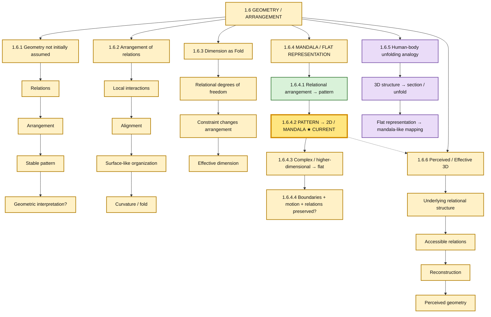

### Current test

> **Can an organized relational structure be represented as a 2D pattern without losing the relations that matter?**

The immediate test is not whether a mandala proves physical space. The test is whether flattening/unfolding preserves identifiable relational information, boundaries, connectivity, ordering, symmetry, or other invariants.

## 3. Relational Mathematics → Emergent Geometry → Gravity

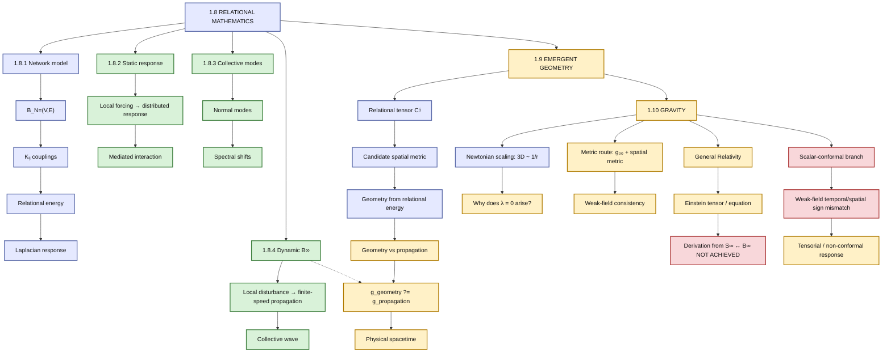

## 4. Manifestation → Time → Quantum → EM/GW

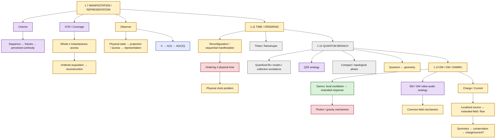


## 5. Observable Reconstruction / Emergent Time / Emergent-c Branch

**Research coordinate:** 1.12.2

The historical framing–sampling–coverage–sequence work has been audited rather than repeated.

```text
1.12.2 Observable Reconstruction
  ↓
1.12.2.1 Historical framing / sampling / coverage synthesis
  ↓
1.12.2.2 Audit checkpoint
  ↓
🟡 PARTIAL SUCCESS
  ├─ information acquisition → reconstruction ✅ toy
  ├─ different coverage → compatible reconstruction ✅ toy
  ├─ local causal precedence → global partial order ✅ toy
  ├─ finite causal propagation in suitable local models ✅ toy
  ├─ continuous physical time ❌ not derived
  ├─ observer-independent temporal scale ❌ not derived
  ├─ universal physical c ❌ not derived
  └─ Lorentzian spacetime ❌ not derived
  ↓
1.12.2.3 Metric-Free Relational Time + c + Causal-Cone Test
```

### Corrected emergent-c status

Earlier work did demonstrate finite propagation fronts in toy relational models, including c_D = a√(κ/m) and c* = ℓ*/τ*. A random 256-node 4-regular network failed to generate a geometric causal cone; ordered-local/fixed-lattice models produced finite cones but retained preferred microscopic structure. Sampling frequency was rejected as c on dimensional grounds.

Therefore the precise status is:

- **Finite propagation:** 🟢 toy-model result.
- **Universal observer-independent c:** 🔴 not derived.
- **Lorentz invariance:** 🔴 not derived.
- **Lorentzian spacetime from S∞ ↔ B∞:** 🔴 not derived.

The next test must derive relational distance and operational duration from the same substrate and determine whether their ratio approaches a stable, isotropic, observer-independent propagation invariant without inserting c into the microscopic rules.


### PGA 1.12.2.3 result

A metric-free toy test used only relational graph distance D_G and causal update depth T_G. Organized local square/triangular connectivity produced finite causal cones with an internal ratio c_R = D_G/T_G = 1 relational link/update. The random 256-node 4-regular control again showed rapid reachability saturation rather than a geometric cone.

**Status:** 🟢 finite local causal cone and internal dimensionless propagation ratio survive; 🔴 universal physical c, Lorentz invariance, and Lorentzian spacetime remain un-derived.

The critical limitation is that distance and duration are still measured in the same substrate-defined units. The next required gate is independent scale generation and observer-clock consistency.

**Next:** PGA 1.12.2.4 — Independent Relational Space/Time Scale and Observer-Clock Consistency Test.


### RT-004 Change Record

- **PGA 1.12.2.2 audit completed:** historical framing/sampling/sequence/reconstruction work was checked against explicit branch gates.
- **Corrected status:** finite propagation is a surviving toy result; universal c remains un-derived.
- **Partial-order boundary preserved:** causal partial order is not promoted to physical time.
- **New next node:** PGA 1.12.2.3 — Metric-Free Relational Time + c + Causal-Cone Test.
- **Quantum branch preserved:** 1.12.1.6 remains a parallel quantum branch and is not deleted or overwritten.


## 5. Ultimate Research Gate

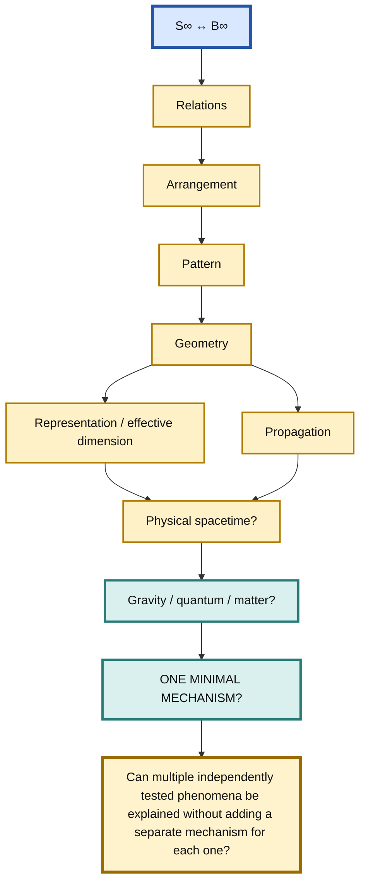

## RT-003 Change Record

- **Research focus moved:** from historical geometry test `1.6.4.2` to strategic quantum node `1.12.1`.
- **Reason:** the current strategic objective is to determine whether S∞ ↔ B∞ can produce quantum structure before attempting particle/atom/chemistry-level identification.
- **PGA recorded:** `PGA 1.12.1.1` — quantized B∞ modes; result is a partial/boundary result, not a quantum derivation.
- **Historical branches preserved:** the geometry/mandala branch remains in the tree and is not deleted or overwritten.

## RT-002 Change Record

- **Presentation:** one wide graph → one vertical master spine + four focused vertical maps.
- **Readability:** major branches now expand downward instead of spreading across the screen.
- **Research status:** unchanged; no pass/fail/open result was altered.
- **Historical coordinate at RT-002:** **1.6.4.2 — Pattern → 2D / Mandala Representation**.
- **Current coordinate after RT-003:** **1.12.1 — Quantized B∞ Modes**.

## Pass / Fail / Open Dashboard

### 🟢 PASS / SURVIVES
- Localized forcing → distributed relational response.
- Relational changes → collective spectral changes.
- Responsive background → toy mediated interaction.
- Dynamic relational response → finite-speed propagation.
- Relational tensor → candidate spatial metric construction.
- Geometry can be reconstructed when relational data already contains geometric structure.

### 🔴 FAIL / CLOSED MECHANISM
- Hilbert Hotel alone → physical time.
- Scalar-conformal metric → required GR weak-field temporal/spatial relation.
- K → established gravity.
- Network → established spacetime.
- Sequential manifestation → established physical time.
- Damru → established photon/gravity mechanism.
- EM/GW video/audio → established physical mechanism.

### 🟡 OPEN / NEXT TESTS
- Stable localized relational excitation → particle-like properties (new branch **1.12.6**).
- Persistence / identity of a relational excitation under reconfiguration and propagation.
- Relational arrangement → geometry without primitive geometric scaffolding.
- Pattern → flat / mandala representation.
- Fold / constraint → geometric change.
- Non-arbitrary selection of effective 3D.
- g_geometry ?= g_propagation.
- Derivation of g₀₀ and Newtonian limit.
- Tensorial/non-conformal B∞ response.
- Quantum S∞↔B∞ model.
- Pre-quantization derivation of quantum state structure.
- Quantitative EM/GW common-field mechanism.
- Charge/current derivation.

### 🟣 ANALOGY SOURCES
Hilbert Hotel · Bead/String · Mala · DNA/Double Helix · Sugar/Water · Elasticity · Damru · Cinema · VCR · QZE · EM/GW.

### 🛡️ Research protection
**Analogy → structural claim → minimal mathematics → experiment → audit → cross-analogy consistency.**

No analogy is allowed to silently become a physical identification.

---

## PGA Numbering Rule — Permanent

Every substantive **PGA (Proceed / Go Ahead)** must carry a **hierarchical Research Tree number**.

### Convention

- The PGA inherits the Research Tree position where the work is being performed.
- A concrete research action beneath that node receives the next hierarchical level.
- Example:
  - Current node: **1.6.4.2**
  - First PGA under it: **PGA 1.6.4.2.1**
  - Next sibling PGA: **PGA 1.6.4.2.2**
  - A deeper experiment under PGA 1.6.4.2.1: **1.6.4.2.1.1**
- A new research branch becomes a new sibling rather than overwriting an earlier PGA.
- Failed branches remain permanently recorded.

### Mandatory PGA record

Every substantive PGA should identify:

**PGA:** hierarchical number
**Research Tree Node:** parent node
**Objective:** what this PGA is testing or developing
**Expected outcome:** what would count as progress / failure / inconclusive
**Result:** recorded after the work
**Next node:** where the research goes next

**Current example:**
**PGA 1.6.4.2.1** — Test whether a relational pattern can be represented in 2D while preserving the relevant relational invariants.

This numbering is part of the research-control system and should be used consistently in future research records, experiments, audits, prompts, and chat exports. 

## PGA 1.12.2.4 — Information Coverage / Boundary Interaction

The current branch now explicitly separates:

1. **Propagation:** the causal/information-arrival limit.
2. **Coverage:** which parts of a physical boundary have become accessible.
3. **Reconstruction:** the coarse-grained object/frame inferred from acquired relational information.

A toy boundary test showed that identical propagation speed can produce different coverage histories for different boundary geometries. Therefore coverage rate is not itself a universal c-like constant.

A logical reconstruction test further showed that the same coverage fraction can leave multiple underlying configurations indistinguishable when the unobserved region contains the distinguishing information.

The active hypothesis is now:

S∞ ↔ B∞ → relational excitation/propagation → boundary interaction → information distribution → coverage → coarse-grained reconstruction.

This does not yet derive photons, physical c, or spacetime.

**Current node: 1.12.2.5 — Observer-Coverage / Reconstruction Invariance Test**

### RT-005 Change Record

- **PGA 1.12.2.4 completed.**
- Coverage-rate = c interpretation rejected.
- Propagation-limit versus coverage distinction established.
- Photon/boundary/information/coarse-graining line restored as an active hypothesis.
- Next node: **PGA 1.12.2.5**.

## PGA 1.12.2.5 — Observer-Coverage / Reconstruction Invariance Test

A toy observer-coverage test gave three observers complementary angular sectors of the same irregular relational boundary. Each observer reconstructed only its local information. Their partial descriptions were compatible, and combining the sectors reconstructed the target exactly within the accessible region.

**Status:** 🟢 toy-level observer-compatibility result; 🟡 stronger observer-independent reconstruction remains open.

The critical protection is that the common underlying configuration and accessible boundary model were supplied by the experiment. Therefore this is not yet a derivation of objective physical objects. It supports only the narrower chain:

propagation → boundary interaction → partial information → local reconstruction → compatible reconstruction.

The next question is whether increasing information coverage produces a stable coarse-grained equivalence class, beyond which additional microscopic information no longer changes the observable object/frame.

**Historical RT-006 next node: 1.12.2.6 — Coverage Threshold / Equivalence-Class Stability Test.**

Subsequent work continued through 1.12.2.8 and 1.12.2.9; the current integrated position is recorded at the top of this master tree.


## RT-006 — Complete Audit of Branch 1.12.2

**Audit scope:** Branch 1.12.2 — Observable Reconstruction / Time / Causal Ordering, including the historical 1.12.2.1 synthesis and PGA 1.12.2.2–1.12.2.5.

### Audit conclusion

The complete branch is conceptually related, but it is not only a time branch. Its actual chain is:

relational accessibility → information propagation → coverage → reconstruction → causal ordering → operational duration/distance → candidate universal propagation limit.

This is coherent because the later c/time questions depend on the earlier information-acquisition layer. However, reconstruction results must not be treated as direct evidence for physical time or c.

### Two linked layers

**Layer A — Observable reconstruction**

propagation → information → coverage → coarse-grained object/frame.

**Layer B — Causal/temporal structure**

local update → causal cone → distance/duration → candidate c.

Layer A supplies the operational meaning of information available to an observer. Layer B asks whether propagation has a universal physical scale.

### Node audit

| Node | Actual question | Status |
|---|---|---|
| 1.12.2.1 | Can information acquisition/coverage support reconstruction? | 🟢/🟡 historical toy framework |
| PGA 1.12.2.2 | What survives the framing/coverage/ordering/emergent-c audit? | 🟡 partial; time/c remain open |
| PGA 1.12.2.3 | Can a causal cone exist without primitive metric/time/c? | 🟢 toy result |
| PGA 1.12.2.4 | Is coverage itself c? | 🔴 identification rejected; 🟢 structural result |
| PGA 1.12.2.5 | Can different partial observations be compatible? | 🟢 limited toy result; stronger form open |

### Core surviving chain

S∞ ↔ B∞ → local relational change → propagation → boundary interaction → information acquisition → coverage → coarse-grained reconstruction.

Then:

reconstructed state → causal ordering → operational duration/distance → candidate propagation invariant.

### Critical separations established

propagation ≠ coverage ≠ reconstruction ≠ physical time.

The branch does not establish:
- object = coarse-graining;
- c = information rate;
- c = coverage rate;
- photon = observer;
- causal order = physical time;
- finite propagation = Lorentz invariance.

### PGA 1.12.2.5 correction

The three-observer experiment is weaker than initially stated because all observers were given complementary sectors generated from the same known underlying configuration. Compatibility is therefore partly built into the construction.

Proper status: **🟢 limited toy compatibility result**, not observer-independent object reconstruction.

### Branch-level status

- information acquisition → reconstruction: 🟢 toy
- partial coverage → partial reconstruction: 🟢 toy
- compatible partial descriptions: 🟢 limited toy
- local causal precedence: 🟢 toy
- finite causal propagation: 🟢 toy
- metric-free causal cone: 🟢 toy
- coverage rate = c: 🔴 rejected
- universal physical c: 🔴 not derived
- continuous physical time: 🔴 not derived
- observer-independent temporal scale: 🔴 not derived
- Lorentz invariance: 🔴 not derived
- Lorentzian spacetime: 🔴 not derived

### Revised architecture

1.12.2 Observable Reconstruction / Information / Causality
  ├── 1.12.2.1 Historical information-acquisition synthesis
  ├── 1.12.2.2 Branch audit
  ├── 1.12.2.3 Metric-free causal propagation
  ├── 1.12.2.4 Boundary information / coverage
  ├── 1.12.2.5 Observer-coverage compatibility
  ├── 1.12.2.6 Coverage threshold / equivalence-class stability
  ├── 1.12.2.7 [historical continuation; see experiment/current-state records]
  ├── 1.12.2.8 Integrated Relational Dynamics Test
  └── 1.12.2.9 Relational Mode → Quantum-State Structure Test

### Next decisive test

**PGA 1.12.2.6 — Coverage Threshold / Equivalence-Class Stability Test**

Generate multiple microscopic relational configurations, make some observationally indistinguishable under limited coverage, increase coverage systematically, and measure when the coarse-grained observable class becomes stable under additional microscopic information.

Use the observation map A_C and test:

X_a ~_C X_b iff A_C(X_a) = A_C(X_b).

Then test whether there is a stable regime:

A_(C+ΔC)(X) ≈ A_C(X).

Repeat across observer paths, sampling patterns, and coarse-graining resolutions.

Only after this reconstruction layer is controlled should the branch return to the physical-scale question: what independent mechanism supplies distance and duration?

### RT-006 protection

reconstructability ≠ geometry ≠ time ≠ c.

This audit prevents individual reconstruction successes from silently becoming a derivation of physical c or spacetime.


---

## Integrated Cross-Branch Record — PGA 1.12.2.8 and 1.12.2.9

### PGA 1.12.2.8 — Integrated Relational Dynamics Test

The same relational substrate was used to test effective spectral structure and local propagation.

**Result:** one relational coupling structure produced stable effective regional organization (baseline ARI = 1.00) and, using the same graph, a finite causal propagation front.

**Status:** 🟢 structural toy result.

**Protection:** the regional structure was deliberately encoded in the microscopic coupling pattern. The result therefore demonstrates common-mechanism compatibility, not spontaneous physical-object formation.

### PGA 1.12.2.9 — Relational Mode → Quantum-State Structure Test

The collective modes of the same relational dynamics were examined as precursors to quantum state structure.

The model naturally provides:

[
Ku_n=\lambda_nu_n,
qquad
x(t)=\sum_n q_n(t)u_n
]

together with classical phase-space and Hamiltonian structure.

**Result:** collective modes, linear mode space, classical superposition, and Hamiltonian dynamics arise naturally at the toy-model level.

**Boundary:** \(\hbar\), Hilbert-space structure, quantum commutation relations, Born probabilities, and quantum measurement remain externally supplied or un-derived.

**Status:** 🟡 boundary result.

### Combined significance

The two PGAs support the following controlled structural chain:

[
S_\infty\leftrightarrow B_\infty
\rightarrow
\text{relational dynamics}
\rightarrow
\begin{cases}
\text{effective structure}\\
\text{causal propagation}\\
\text{collective modes}
\end{cases}
]

They do **not** establish quantum mechanics, physical spacetime, gravity, or physical (c).

### Next substantive gate

The unresolved quantum gate returns to **PGA 1.12.1.5 — Relational action-scale audit**:

[
\boxed{
\text{Can an internal relational invariant generate a discrete action/phase scale without inserting }\hbar?
}
]

### RT-007 Change Record

- **PGA 1.12.2.8 preserved:** common relational substrate simultaneously carrying effective structure, spectral organization, and causal propagation.
- **PGA 1.12.2.9 preserved:** relational collective modes reach a classical phase-space/Hamiltonian boundary but do not derive quantum state structure.
- **Cross-branch dependency recorded:** the 1.12.2 results now feed the quantum action-scale gate rather than creating a separate quantum mechanism.
- **Research protection preserved:** collective mode ≠ quantum state; causal propagation ≠ physical c; effective structure ≠ particle.


---

## RT-008 — Relational Structure Before Physical Calibration

**Scope:** 1.12.1 scale/action branch

A methodological clarification has been added: physical-unit calibration is a later layer and must not be used as the sole criterion for accepting or rejecting an underlying relational result.

[
	ext{derive relational structure}

ightarrow
	ext{derive relational laws}

ightarrow
	ext{identify observables}

ightarrow
	ext{physical calibration}
]

This applies particularly to PGA 1.12.1.6 (discrete sectors), PGA 1.12.1.9 (interaction ordering/candidate clock), and PGA 1.12.1.10 (internal relational universality).

The clarification does not change experiment results; it changes the interpretation hierarchy.


---

## RT-009 — Fundamental Correction: Infinite Substrate as Relational Reconfiguration, Not Empty Rooms

**Reason for correction:** Historical review of the Hilbert Hotel line, together with physical analogies such as dissolution of sugar in water and electron/hole complementarity in semiconductor systems, exposed an overly literal interpretation of the Hilbert Hotel example in the recent 1.12.1 discussion.

### Correct interpretation

The Hilbert Hotel example was useful for demonstrating that an infinite arrangement can accommodate an additional element through reorganization. However, the **rooms must not be treated as physical substrate cells or empty slots**.

The deeper hypothesis under investigation is:

[
oxed{
S_inftyleftrightarrow B_infty

ightarrow
	ext{relational reconfiguration}
}
]

rather than:

[
	ext{new object}
ightarrow	ext{empty physical room}.
]

An effective object/excitation may correspond to a new stable relational configuration of the same underlying substrate.

Represent this schematically as:

[
B_infty(C)
ightarrow B_infty(C').
]

### Physical intuition retained

Examples that motivate the correction:

- **Sugar dissolving in water:** the relevant change is a redistribution/reconfiguration of molecular relations, not the occupation of a pre-existing “sugar room.”
- **Electron/hole systems:** a hole is an effective relational description of an electronic configuration; it is not a new empty container that must be physically occupied.
- **Hilbert Hotel:** retain the mathematical lesson of accommodation through infinite reorganization, but do not literalize the rooms.

These examples are analogical motivation, not claims that the S∞↔B∞ mechanism has already been demonstrated by them.

### Exact research question to reinvestigate

Before deriving phase increments, clocks, (hbar), or physical units, investigate:

[
oxed{
	extbf{What constitutes an elementary relational reconfiguration of }S_inftyleftrightarrow B_infty	extbf{?}
}
]

The test should begin with:

1. an initial relational configuration (C_0);
2. the S∞↔B∞ interaction rule;
3. the resulting configuration (C_1);
4. the invariant/change between (C_0) and (C_1);
5. repeated evolution
   [
   C_0
ightarrow C_1
ightarrow C_2
ightarrowcdots;
   ]
6. whether the resulting change can support, without separately inserting them:
   - ordering,
   - propagation,
   - phase,
   - information transfer,
   - stable effective excitations.

### Dependency correction

The intended research dependency is now:

[
oxed{
	ext{relational reconfiguration}

ightarrow
	ext{interaction ordering}

ightarrow
	ext{phase / propagation}

ightarrow
	ext{stable excitation}

ightarrow
	ext{observable reconstruction}

ightarrow
	ext{physical calibration}
}
]

This supersedes the overly shallow immediate sequence:

[
	ext{assume update rule}
ightarrowphi.
]

Therefore the previously proposed **PGA 1.12.1.13 — Relational Update-Law Selection Test** is superseded by:

[
oxed{	extbf{PGA 1.12.1.13 — Elementary Relational Reconfiguration Test}}
]

### Important interpretation rule for future reviewers

Do **not** read the Hilbert Hotel analogy as claiming that B∞ is an infinite set of physical rooms or that every particle requires an unused substrate slot.

The research question is instead whether an unlimited relational substrate can accommodate additional or transformed effective structures through **reconfiguration of relations**.

Also do not infer from the sugar/water or semiconductor analogies that they prove S∞↔B∞. They are physical intuition for the distinction between **occupying a location** and **changing a relational configuration**.

### Relation to previous PGAs

This correction does not invalidate the numerical results of PGA 1.12.1.6, 1.12.1.9, 1.12.1.11, or 1.12.1.12. It changes their dependency interpretation:

- PGA 1.12.1.6 demonstrates compact-phase discreteness **within an assumed compact relational degree of freedom**.
- PGA 1.12.1.9 demonstrates interaction ordering as a candidate relational clock **within an assumed interaction/update sequence**.
- PGA 1.12.1.11 integrates interaction count with compact phase.
- PGA 1.12.1.12 shows how phase increment can be extracted once a relational update law exists.

The deeper missing layer is now explicitly identified as:

[
oxed{
S_inftyleftrightarrow B_infty

ightarrow
	ext{elementary relational reconfiguration}
}
]

This is the level that must be investigated next.

**Research principle:**  
> **Do not confuse the representation of accommodation (Hilbert Hotel rooms) with the physical mechanism of accommodation (relational reconfiguration).**
---

## RT-010 — Master-Tree Numbering Audit and Missing-Node Registration

**Audit scope:** complete numbered master spine 1.1–1.14, detailed 1.6 branch, quantum 1.12 branch, observable-reconstruction 1.12.2 branch, and Research Program B1–B10.

### Decision

No existing master-tree number is renumbered, deleted, or repurposed.

The existing Research Program contains **B9 — Matter / Particle Excitations**, but the visual master tree previously had no numbered home for that substantive branch.

It is therefore registered as:

**1.12.6 — Matter / Particle Excitations**

This is a new sibling under the existing 1.12 Quantum Branch. Existing 1.12.1–1.12.5 numbering is unchanged.

### Other unnumbered/deferred concepts

- **Criticality / Instability (B6):** existing substantive concept; no new number yet because its proper parent/dependency remains unresolved.
- **Thermodynamics (B7):** existing substantive concept; no new number yet because its proper parent/dependency remains unresolved.
- **Charge / Current (B8):** already represented under 1.13; no duplicate number created.
- **Arrow of Time (B10):** already represented under 1.11; no duplicate number created.
- **Relational reconfiguration:** already represented by **PGA 1.12.1.13**; no duplicate number created.

### Closure / continuation rule

Failed mechanisms remain at their original locations. If the underlying research question survives, the continuation explicitly references the new node rather than overwriting the historical branch.

Examples preserved in the tree include:

- scalar-conformal gravity → failed mechanism → tensorial/non-conformal response;
- Damru photon/gravity identification → failed identification → common relational mechanism remains open;
- coverage-rate = c → rejected identification → propagation/scale question remains open.

### Synchronization correction

Historical navigation text had stopped at 1.12.2.6 even though later records completed 1.12.2.8 and 1.12.2.9. The detailed architecture is now synchronized to show:

**1.12.2.6 → 1.12.2.7 → 1.12.2.8 → 1.12.2.9**

The 1.12.2.7 label is deliberately kept as a historical continuation reference rather than inventing a new title not established by the source records.

### Result

**RT-010 status: 🟢 completed.**

The master tree now distinguishes existing numbered nodes, newly registered missing nodes, deferred unnumbered concepts, and closed mechanisms with explicit continuation references.

**Next substantive research action:** PGA 1.12.6.1-K — Propagation of Persistent Relational Organization.


## RT-011 — EPR / Bell / Chandas Relational Correlation Branch

**Research-tree registration:** `1.12.2.10`  
**Detailed record:** `10_LOT_ACCOMMODATION_RELATIONAL_EMERGENCE/11_EPR_BELL_CHANDAS/01_EPR_BELL_CHANDAS_CORRELATION_RESEARCH.md`

### Purpose

This branch records the EPR/Bell investigation developed from the hypothesis that A and B can remain operationally isolated while their observable outcomes are generated from a shared relational state rather than independent local predetermined instruction tables.

### Registered experiments

- **1.12.2.10.1 / EXP-BELL-01** — EPR / Bell baseline
- **1.12.2.10.2 / EXP-BELL-02** — X–Z–Q Boolean configuration
- **1.12.2.10.3 / EXP-BELL-03** — Piṅgala Prastāra ↔ Bell configuration
- **1.12.2.10.4 / EXP-BELL-04** — Continuous local hidden-variable test
- **1.12.2.10.5 / EXP-BELL-05** — Continuous relational-state target
- **1.12.2.10.6 / EXP-CHANDAS-01** — Chandas → periodic / multimode representation
- **1.12.2.10.7 / EXP-CHANDAS-02** — Harmonic mode → cosine correlation
- **1.12.2.10.8 / EXP-BELL-06** — CHSH / Bell-inequality test
- **1.12.2.10.9 / EXP-BELL-07** — No-signalling test
- **1.12.2.10.10 / EXP-CHANDAS-03…08** — Chandas → relational Bell mechanism

### Consolidated result

The mathematical target

`E(a,b) = -cos(a-b)`

produces the CHSH value `2√2` for the standard test settings and is compatible with no-signalling when represented by

`P(A,B|a,b) = 1/4 [1 - AB cos(a-b)]`.

A continuous local hidden-variable threshold construction instead gives the piecewise-linear correlation `-1 + 2θ/π`, so continuity alone does not reproduce the quantum target.

Relative phase of a common harmonic naturally produces cosine correlation. Chandas provides a candidate structured periodic/multimode input, but the raw metrical structure has not been shown to automatically produce a pure cosine. Most importantly, the binary joint-outcome rule has not yet been derived from Chandas or S∞ ↔ B∞; the target distribution remains a benchmark rather than a physical derivation.

### Protection

Piṅgala/Chandas ↔ Bell is recorded as a mathematical structural correspondence only. No claim is made that Piṅgala discovered Bell's theorem or quantum mechanics.

### Next gate

**PGA 1.12.2.10.11 — Relational Binary Outcome Derivation Test**

Derive the binary outcomes from the relational/metrical state without inserting a local predetermined instruction table or the target quantum distribution by hand. Acceptance requires operational A/B isolation, `E=-cosθ`, no-signalling, and CHSH violation.

**Status:** 🟡 OPEN / DECISIVE.

See the detailed research record for the complete experiment register, protections, negative results, and next test.

## RT-012 — Cube / Yamātārājabhānasalagam / Relational Projection Checkpoint

**Research-tree registration:** `1.12.2.10.11` and continuation record under `11_EPR_BELL_CHANDAS/02_CUBE_YAMATARAjABHANASALAGAM_RELATIONAL_PROJECTION.md`.

### Consolidated result

The X–Z–Q three-variable configuration space has exactly \(2^3=8\) states and can be represented geometrically as the eight vertices of a Boolean cube. A predetermined vertex assignment remains a classical hidden-variable structure and therefore does not evade Bell.

The Yamātārājabhānasalagam ordering was then treated as an ordering/traversal of the eight configurations. The tested deterministic projection remained within the Bell bound (\(|S|=2\)); therefore ordering alone does not generate Bell violation.

The next structural step treated the ordered configuration space as supporting a periodic relational mode. A discrete Fourier mode on the eight-state cycle supplies a phase representation, and relative phase naturally generates cosine correlation. When a relational mode is projected onto binary measurement components with the standard quadratic norm/probability rule, the familiar \(E(a,b)=-\cos(a-b)\) and CHSH \(|S|=2\sqrt2\) follow, with the standard target distribution remaining no-signalling.

### Main insight

> **Binary observed outcomes need not imply a binary underlying state. A relational state can carry continuous mode/phase structure while measurement produces discrete binary outcomes through projection.**

This is a promising structural mechanism capable of reproducing selected quantum phenomena, but it is not yet a derivation of quantum mechanics from S∞ ↔ B∞. The unresolved assumptions are the physical origin of phase geometry, orthogonality, the quadratic norm/Born rule, and the binary joint-outcome mechanism.

### Parked future direction

Color and charge were identified as possible physical anchors for two currently abstract structures:

- three-component internal structure ↔ possible clue for the three-variable architecture;
- charge/conservation/sector structure ↔ possible clue for compatibility or orthogonality.

These are explicitly parked and are **not** identified with the cube or orthogonality at this stage.

### Branch status

**🟡 PARKED — LOGICAL CHECKPOINT REACHED.**

The branch is not closed as a failure. It has identified a concrete relational-state → projection architecture and a precise list of unresolved assumptions. Further work should resume only when a new branch or the parked Color + Charge direction is deliberately selected.


## RT-013 — Meru / Prastāra Quadratic Projection → Bell Route

**Research-tree registration:** `1.12.2.10.12`
**Detailed record:** `10_LOT_ACCOMMODATION_RELATIONAL_EMERGENCE/11_EPR_BELL_CHANDAS/03_MERU_PRASTARA_QUADRATIC_PROJECTION.md`

### Purpose

Test whether the Meru/Prastāra structure associated with Chandas supplies a natural projection/coarse-graining mechanism for the quadratic structure required by binary measurement probabilities, and whether that route can reach the Bell benchmark.

### Structural result

For two binary alternatives, Prastāra gives `00, 01, 10, 11`. Meru groups these by the number of selected components, giving the binomial multiplicities `1, 2, 1`.

`(a+b)^2 = a² + 2ab + b²`.

The outer classes provide `a²` and `b²`; the middle class provides the cross term `2ab`. For normalized amplitudes, `a²+b²=1`.

With the parameterization `a=cos(theta/2)`, `b=sin(theta/2)`:

- `P0=a²=cos²(theta/2)`
- `P2=b²=sin²(theta/2)`
- `P0-P2=cos(theta)`
- `2ab=sin(theta)`

Thus Meru/Prastāra supplies a candidate quadratic projection structure containing both complementary squared components and a cross/interference component.

### Bell-route benchmark

Using the additional two-component relational geometry `u(a)=(cos a,sin a)` and `u(b)=(cos b,sin b)`, their overlap is `cos(a-b)`. With anti-correlation, the candidate correlation is `E(a,b)=-cos(a-b)`.

For the standard CHSH settings `a=0°`, `a'=90°`, `b=45°`, `b'=-45°`, this benchmark gives `|S|=2sqrt(2)≈2.828`.

### Audit

🟢 Meru/Prastāra naturally supplies binomial multiplicity and a quadratic expansion.

🟢 The outer classes can form normalized complementary squared components when amplitudes are normalized.

🟢 The middle class is naturally the cross term.

🟡 The half-angle amplitude parameterization is not yet derived from Meru alone.

🟡 Selection of the outer classes as physical binary outcomes is not yet derived.

🟡 The two-sided nonseparable relational state is not yet derived from S∞ ↔ B∞.

🟡 The probabilistic interpretation is not yet derived from the substrate.

🔴 Therefore the CHSH value `2sqrt(2)` must be recorded as a downstream benchmark of the proposed construction, not as a demonstrated Bell violation derived from Meru/S∞ ↔ B∞ alone.

### Comparison with previous Chandas route

The earlier local 3-gaṇa-mode projection produced `E=-(1/3)cos(theta)` and stayed below the Bell bound. The Meru route is structurally different because its `1,2,1` binomial projection supplies a quadratic two-component construction without the `1/3` suppression.

### Next gate

**PGA 1.12.2.10.13 — Parameter-free Meru/S∞↔B∞ derivation:** derive the two-dimensional state, half-angle parameterization, outcome selection, and nonseparable A/B relational state without importing quantum projection rules.


## RT-014 — PGA 1.12.2.10.13: Parameter-free Meru quadratic map

**Status:** 🟢 mathematical structure survives / 🟡 physical derivation open.

The previous Bell-route construction explicitly introduced a=cos(theta/2), b=sin(theta/2). The new test removes that as a starting assumption.

From normalized a²+b²=1, Meru gives a², 2ab, b². Define X=a²-b² and Y=2ab. Then X²+Y²=1 identically. Hence the normalized Meru projection itself defines a unit-circle pair, with an angle subsequently defined by cos(theta)=X and sin(theta)=Y.

For two such projected states, Euclidean overlap gives cos(theta-theta'). This is a stronger mathematical result than the previous half-angle-assumed route.

**Protection:** this still does not derive the physical outcome rule, nonseparable A/B state, or Bell violation from S∞ ↔ B∞.

**Next:** 1.12.2.10.14 — Meru-derived two-sided relational state test.
## RT-015 — PGA 1.12.2.10.14: Attempted Full Quantum Mechanics Derivation

**Status:** 🟡 Partial derivation; full derivation not established.

The Meru route was extended from quadratic projection toward the complete quantum-mechanical framework:

Prastāra → Meru multiplicity → quadratic projection → unit circle → complex phase → quadratic norm → Born-type weights → superposition/interference → norm-preserving transformations → unitary evolution → Schrödinger form → projectors/observables → tensor composition → entanglement/Bell.

The strongest newly supported point is that the two-dimensional complex-phase structure can be motivated by the Meru quadratic map rather than simply postulated.

The remaining fundamental gates are:
- derive orthogonality/projector algebra;
- derive physical probability interpretation;
- derive tensor-product composition;
- derive noncommutativity;
- derive the Hamiltonian and physical time parameter;
- derive position/momentum structure;
- derive the entangled two-sided state from S∞ ↔ B∞;
- ultimately extend to relativistic quantum field theory if “full quantum mechanics” is to include QFT.

**Protection:** Schrödinger equation, Born rule, Hilbert space, tensor products, and Bell violation must not be labelled fully derived until their underlying physical assumptions are independently obtained from S∞ ↔ B∞.

**Record:** `11_EPR_BELL_CHANDAS/04_FULL_QUANTUM_MECHANICS_DERIVATION.md`.

## RT-016 — PGA 1.12.2.10.15: Quantum state space and measurement from Meru

The same quadratic projection was extended beyond Bell to state construction and measurement. The strongest result is a direct two-level route from normalized Meru quadratic data to a unit circle, complex phase representation, quadratic outcome weights, binary probabilities, interference, and conditional measurement projection. General-dimensional Hilbert structure remains conditional on extension/uniqueness tests.

**Record:** `11_EPR_BELL_CHANDAS/05_QUADRATIC_STATE_SPACE_BORN_MEASUREMENT_DERIVATION.md`.

## RT-017 — PGA 1.12.2.10.16: Integrated full quantum-mechanics derivation attempt

Integrated chain: Prastāra → Meru quadratic projection → continuous state geometry → complex phase → normalized amplitudes → quadratic probability → measurement/update → observables → norm-preserving dynamics → unitary evolution → Schrödinger form → composite relational states → entanglement → existing Bell-violation benchmark.

**Important:** the Bell violation is treated as an already-passed benchmark, not reopened.

**Status:** 🟡 substantial structural route; full first-principles QM not yet proven.

**Next:** `1.12.2.10.17` — arbitrary-dimensional and composite-system derivation from multinomial Meru structure.


## RT-018 — PGA 1.12.2.10.17: General-dimensional and composite-system test

Meru multinomial grouping was extended to arbitrary-dimensional candidate complex amplitudes and composite relational configurations. The construction naturally gives 2d real quadratic coordinates for d complex amplitudes and d_A d_B joint configuration dimension for two subsystems. Global phase becomes an equivalence under quadratic probabilities. Tensor-product dimension is combinatorially motivated. However, uniqueness of complex Hilbert-space structure, orthogonality, completeness, and the full operator algebra is not yet derived.

**Status:** 🟡 consistent generalization; uniqueness open.

**Record:** `11_EPR_BELL_CHANDAS/07_GENERAL_DIMENSION_COMPOSITION_TEST.md`.

**Next gate:** derive the relational composition law capable of forcing orthogonality, completeness, tensor products, noncommutativity, and no-signalling together.


## RT-019 — PGA 1.12.2.10.18: Relational composition law → quantum algebra

A single composition principle was tested: exclusive relational channels add quadratically, while coherent channels retain phase-sensitive cross terms. From this, operational orthogonality, completeness, projector structure, tensor-product dimension, factorized/entangled states, order-dependent projections, and the no-signalling constraint can be given one relational interpretation.

**Status:** 🟢 strong structural unification / 🟡 uniqueness and physical derivation open.

**Record:** `11_EPR_BELL_CHANDAS/08_RELATIONAL_COMPOSITION_LAW_QUANTUM_ALGEBRA_TEST.md`.

**Next:** `1.12.2.10.19` — derive quantum commutator and ħ from relational phase/coverage dynamics.


## RT-020 — PGA 1.12.2.10.19: Commutator and ħ from relational phase/coverage

The derived Meru phase was treated as a coordinate of ordered relational coverage. Translation generators give a conditional canonical commutator `[x,p]=iκ`, where κ has dimensions of action. The same κ appears in the continuous evolution equation `iκ∂ψ/∂τ=Hψ`. Thus one action-scale constant can unify the commutator and Schrödinger dynamics.

**Status:** 🟢 commutator structure conditional on relational translation / 🟡 physical canonical structure and universal action scale open / 🔴 numerical ħ not derived.

**Record:** `11_EPR_BELL_CHANDAS/09_COMMUTATOR_HBAR_RELATIONAL_PHASE_DERIVATION.md`.

**Next:** derive invariant action from S∞↔B∞ dynamics without inserting ħ.


## RT-021 — PGA 1.12.2.10.20: Invariant action from S∞↔B∞ dynamics

An invariant relational phase functional was constructed without inserting ħ. The closed relational phase is Θ[Γ]=∮Γ A_I dq^I, with reparameterization-invariant action form S=κΘ.

This yields canonical momentum p_I=κ ∂_IΘ, conditional commutator [q^I,p_J]=iκδ^I_J, and Schrödinger-type evolution iκ∂ψ/∂τ=Hψ. The same dimensional conversion constant therefore links relational phase, action, momentum, and quantum evolution.

**Status:** 🟢 invariant-action form survives / 🟡 physical canonical structure and independent dimensional scale remain open / 🔴 numerical ħ not derived.

**Key result:** the unresolved problem is now specifically the derivation of an absolute action scale from S∞↔B∞ dynamics, rather than the form of the quantum action.

**Record:** 11_EPR_BELL_CHANDAS/10_INVARIANT_ACTION_HBAR_RELATIONAL_DERIVATION.md.

**Next gate:** derive a physical dimensional action scale from an independently derived S∞↔B∞ invariant, without naming it ħ in advance.


## RT-022 — PGA 1.12.2.10.21: Meru Yantra geometric scale / phase test

The Sri Yantra / Sri Meru geometry was examined as a separate route from the earlier Meru Prastāra quadratic construction. The geometry provides a constrained nine-triangle system, 43 subsidiary triangles arranged 1, 8, 10, 10, 14 from centre outward, documented dimensionless ratios, and a source-reported traditional 96-unit construction datum with 4:9:11:48 proportions. These are useful geometric structures, but no justified mapping from those numbers to physical phase or ħ was found.

The strongest surviving route is therefore structural rather than numerical: Meru may supply an invariant phase/cycle architecture, while S∞↔B∞ dynamics would need to supply the physical energy/frequency of that cycle. Candidate action scale: κ = E_cycle/ω_cycle = S_cycle/(2π) = pλ/(2π), without inserting ħ.

**Status:** 🟢 geometric structure / 🟡 phase-cycle interpretation open / 🔴 numerical ħ not derived.

**Record:** 11_EPR_BELL_CHANDAS/11_MERU_YANTRA_GEOMETRIC_SCALE_PHASE_TEST.md.

**Next:** 1.12.2.10.22 — Meru cycle invariant test.


## RT-023 — PGA 1.12.2.10.22: Meru cycle invariant test

The five centre-outward Meru groups (1, 8, 10, 10, 14) and cumulative counts (1, 9, 19, 29, 43) were tested as a possible source of a dimensionless phase cycle. Overall scaling leaves normalized ratios invariant, so Meru can supply a scale-independent relational coordinate. However, the radial groups alone do not uniquely define a periodic cycle or derive 2π. The earlier quadratic Meru construction already supplies unit-circle phase geometry; the Yantra geometry can therefore serve as a candidate normalized coordinate driving that phase, but the closed cycle must come from S∞↔B∞ dynamics.

No numerological mapping of 96, 4:9:11:48, or the triangle counts to ħ is accepted.

**Status:** 🟢 scale-independent relational coordinate / 🟡 dynamical cycle and phase mapping open / 🔴 ħ not derived.

**Record:** 11_EPR_BELL_CHANDAS/12_MERU_CYCLE_INVARIANT_TEST.md.

**Next:** 1.12.2.10.23 — derive the energy/frequency of the closed S∞↔B∞ relational cycle without inserting ħ.


## RT-024 — PGA 1.12.2.10.23: S∞↔B∞ Spirograph closed-mode cycle test

A two-mode relational trajectory Z(t)=A exp(iω_S t)+B exp(iω_B t) was tested. When ω_S/ω_B=p/q is rational, the combined trajectory has a finite common period and closes exactly; for an irrational ratio, no finite exact closure occurs. This supplies a mathematically defined reproducible relational cycle while keeping the two modes distinct. The result does not by itself establish a physical S∞↔B∞ interaction or derive E=ħω. A cycle action S_cycle=∫E dt is definable, and κ=S_cycle/Θ_cycle remains the candidate phase-to-action scale.

**Status:** 🟢 closure criterion / 🟢 separate-but-correlated two-mode structure / 🔴 energy functional and ħ remain open.

**Record:** 11_EPR_BELL_CHANDAS/13_S_INFINITY_B_INFINITY_SPIROGRAPH_CLOSED_MODE_CYCLE_TEST.md.

**Next:** 1.12.2.10.24 — derive the energy functional of the two-mode S∞↔B∞ system without inserting E=ħω or a pre-existing quantum action scale.


## RT-025 — PGA 1.12.2.10.24: two-mode relational energy functional test

The closed two-mode trajectory admits a time-translation-invariant quadratic dynamical description. This gives a structurally conserved energy functional and, in the weakly coupled limit, separable mode contributions. A relational cross-term can encode correlation through relative phase. However, closure remains dimensionless and cannot by itself supply an energy unit. The coefficients of the energy functional are not yet derived from S∞↔B∞ accommodation/capacity, and E=ħω is explicitly not inserted or derived.

**Status:** 🟢 conserved-energy structure / 🟢 relational coupling structure / 🔴 absolute energy scale and ħ remain open.

**Record:** 11_EPR_BELL_CHANDAS/14_TWO_MODE_RELATIONAL_ENERGY_FUNCTIONAL_TEST.md.

**Next:** 1.12.2.10.25 — derive the relational energy scale from S∞↔B∞ accommodation/capacity dynamics and test whether a universal phase-to-action constant emerges without inserting ħ.


## RT-026 — PGA 1.12.2.10.25: S∞↔B∞ accommodation energy-scale test

The accommodation/capacity concept can motivate effective relational inertia/restoring coefficients and hence a conserved quadratic energy for the closed two-mode cycle. For a harmonic mode, the cycle action is well-defined, but the resulting candidate phase-to-action scale is generally mode-dependent. No universal action scale, numerical ħ, or E=ħω follows automatically. The hard bottleneck is now isolated: why should the action per fundamental relational phase cycle be invariant?

**Status:** 🟢 effective energy structure / 🟢 cycle action / 🔴 universal action scale not derived.

**Record:** 11_EPR_BELL_CHANDAS/15_S_INFINITY_B_INFINITY_ACCOMMODATION_ENERGY_SCALE_TEST.md.

**Next:** 1.12.2.10.26 — test whether universal action-per-cycle follows from relational closure/topological winding using the established unit-circle/quadratic phase structure without inserting ħ.


## RT-027 — PGA 1.12.2.10.26: relational winding/action invariant test

Closed unit-circle phase trajectories have integer winding n and phase circulation Θ=2πn. This is a genuine topological invariant under continuous deformation within the phase space. It provides a non-arbitrary origin for integer full-turn phase circulation once the circular phase structure is established. However, winding is dimensionless and therefore cannot by itself generate the dimensional action scale κ. The physical Spirograph curve must also not be confused with the winding of the derived unit-circle phase.

**Status:** 🟢 topological phase quantization / 🔴 universal dimensional κ not derived.

**Record:** 11_EPR_BELL_CHANDAS/16_RELATIONAL_WINDING_ACTION_INVARIANT_TEST.md.

**Next:** 1.12.2.10.27 — test whether an S∞↔B∞ accommodation/capacity invariant can supply an action density per topological winding and force a universal κ across closed cycles.
