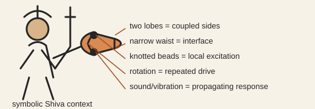

# Analogy A001 — Damru (hourglass drum)

**Mythological source:** Damru — the small hourglass-shaped drum associated with Shiva, two lobed
resonating chambers joined at a narrow waist, played by rotating the wrist so a knotted striker
strikes each face alternately.
**Modern domain:** physics (coupled oscillators, curvature/coupling, radiation)
**📌 Status:** CLOSED (as a literal new mechanism) / retained as conceptual analogy

**Prior-project source:** `indian-philosophy-modern-physics/V1/analogies/README.md`,
`V1/RESEARCH_LOG.md` (Entry 1), `V1/CLAIMS_STATUS.md` (C13), `V1/DECISIONS.md` ([A]);
`indian-philosophy-modern-physics/V2/analogies/V2.2-Ramanujan-three-branch-decomposition.md`
("A3 Cosmic Damru"); `indian-mythology-modern-science/research/DAMRU/HISTORY.md` and
`research/ANALOGY_MAP.md`.

*Conceptual schematic, not a historical depiction. The labels identify only the Damru properties used in this analogy.*

> **🔴 Boundary sticker:** The literal Damru-to-gravity mechanism is closed; coupled-mode toy modeling remains valid as established-physics work.

## 📖 The story / incident

The Damru has two lobed chambers joined by a narrow waist/interface, is set into rhythmic
oscillation by a rotating wrist, and produces sound through a striker repeatedly hitting both
faces. It is one of Shiva's attributes and is associated in tradition with rhythm, creation, and
the pulse of the cosmos.

## 🗺️ The mapping

| Mythological element | Mapped concept |
|---|---|
| Two lobed chambers | Two coupled sub-systems / "two sides" of a coupled field |
| Narrow waist | Interface/coupling region between the two sub-systems |
| Knotted striker | Localized particle-like excitation |
| Rotating/oscillating motion | Repeated oscillation driving the coupled system |
| Produced sound/vibration | Propagating disturbance or radiation coupled to the surrounding field |

## 💡 Why this analogy was proposed

To ask whether a simple, dual-chamber oscillating geometry with a coupling waist could supply a
new physical mechanism for coupling, curvature response, or gravitational/electromagnetic
radiation — i.e., whether "rhythm" in this geometry maps onto something physically generative
rather than merely decorative.

## ✅ What it helps explain / suggest

- Motivated a concrete atomic-mechanism chain: dual/lobed geometry → waist as interface/coupling →
  localized striker/excitation → repeated oscillation → interaction with a surrounding field →
  curvature/stress-energy response → propagating disturbance → observable output → observer/
  detection sequence (V2.2).
- Motivated collective-mode and mode-mismatch toy models in the chat-archive reconstruction
  (`research/DAMRU/HISTORY.md`).
- Provided a lens for asking whether coherent oscillation could select a gravitational (tensor)
  mode over other sectors.

## ⚠️ What it does NOT explain

- It does not supply a new physical coupling or curvature mechanism: V1 explicitly tested and
  closed this ("Damru analogy supplies a new physical coupling mechanism" — REJECTED, C13)
  because coupling/curvature ideas of this kind are already represented in established physics.
- Coherent oscillation did not, in the historical toy tests, naturally transfer energy into the
  gravitational/tensor sector (see `research/FAILED_AND_ABANDONED_PATHS.md`: "Damru rhythm → gravity").
- It is not evidence that gravitational waves are literally produced by a Damru-like mechanism.

## 🧪 Testable component

The atomic-mechanism chain (coupled oscillators with a waist/interface, driven excitation,
response of a surrounding field) can be written as an explicit coupled-oscillator/lattice model and
its spectrum computed — this is the "toy model of established physics" that survives from the
analogy.

## 🪞 Non-testable / metaphorical component

The identification of the Damru specifically (as opposed to any two-lobed coupled oscillator) with
a cosmic/gravitational generative principle is symbolic and not a physical claim.

## 🔬 Known-science connection

Coupled oscillators, mode coupling, and radiation from oscillating sources are established physics
(classical mechanics, GR linearized-wave theory, QFT). The Damru analogy reduces, once
mathematized, to known coupled-oscillator/field-radiation physics rather than something new
(V1 C13, V2.2 "required discrimination").

## 📚 Used by (lines of thought)

- [Line-Of-Thoughts/L003_coupled_oscillator_cosmic_mechanism.md](../Line-Of-Thoughts/L003_coupled_oscillator_cosmic_mechanism.md) — status corrected: V1's literal-mechanism claim is CLOSED, but V2 reopened Damru as "Cosmic Damru" and this line is now PAUSED (not closed), frozen at V2.13.
