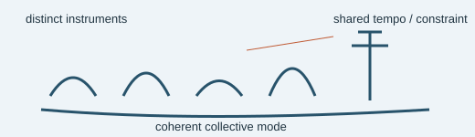

# Analogy A002 — Orchestra (coherence and constraint)

**Mythological/cultural source:** The image of an orchestra — many distinct instruments/players
constrained to a shared tempo and harmonic structure, producing coherent collective sound. (Used
in the source project as a general explanatory metaphor alongside the mythologically-sourced
analogies; retained here for completeness since it was tested and closed in the same audit as
Damru.)
**Modern domain:** physics (coupled fields, coherence, constraint)
**📌 Status:** CLOSED (as a literal new mechanism) / retained as explanatory metaphor

**Prior-project source:** `indian-philosophy-modern-physics/V1/analogies/README.md`,
\(V1/RESEARCH_{LOG}.md\) (Entry 2), \(V1/CLAIMS_{STATUS}.md\) (C14), `V1/DECISIONS.md` ([B]).

*Conceptual schematic: the instruments represent coupled degrees of freedom, not a physical derivation.*

> **🔴 Boundary sticker:** Orchestra coherence is an explanatory metaphor; coupled-field coherence is already known physics.

## 📖 The story / incident

An orchestra is a collection of independent instruments that, through shared tempo, key, and
conductor cues, produce a single coherent musical output rather than independent noise.

## 🗺️ The mapping

| Orchestra element | Mapped concept |
|---|---|
| Individual instruments | Independent coupled fields/degrees of freedom |
| Shared tempo/key/conductor | Constraint enforcing coherence |
| Coherent collective sound | Emergent coherent physical state/mode |

## 💡 Why this analogy was proposed

To ask whether "coherence emerging from constrained independent parts" is itself a new physical
mechanism, distinct from known coupled-field behavior.

## ✅ What it helped explain / suggest

Provided intuitive language for discussing coherence and constraint among coupled degrees of
freedom prior to formal modeling.

## ⚠️ What it did NOT explain

It does not supply a new mechanism of coherence/constraint: V1 tested and closed this claim
("Orchestra analogy supplies a new physical mechanism of coherence/constraint" — REJECTED, C14)
because coupled fields and coherence are already established physics.

## 🧪 Testable component

None beyond what is already covered by standard coupled-oscillator/coupled-field coherence theory.

## 🪞 Non-testable / metaphorical component

The orchestra-as-cosmic-coherence framing itself is purely explanatory language.

## 🔬 Known-science connection

Coupled-field coherence and synchronization are established physics (e.g. coupled oscillator
synchronization, normal modes). Retained only as an explanatory metaphor (V1 DECISIONS.md [B]).

## 📚 Used by (lines of thought)

- [Line-Of-Thoughts/L003_coupled_oscillator_cosmic_mechanism.md](../Line-Of-Thoughts/L003_coupled_oscillator_cosmic_mechanism.md)
