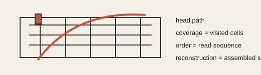

# Analogy A003 — VCR / Cinema / Sequential Coverage (moving/tilted head)

**Mythological source:** Framed in the source chats via the VCR/cinema/moving-head metaphor
(sequential frame coverage, tilted playback head) and connected there to Indian-tradition framing
of perception/observation as sequential access rather than total, instantaneous access.
**Modern domain:** physics (observation, reconstruction, time), signal processing
**📌 Status:** ACTIVE (reconstruction/decomposition stage in V2); ANALOGY_ONLY / RECONSTRUCTION
FRAMEWORK in the mythology-archive reconstruction

**Prior-project source:** `indian-philosophy-modern-physics/V2/analogies/V2.1-VCR.md`,
`V2/hypotheses/V2.1-VCR-hypothesis.md`,
`V2/analogies/V2.2-Ramanujan-three-branch-decomposition.md` ("A1 VCR / moving-head ordered
coverage"); \(indian-mythology-modern-science/research/AUDIO_{VIDEO}_VCR/HISTORY.md\) and
\(research/ANALOGY_{MAP}.md\) ("VCR/cinema", "Moving/tilted head").

*Conceptual schematic: the path separates visited coverage from the order in which samples are read.*

> **🟠 Active sticker:** The reconstruction framework is active; sequential coverage has not established physical time.

## 📖 The story / incident

A VCR (or cinema projector) does not present an entire scene at once; a read/playback head moves
across a medium (tape, film) in a sequence, and a moving or tilted head changes what is accessed
and in what order. The viewer experiences a reconstructed, seemingly continuous scene built from
this sequential, ordered coverage.

## 🗺️ The mapping

| VCR/cinema element | Mapped concept |
|---|---|
| Spatially distributed medium (tape/film) | Spatial field/information distributed over a domain |
| Playback/read head | Sampling/observation operator |
| Head trajectory across the medium | A path visiting a sequence of locations |
| Frames covered so far | Coverage of the domain |
| Order in which frames are read | Acquisition ordering (distinct from the sample set itself) |
| Assembled playback | Reconstruction operator producing a state/frame estimate |
| Apparent smooth motion | Continuity from sufficiently dense/structured coverage |

## 💡 Why this analogy was proposed

To ask whether a moving observation process can turn spatially distributed information into an
ordered sequence, and whether that ordered coverage could account for an *effective* notion of
time — explicitly treated as a mechanism-discovery device, not a literal physical claim
(V2.1-VCR.md).

## ✅ What it helps explain / suggest

- Cleanly separates two distinct observables: the **sample set** (coverage information) and the
  **ordering** (sequence information) — neither alone necessarily defines a physical time scale
  (V2.1-VCR.md).
- Motivated the falsification design: same spatial information and sample locations, different
  traversal orderings, testing whether reconstruction depends on ordering (V2.1, V2.2).
- In V2's completed pre-Ramanujan test: static spatial reconstruction after restoring spatial
  coordinates was invariant to acquisition permutation in the tested model — i.e., coverage/
  reconstruction and acquisition ordering were shown to be separable (V2.2, "Completed before
  Ramanujan").
- In the mythology-chat archive, motivated the observer/audience/reconstruction framework and the
  explicit rejection of "VCR literally creates time" (\(research/FAILED_{AND}_ABANDONED_PATHS.md\)).

## ⚠️ What it does NOT explain

- It must not be used to smuggle time into the model by assigning the traversal parameter `s = t`
  and then calling the result emergent time — this is an explicit required boundary in V2.1.
- It does not, by itself, establish that gravitational waves are "audio" or that EM/light is
  "video" — that mapping is explicitly rejected as a literal claim in the mythology-archive
  reconstruction (\(research/ANALOGY_{MAP}.md\), "Audio/video").
- The null hypothesis under active test (V2.1-VCR-hypothesis.md) is that the VCR analogy adds no
  physical content beyond ordinary sampling theory and signal reconstruction.

## 🧪 Testable component

- Formal model: spatial field \(f(x), x \in D\); sampling head path \(\gamma(s): [0,1] \rightarrow D\); samples
  \(y_{i} = M[f, \gamma(s_{i})]\); ordered record \(R = ((s_{1},y_{1}), ..., (s_{N},y_{N}))\); reconstruction
  `F = A(R)` (V2.1-VCR.md).
- Falsification target: identical spatial information/sample locations, different traversal
  orderings — test whether reconstruction changes, and whether an arbitrary reparameterization of
  the traversal leaves observables unchanged (which would mean `s` cannot be identified as
  physical time).
- Decision criterion: the analogy becomes physically interesting only if it yields a
  non-tautological invariant that (a) survives reparameterization, (b) is not merely a
  reconstruction convention, (c) is compatible with established physics, and (d) can be connected
  to a measurable physical process (V2.1-VCR.md).

## 🪞 Non-testable / metaphorical component

The narrative framing of "the universe as a VCR/cinema being played back to an observer" is
metaphorical language for the reconstruction framework, not a physical claim.

## 🔬 Known-science connection

Sampling theory and signal reconstruction are established (V2.1-VCR-hypothesis.md null
hypothesis). Ordering-vs-coverage separability, once formalized, reduces to known
sampling/reconstruction mathematics unless a genuinely non-generic invariant is found.

## 📚 Used by (lines of thought)

- [Line-Of-Thoughts/L001_ordered_coverage_observer_time.md](../Line-Of-Thoughts/L001_ordered_coverage_observer_time.md)
- [Line-Of-Thoughts/L006_s_infinity_b_infinity_relational_substrate.md](../Line-Of-Thoughts/L006_s_infinity_b_infinity_relational_substrate.md) — as the ordered-coverage/observer-reconstruction sub-question of S∞/B∞.
