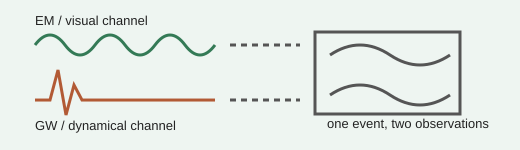

# Analogy A004 — Audio/Video as complementary channels

**Mythological/conceptual source:** Framed in the source chats as a question about why the
universe appears to have a "video" (electromagnetic/light) channel but no obvious "air"/audio
medium, and whether gravitational waves could be an "audio" analogue to electromagnetic "video".
**Modern domain:** physics (gravitational waves, electromagnetic waves, multi-channel observation)
**📌 Status:** ANALOGY_ONLY

**Prior-project source:** \(indian-mythology-modern-science/research/AUDIO_{VIDEO}_VCR/HISTORY.md\),
\(research/ANALOGY_{MAP}.md\) ("Audio/video"); related dual-channel experiments referenced in
\(research/EXPERIMENT_{INDEX}.md\) (PGA-152 "Dual-Channel Reconstruction Test", PGA-153
"Complementary-Channel Reconstruction Test"); `indian-philosophy-modern-physics/V2/experiments/`
(`V2.7-gravitational-wave-em-coupling`, `V2.8-gw-em-polarization-invariant`).

*Conceptual schematic: the channels are an abstract comparison, not literal audio and video.*

> **⚪ Analogy-only sticker:** Any new-physics claim still requires a residual beyond established GW-EM and Einstein-Maxwell effects.

## 📖 The story / incident

Cinema/television historically combined two complementary channels — an audio track and a video
track — that are synchronized to reconstruct one coherent experience. The chat archive asked
whether gravitational waves (often popularly described as ripples/"sound of spacetime") and
electromagnetic waves/light could be treated analogously as two complementary observational
channels of one underlying phenomenon.

## 🗺️ The mapping

| Audio/video element | Mapped concept |
|---|---|
| Audio track | Gravitational-wave channel (analogy only — not a literal sound claim) |
| Video track | Electromagnetic-wave/light channel |
| Synchronization of the two tracks | Coupled/complementary observation of one underlying event |

## 💡 Why this analogy was proposed

To explore whether treating gravity and electromagnetism as two complementary "channels" of one
underlying substrate could motivate new coupled-channel experiments or reveal an overlooked
observational relationship.

## ✅ What it helps explain / suggest

- Motivated dual-channel/complementary-channel reconstruction experiments (PGA-152, PGA-153) and,
  in V2, an explicit gravitational-wave/electromagnetic coupling and polarization-invariant test
  line (`V2.7`, `V2.8`).

## ⚠️ What it does NOT explain

- Gravitational waves are **not** literally sound/audio, and electromagnetic waves/light are
  **not** literally video — this is an explicit rule preserved from the source reconstruction
  (\(research/ANALOGY_{MAP}.md\)).
- Known physics already accounts for established gravitational-wave/electromagnetic conversion
  effects (e.g. in binary mergers, pulsar timing); no confirmed additional/residual term has been
  established from this analogy (\(research/FAILED_{AND}_ABANDONED_PATHS.md\), "Direct Damru/VCR
  EM-GW novelty").

## 🧪 Testable component

Any residual coupling term between a gravitational-wave channel and an electromagnetic channel
that is *not* already explained by known Einstein–Maxwell / GW–EM conversion physics — this
residual-term test remains open (\(research/REPRODUCTION_{QUEUE}.md\), R013).

## 🪞 Non-testable / metaphorical component

The "audio = gravity, video = light" labeling itself is purely descriptive language, not a
physical identity claim.

## 🔬 Known-science connection

Established Einstein–Maxwell theory and known gravitational-wave/electromagnetic-wave conversion
processes already account for observed coupling; this analogy has not established anything beyond
that (KNOWN PHYSICS boundary, per \(research/CURRENT_{STATE}.md\)).

## 📚 Used by (lines of thought)

- [Line-Of-Thoughts/L005_complementary_channel_unification.md](../Line-Of-Thoughts/L005_complementary_channel_unification.md)
- [Line-Of-Thoughts/L003_coupled_oscillator_cosmic_mechanism.md](../Line-Of-Thoughts/L003_coupled_oscillator_cosmic_mechanism.md) — V2 formalized this into the GW→EM coupling test (V2.7/V2.8) inside the Cosmic Damru thread.
