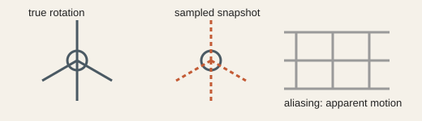

# Analogy A005 — Fan / sampling (apparent motion)

**Conceptual source:** The everyday observation that a fast-spinning fan can appear to move slowly,
stop, or reverse under stroboscopic/sampled observation (an "apparent motion" artifact), used in the
source chats as the seed for asking whether relativistic invariants could emerge from a sampling
process.
**Modern domain:** physics (sampling theory, special relativity)
**📌 Status:** CLOSED AS MECHANISM (for the specific claim tested)

**Prior-project source:** `indian-mythology-modern-science/research/ANALOGY_MAP.md` ("Fan/
sampling"), `research/FAILED_AND_ABANDONED_PATHS.md` ("Fan/ordinary sampling explains universal
c"); early `PGA-6` through `PGA-20` sequence in `shared/test/`.

*Conceptual schematic: sampling can change apparent motion; it does not explain the invariant speed c.*

> **🔴 Closed sticker:** Aliasing explains apparent motion, not the universal invariant speed `c`.

## 📖 The story / incident

A rotating fan viewed under a strobe light or camera frame rate can appear to move at a different
speed than its true rotation, or appear stationary/reversed — an artifact of sampling frequency
versus rotation frequency.

## 🗺️ The mapping

| Fan/strobe element | Mapped concept |
|---|---|
| True rotation rate | Underlying microscopic process rate |
| Strobe/sampling frequency | Observer's sampling/observation rate |
| Apparent motion (fan illusion) | Reconstructed/observed motion, possibly differing from the true rate |

## 💡 Why this analogy was proposed

To ask whether the invariant speed `c` in relativity could originate from an observer-sampling
artifact rather than being a fundamental constant — i.e., whether "apparent motion from sampling"
scales up into a universal invariant.

## ✅ What it helped explain / suggest

It exposed the observer-reconstruction question (how an observer builds a picture of motion from
discrete samples) that later fed into the VCR/moving-head line of thought (A003).

## ⚠️ What it did NOT explain

Closed as a mechanism: comparison of the microscopic rate and the observer sampling frequency
showed they have incompatible dimensions, so no universal invariant follows from this mechanism
(`research/FAILED_AND_ABANDONED_PATHS.md`).

## 🧪 Testable component

None survives as a direct mechanism; the underlying observer-reconstruction question survived and
was redirected into the VCR/moving-head and dispersion/collective low-energy-limit lines.

## 🪞 Non-testable / metaphorical component

The fan-illusion-as-origin-of-`c` framing itself, once the dimensional mismatch was identified, is
retained only as a historical illustration of why the idea does not work.

## 🔬 Known-science connection

Aliasing/stroboscopic effects are well-established in signal processing; special relativity's
invariant `c` is an established physical constant with an entirely different theoretical basis.

## 📚 Used by (lines of thought)

- [Line-Of-Thoughts/L001_ordered_coverage_observer_time.md](../Line-Of-Thoughts/L001_ordered_coverage_observer_time.md) — retained as a closed historical precursor, not an active mechanism.
