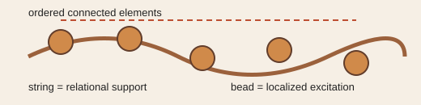

# Analogy A006 — Bead/string on a relational structure

**Mythological source:** The image of a bead threaded on a string — a localized object supported
by, and moving along, an extended connective structure — echoed in the Indian tradition of the
mala (prayer beads on a thread) as a model of discrete, ordered, connected elements.
**Modern domain:** physics (localized excitations on extended structures, string-like models)
**📌 Status:** ANALOGY_ONLY

**Prior-project source:** \(indian-mythology-modern-science/research/ANALOGY_{MAP}.md\) ("Bead/
string"), `research/DAMRU/HISTORY.md`, early `PGA` string/mode sequence in `shared/test/`
(e.g. `PGA-28`, `PGA-34`, `PGA-40`).

*Conceptual schematic: beads and string label local features and relational support, not a literal ontology.*

> **⚪ Analogy-only sticker:** The visual motivates localized-mode models but does not establish strings, particles, or spacetime.

## 📖 The story / incident

A bead is a discrete, localized object threaded on a string; many beads on one string form an
ordered, connected sequence (as in a mala). The string itself is an extended, continuous connective
medium, while beads are discrete, localized features on it.

## 🗺️ The mapping

| Bead/string element | Mapped concept |
|---|---|
| String | Extended relational/field structure |
| Bead | Localized excitation or particle-like feature on that structure |
| Bead's position along the string | Locality / position within the relational structure |
| Sequence of beads | Persistence and propagation of a localized feature |

## 💡 Why this analogy was proposed

To provide an intuitive picture for how a localized, particle-like feature could persist and
propagate on an extended relational substrate, motivating "long string" and mode-carrying
constructions in the early substrate/dispersion sequence.

## ✅ What it helps explain / suggest

Provided the intuition for persistence, propagation, and the local/global distinction used when
constructing early discrete-substrate and mode/spectrum toy models (\(research/ANALOGY_{MAP}.md\)).

## ⚠️ What it does NOT explain

It does not establish a literal string or particle ontology — it does not, by itself, derive
particle masses, spectra, or spacetime geometry (\(research/ANALOGY_{MAP}.md\)).

## 🧪 Testable component

The underlying toy models it motivated (discrete substrate + local excitation + dispersion
relation) are testable once formalized; the bead/string picture itself is not directly testable.

## 🪞 Non-testable / metaphorical component

The bead-as-particle / string-as-spacetime-fabric identification is illustrative language.

## 🔬 Known-science connection

Resembles (without being identical to) established solitons/localized-mode physics on
one-dimensional media, and is loosely reminiscent of (but not a claim about) string theory.

## 📚 Used by (lines of thought)

- [Line-Of-Thoughts/L003_coupled_oscillator_cosmic_mechanism.md](../Line-Of-Thoughts/L003_coupled_oscillator_cosmic_mechanism.md)
- [Line-Of-Thoughts/L006_s_infinity_b_infinity_relational_substrate.md](../Line-Of-Thoughts/L006_s_infinity_b_infinity_relational_substrate.md)
