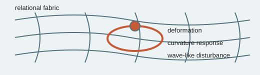

# Analogy A007 — Fabric / spacetime

**Conceptual source:** The common popular-science image of spacetime as a stretchable "fabric"
that deforms under mass/energy, adopted in the source chats as language for describing how a
relational substrate might deform and propagate disturbances.
**Modern domain:** physics (general relativity, relational substrate models)
**📌 Status:** ANALOGY_ONLY

**Prior-project source:** \(indian-mythology-modern-science/research/ANALOGY_{MAP}.md\) ("Fabric/
spacetime"), `research/DAMRU/HISTORY.md`.

*Conceptual schematic: the fabric image is explanatory language, not a derivation of general relativity.*

> **⚪ Analogy-only sticker:** Deformation and ripples provide vocabulary; they do not replace a metric or Einstein dynamics.

## 📖 The story / incident

Not itself a mythological story; it is the familiar rubber-sheet/fabric image used to visualize
general-relativistic curvature, which the source chats adopted as connective language between the
Damru/bead-string analogies and formal backreaction/geometry discussions.

## 🗺️ The mapping

| Fabric element | Mapped concept |
|---|---|
| Stretchable fabric | Relational substrate / spacetime medium |
| Deformation under a weight | Curvature response to mass/energy (backreaction) |
| Ripples propagating across the fabric | Propagating disturbances (wave-like behavior) |

## 💡 Why this analogy was proposed

To give a shared vocabulary for discussing backreaction and geometry while working with the
Damru/bead-string toy models, without yet committing to a specific mathematical derivation.

## ✅ What it helps explain / suggest

Provided language for backreaction and geometry discussions in the substrate research line
(\(research/ANALOGY_{MAP}.md\)).

## ⚠️ What it does NOT explain

It does not constitute or replace a derivation of general relativity; it is explicitly not treated
as such (\(research/ANALOGY_{MAP}.md\): "Did not establish: Derivation of GR").

## 🧪 Testable component

None directly — it is a descriptive/illustrative layer over whatever formal backreaction model is
actually being tested (see Damru-derived toy models, A001).

## 🪞 Non-testable / metaphorical component

The "fabric" image itself, including any Indian-textile/weaving framing used to describe it.

## 🔬 Known-science connection

The standard rubber-sheet analogy for GR curvature is a well-known (and well-known-to-be
imperfect) popular-science illustration of general relativity; it is not a new result here.

## 📚 Used by (lines of thought)

- [Line-Of-Thoughts/L003_coupled_oscillator_cosmic_mechanism.md](../Line-Of-Thoughts/L003_coupled_oscillator_cosmic_mechanism.md) — descriptive language only, not independently testable.
- [Line-Of-Thoughts/L006_s_infinity_b_infinity_relational_substrate.md](../Line-Of-Thoughts/L006_s_infinity_b_infinity_relational_substrate.md) — descriptive language only, not independently testable.
