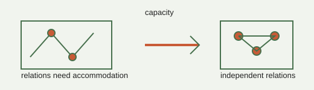

# Analogy A008 — Space as capacity / accommodation

**Conceptual source:** The idea, discussed in the source project, that "space" might be better
understood as a capacity to accommodate relations rather than a pre-existing container — echoing
philosophical framings in Indian thought where space (akasha) is treated as a subtle
accommodating principle rather than a passive void.
**Modern domain:** physics (emergent geometry, relational/combinatorial models)
**📌 Status:** OPEN / conceptual candidate

**Prior-project source:**
`indian-philosophy-modern-physics/V2/analogies/V2.2-Ramanujan-three-branch-decomposition.md`
("A6 Space = capacity / accommodation"); `indian-philosophy-modern-physics/V1/CLAIMS_STATUS.md`
(C10).

*Conceptual schematic: capacity is a proposed counting question, not an established origin of physical dimension.*

> **🟣 Open sticker:** A capacity quantity still needs generic controls and an independent derivation of dimension.

## 📖 The story / incident

Rather than a story/incident, this is a philosophical framing: space is not a pre-given empty
container but a capacity for relations/accommodation to exist — something must be "accommodatable"
before "space" as commonly understood can be said to exist.

## 🗺️ The mapping

| Conceptual element | Mapped concept |
|---|---|
| "Something to be accommodated" | A relation or degree of freedom requiring room to exist |
| Accommodation capacity | A combinatorial/relational counting quantity |
| Fold / constraint | A mechanism that can increase relational capacity without a flat embedding |
| Dimensionality | Number of independent accommodations/relations |

## 💡 Why this analogy was proposed

To ask whether physical spatial dimensions could emerge from a capacity/relational-counting
structure rather than being assumed as a primitive background (V2.2, "A6").

## ✅ What it helps explain / suggest

- Motivated the atomic-mechanism chain: something to accommodate → relations define capacity →
  fold/constraint can create capacity → dimensionality as independent accommodations → derive a
  capacity/state-count quantity → test whether geometry can emerge from it (V2.2).
- Suggested partition functions, q-series, theta functions, and modular transformation structure
  (Ramanujan-derived tools, A013) as candidate counting mechanisms (V2.2).

## ⚠️ What it does NOT explain

- "Physical spatial dimensions can emerge from state-space capacity/relations" is explicitly
  labeled OPEN with no mathematical derivation yet (V1 CLAIMS_STATUS.md, C10).
- A Ramanujan-based state-counting law must be compared against generic generating functions and
  known combinatorial/statistical-mechanical growth laws before any physical claim is warranted;
  "a successful counting identity is not automatically physical geometry" (V2.2).
- Status as of the source material: "conceptual candidate; no independent numerical result yet"
  (V2.2).

## 🧪 Testable component

A candidate capacity/state-counting quantity (e.g. built from partition/theta functions) compared
against generic combinatorial growth laws, with the aim of testing whether geometry/dimension can
emerge from it.

## 🪞 Non-testable / metaphorical component

The philosophical framing of space-as-akasha/accommodation itself is not directly testable; only
its formalized combinatorial consequence is.

## 🔬 Known-science connection

Related in spirit to emergent-geometry and entropic-gravity research programs in physics, and to
combinatorial/statistical-mechanics counting arguments; not established as a new result here.

## 📚 Used by (lines of thought)

- [Line-Of-Thoughts/L002_emergent_dimension_relational_capacity.md](../Line-Of-Thoughts/L002_emergent_dimension_relational_capacity.md)
