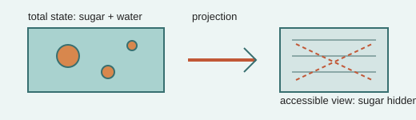

# Analogy A009 — Sugar dissolving in water (visibility / hidden state)

**Conceptual source:** The everyday observation that sugar, once dissolved in water, becomes
invisible to the eye while its mass/substance is still present — used in the source chats as the
seed of the "Interacting Infinities & Visibility Model" (IIVM).
**Modern domain:** physics (coarse-graining, hidden-state/observability, statistical mechanics)
**📌 Status:** ANALOGY_ONLY (toy-model tests retained)

**Prior-project source:** \(indian-mythology-modern-science/research/ANALOGY_{MAP}.md\) ("Sugar
dissolving in water"); `shared/test/PGA-IIVM-5.md` and related `IIVM-1` through `IIVM-4`,
`PGA-IIVM-6`, `IIVM-7`, `PGA-IIVM-8` entries in `shared/test/` and `shared/results/`.

*Conceptual schematic: loss of visibility is represented as projection/coarse-graining, not disappearance.*

> **⚪ Analogy-only sticker:** Hidden-state behavior is a coarse-graining toy model and does not create a fundamental arrow of time.

## 📖 The story / incident

When sugar dissolves in water, it disperses at a scale where it is no longer visible to an
observer, even though it has not disappeared — its mass and chemical identity persist, only its
observability has changed.

## 🗺️ The mapping

| Sugar/water element | Mapped concept |
|---|---|
| Sugar crystal before dissolving | A distinguishable, directly observable state |
| Dissolving process | Coarse-graining / dispersal into many degrees of freedom |
| Sugar after dissolving (invisible but present) | Hidden state — present but not directly accessible to the observer |
| Water (the visible remainder) | The observer-accessible/coarse-grained description |

## 💡 Why this analogy was proposed

To build a toy model (IIVM) distinguishing an observer's accessible description of a system from
its total underlying state, and to test how/when information "disappears" from observation without
actually being destroyed.

## ✅ What it helps explain / suggest

- Motivated a numerical IIVM test with heterogeneous elements, resonance, harmonics, interactions,
  a "sugar" subsystem, a "water" background, and multiple observers, measuring when the sugar
  becomes invisible (`shared/test/PGA-IIVM-5.md` and related IIVM entries).
- Fed into the hidden-state/accessibility branch audit (`PGA-110` "Accessibility / Hidden-State
  Model") and its distinction \(\Omega_{total} \supset \Omega_{accessible} \supset \Omega_{observed} \supset \Omega_{represented}\)
  (\(research/MATHEMATICAL_{MODELS}.md\)).

## ⚠️ What it does NOT explain

- The IIVM toy model does not, by itself, prove any physics: "The IIVM doesn't prove any of this
  physics" is stated explicitly in the source chat (per `shared/test/` IIVM entries).
- It does not establish that observation/coarse-graining alone creates a fundamental arrow of time
  (\(research/FAILED_{AND}_ABANDONED_PATHS.md\): "Coarse-graining alone → fundamental time arrow").

## 🧪 Testable component

The finite reversible hidden-state model (permutation dynamics + restricted projection + entropy
measurement) is a concrete, testable toy model — reported historically at \(|\Omega| = 65,536\) with an
8-bit projection and observer entropy reaching about 7.18 bits after mixing
(\(research/REPRODUCTION_{QUEUE}.md\), R003; requires reproduction).

## 🪞 Non-testable / metaphorical component

The sugar/water framing itself is illustrative; only the formal coarse-graining/hidden-state model
it inspired is testable.

## 🔬 Known-science connection

Directly resembles established statistical-mechanics coarse-graining and entropy concepts; the
IIVM toy model is a specific instance of this established framework, not a new physical principle.

## 📚 Used by (lines of thought)

- [Line-Of-Thoughts/L004_hidden_state_observer_accessibility.md](../Line-Of-Thoughts/L004_hidden_state_observer_accessibility.md)
- [Line-Of-Thoughts/L006_s_infinity_b_infinity_relational_substrate.md](../Line-Of-Thoughts/L006_s_infinity_b_infinity_relational_substrate.md) — as the hidden-state/visibility sub-question within the S∞/B∞ accessibility hierarchy.
