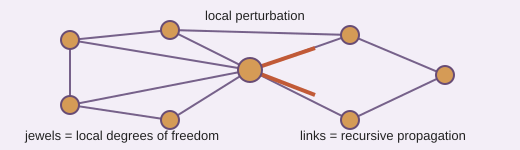

# Analogy A010 — Indra-Net (recursive visibility)

**Mythological source:** Indra's Net (Indra-jāla) — the Buddhist/Indian image of an infinite net
with a jewel at every node, each jewel reflecting every other jewel, used as a metaphor for
universal interconnection and mutual reflection.
**Modern domain:** physics (relational propagation, recursive/hierarchical models)
**📌 Status:** HISTORICAL TOY ANALOGY

**Prior-project source:** \(indian-mythology-modern-science/research/ANALOGY_{MAP}.md\) ("Indra-Net /
recursive visibility"); `shared/test/PGA-IIVM-5.md` ("Recursive Visibility / Indra-Net Test").

*Conceptual schematic: links show recursive propagation, not evidence for a physical Indra-Net.*

> **🔵 Historical sticker:** The relational propagation construction is retained as a toy analogy pending independent formalization and reproduction.

## 📖 The story / incident

Indra's Net is described as an infinite net stretching in all directions, with a reflective jewel
at each node such that every jewel reflects the image of every other jewel, and those reflections
recursively contain further reflections.

## 🗺️ The mapping

| Indra-Net element | Mapped concept |
|---|---|
| Net of nodes | A relational graph/network |
| Jewel at each node | A local element/degree of freedom |
| Mutual reflection between jewels | Propagation of a local perturbation through the relational network |
| Recursive reflection-within-reflection | Hierarchical/recursive propagation structure |

## 💡 Why this analogy was proposed

To test whether a local perturbation introduced into a relational network propagates and reflects
through the network in a way that models recursive, mutually-referential structure, as a follow-on
to the IIVM visibility toy model (A009).

## ✅ What it helps explain / suggest

Motivated the `PGA-IIVM-5` "Recursive Visibility / Indra-Net Test" — first toy experiment on local
perturbation → relational propagation (`shared/test/PGA-IIVM-5.md`).

## ⚠️ What it does NOT explain

It does not establish physical network evidence; it remains a historical toy analogy
(\(research/ANALOGY_{MAP}.md\)).

## 🧪 Testable component

The local-perturbation-propagation toy model on a relational graph is a concrete, testable
construction, independent of the Indra-Net framing itself.

## 🪞 Non-testable / metaphorical component

The identification of the toy relational graph with the mythological Indra-Net (infinite
mutually-reflecting jewels) is symbolic.

## 🔬 Known-science connection

Resembles network/graph propagation and reflection models used generically in complex-systems and
statistical-physics contexts; not established as new physics.

## 📚 Used by (lines of thought)

- [Line-Of-Thoughts/L004_hidden_state_observer_accessibility.md](../Line-Of-Thoughts/L004_hidden_state_observer_accessibility.md)
- [Line-Of-Thoughts/L006_s_infinity_b_infinity_relational_substrate.md](../Line-Of-Thoughts/L006_s_infinity_b_infinity_relational_substrate.md)
