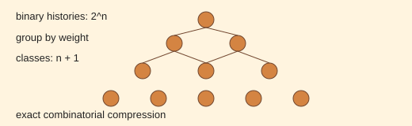

# Analogy A011 — Meru Prastara (Pascal's-triangle-like combinatorial row)

**Mythological/mathematical source:** Meru Prastara — the classical Indian combinatorial
construction (associated with Pingala's prosody and later formalized similarly to Pascal's
triangle) used for counting arrangements/compositions, invoked in the source chats as a
compression mechanism from microscopic histories to coarse classes.
**Modern domain:** physics/mathematics (combinatorics, coarse-graining)
**📌 Status:** MATHEMATICAL MECHANISM (established combinatorics); physical claim OPEN

**Prior-project source:** `indian-mythology-modern-science/research/ANALOGY_MAP.md` ("Meru
Prastara / Pascal row"); `shared/test/PGA-IIVM-6.md` ("Meru Prastara compression ↔ expansion"),
`shared/test/IIVM-7.md` ("Dynamic Meru Compression"); `research/REPRODUCTION_QUEUE.md` (R005, R006).

*Conceptual schematic: the row illustrates the exact 2^n to n+1 grouping used in the mathematical analogy.*

> **🟢 Mathematics sticker:** The grouping identity is exact combinatorics; its physical interpretation remains open.

## 📖 The story / incident

Meru Prastara is a historical Indian combinatorial device for systematically enumerating and
grouping arrangements (e.g. of syllables/binary choices), later recognized as structurally
equivalent to Pascal's triangle: each row groups `2^n` binary histories into `n+1` classes by
weight/count.

## 🗺️ The mapping

| Meru Prastara element | Mapped concept |
|---|---|
| Row of the triangle | A coarse-graining level |
| Binary compositions summing to a row | Microscopic histories/microstates |
| Grouping by weight into `n+1` classes | Compression of `2^n` microstates into `n+1` observable classes |

## 💡 Why this analogy was proposed

To supply an exact, pre-existing Indian mathematical mechanism for compressing a large number of
microscopic histories into a much smaller number of observable/coarse classes, as a candidate
coarse-graining law for the IIVM visibility framework (A009).

## ✅ What it helps explain / suggest

- Gives an exact combinatorial identity: `2^n` histories map to `n+1` classes for binary
  composition (`research/REPRODUCTION_QUEUE.md`, R005); a general `q`-category composition scaling
  extends this (R006).
- Provided the compression/expansion mechanism tested in `PGA-IIVM-6` ("Meru Prastara compression
  ↔ expansion") and `IIVM-7` ("Dynamic Meru Compression").

## ⚠️ What it does NOT explain

It does not derive physical 2D/3D space from the combinatorial row: "physical claim open"
(`research/ANALOGY_MAP.md`). The exact count is a mathematical fact; using it to claim a physical
dimensional origin is unestablished.

## 🧪 Testable component

The combinatorial counts themselves (`2^n → n+1` classes; general `q`-category scaling) are exact
and reproducible mathematics, independently of any physical interpretation
(`research/REPRODUCTION_QUEUE.md`, R005–R006).

## 🪞 Non-testable / metaphorical component

The claim that this specific historical device (rather than any equivalent combinatorial
coarse-graining) is physically privileged is symbolic, not physical.

## 🔬 Known-science connection

Structurally identical to Pascal's triangle / binomial coefficients, a well-established
mathematical object; its use here as a coarse-graining device is a toy-model application of known
combinatorics.

## 📚 Used by (lines of thought)

- [Line-Of-Thoughts/L002_emergent_dimension_relational_capacity.md](../Line-Of-Thoughts/L002_emergent_dimension_relational_capacity.md)
- [Line-Of-Thoughts/L004_hidden_state_observer_accessibility.md](../Line-Of-Thoughts/L004_hidden_state_observer_accessibility.md)
- [Line-Of-Thoughts/L006_s_infinity_b_infinity_relational_substrate.md](../Line-Of-Thoughts/L006_s_infinity_b_infinity_relational_substrate.md)
