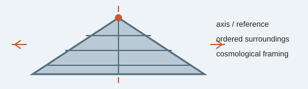

# Analogy A012 — Meru Parvat (cosmic axis mountain)

**Mythological source:** Mount Meru (Meru Parvat) — the cosmic axial mountain in Indian and
broader Asian cosmology, regarded as the center/axis around which celestial bodies and cosmic
order are arranged.
**Modern domain:** physics (cosmological/geometric framing — conceptual only)
**📌 Status:** CONCEPTUAL ANALOGY

**Prior-project source:** \(indian-mythology-modern-science/research/ANALOGY_{MAP}.md\) ("Meru
Parvat").

*Conceptual schematic: Meru is used here as cosmological framing, not as a physical mechanism.*

> **⚪ Analogy-only sticker:** This page supplies axis and order imagery only; no testable mechanism is assigned.

## 📖 The story / incident

Meru Parvat is described in Indian cosmological tradition as an immense central mountain/axis
around which the sun, moon, and celestial spheres are arranged in cosmic order.

## 🗺️ The mapping

| Meru Parvat element | Mapped concept |
|---|---|
| Central axial mountain | An organizing axis/reference structure |
| Celestial bodies arranged around it | Ordered large-scale structure |

## 💡 Why this analogy was proposed

To supply cosmic-scale intuition and framing language (an "axis of order") while discussing
large-scale/cosmological aspects of the research.

## ✅ What it helps explain / suggest

Provided conceptual framing only (\(research/ANALOGY_{MAP}.md\)).

## ⚠️ What it does NOT explain

It does not supply a physical cosmological mechanism — explicitly recorded as conceptual framing
only, with no physics claim attached.

## 🧪 Testable component

None identified in the source material.

## 🪞 Non-testable / metaphorical component

The entire analogy — it functions as cosmological imagery, not a mechanism.

## 🔬 Known-science connection

None established; purely a conceptual/cultural framing device.

## 📚 Used by (lines of thought)

- Not assigned. No testable/mathematical component was identified in the source material; retained as conceptual/cosmological framing only. See [Line-Of-Thoughts/README.md](../Line-Of-Thoughts/README.md#analogies-not-yet-assigned-to-a-line-of-thought).
