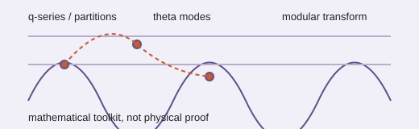

# Analogy A013 — Ramanujan mathematics (partitions, circle method, theta/modular forms)

**Historical/mathematical source:** The work of Srinivasa Ramanujan — partition functions, the
circle method, theta functions, mock modular forms, and modular-form structure — invoked
throughout the source projects as a candidate mathematical language for the underlying-state and
relational hypotheses.
**Modern domain:** mathematics / mathematical physics (number theory, modular forms, spectral
methods)
**📌 Status:** MATHEMATICAL TOOL (KEEP); direct physical mapping REJECTED where tested

**Prior-project source:** `indian-philosophy-modern-physics/V1/RESEARCH_LOG.md` (Entries 4–6),
`V1/CLAIMS_STATUS.md` (C04–C08, C11, C12, C16, C17, C20, C26, C27),
`V1/mathematics/ramanujan_tools.md`, `V1/mathematics/modular_forms.md`, `V1/mathematics/
theta_functions.md`; `indian-philosophy-modern-physics/V2/analogies/
V2.2-Ramanujan-three-branch-decomposition.md`;
`indian-mythology-modern-science/research/ANALOGY_MAP.md` ("Ramanujan/theta functions");
`shared/test/PGA-8C.md` ("Ramanujan: identify one specific mathematical mechanism").

*Conceptual schematic: these are mathematical tools and structures, not evidence that Ramanujan predicted the theory.*

> **🔬 Toolkit sticker:** Partition, theta, and modular mathematics are tools for constructing tests, not physical proof.

## 📖 The story / incident

Not a mythological story but a foundational figure in modern Indian mathematics: Ramanujan's
partition-function identities, circle method, and (posthumously connected) mock modular forms and
theta-function structure were repeatedly proposed in the source chats as candidate tools for
describing an underlying discrete/modal state.

## 🗺️ The mapping

| Ramanujan-mathematics element | Mapped concept |
|---|---|
| Partition function `p(n)` | Direct mapping attempt to particle masses/identities (tested and rejected) |
| Circle method | Reconstruction/asymptotic-analysis tool |
| Theta functions / modular forms | Candidate spectral/mode/phase/duality language for an underlying state |
| Mock modular forms | A speculative further mathematical lead |

## 💡 Why this analogy was proposed

To supply rigorous, pre-existing Indian mathematics as the formal backbone for the underlying-state
and relational-substrate hypotheses, rather than inventing ad hoc mathematics.

## ✅ What it helps explain / suggest

- Motivated representing an underlying state via discrete Fourier/theta-like modes (V1, C01,
  ESTABLISHED as a mathematical model).
- Theta/modular symmetry (S,T representation) was shown, under a tested finite representation, to
  uniquely select the L2 Hermitian quadratic metric up to scale (V1, C20, ESTABLISHED
  mathematical/conditional result, E007).
- Provided the "candidate invariant" step in the V2 branch-decomposition discipline: quadratic/
  theta-like generating weights `G(q) = Σ a_n q^{f(n)}` as an ordering signature to test against
  generic orderings (V2.2).

## ⚠️ What it does NOT explain

- Ramanujan partition numbers do **not** directly encode particle masses or identities — tested
  and REJECTED (V1, C11): "Direct mapping did not yield a defensible physical correspondence."
- "Ramanujan q-series/theta/modular mathematics is useful as a mathematical framework" is
  explicitly a mathematical-use claim, **not** a claim that Ramanujan predicted the theory (V1,
  C12).
- "Modular forms are themselves new physics" — UNSUPPORTED; they are established mathematics used
  across theoretical physics (V1, C16).
- Minimality of the pointwise commutant does **not** uniquely select theta/chirp observables —
  REJECTED within the tested model; multiple distinct observable pairs were equally restrictive
  (V1, C27, E010).
- Mock modular forms remain OPEN with no physical mapping or testable consequence established
  (V1, C17).

## 🧪 Testable component

Specific, falsifiable mathematical claims derived from theta/modular structure (e.g. metric
uniqueness under tested symmetry groups, ordering-signature discrimination) are testable and have
been tested (E006, E007, E009, E010 in V1; the ordering-discrimination test in V2.2).

## 🪞 Non-testable / metaphorical component

The general framing "Ramanujan ⇒ physics" is explicitly flagged as a mapping to avoid
(`research/ANALOGY_MAP.md`: "Did not establish: `Ramanujan => physics`").

## 🔬 Known-science connection

Theta functions, modular forms, and the circle method are established, mainstream mathematics with
existing applications across theoretical physics (string theory, statistical mechanics); their use
here is a toolkit application, not new mathematics or new physics (V1, C16).

## 📚 Used by (lines of thought)

- [Line-Of-Thoughts/L002_emergent_dimension_relational_capacity.md](../Line-Of-Thoughts/L002_emergent_dimension_relational_capacity.md)
