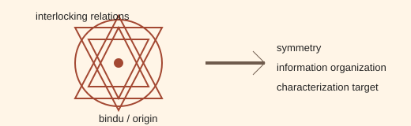

# Analogy A014 — Sri Yantra / Meru Yantra (geometric symmetry)

**Mythological source:** Sri Yantra (also called Meru Yantra in its 3D pyramidal form) — a sacred
geometric diagram of interlocking triangles around a central point (bindu), used in Indian
tantric/meditative tradition to represent cosmic order and the structure of creation.
**Modern domain:** physics/mathematics (geometry, symmetry, information organization)
**📌 Status:** ANALOGY_ONLY

**Prior-project source:** \(indian-mythology-modern-science/research/ANALOGY_{MAP}.md\) ("Sri/Meru
Yantra"); `shared/test/PGA-8D.md` ("Sri/Meru Yantra: mathematically characterize its geometry and
information content").

*Conceptual schematic: the geometry is a characterization target, not an established physical field.*

> **🟣 Open sticker:** Geometry and information content remain proposed characterization tasks requiring generic comparisons.

## 📖 The story / incident

The Sri Yantra consists of nine interlocking triangles (four upward, five downward) radiating from
a central point, forming a highly symmetric pattern traditionally understood as a map of the
cosmos and of consciousness, with the 3D pyramidal form known as Meru Yantra.

## 🗺️ The mapping

| Sri/Meru Yantra element | Mapped concept |
|---|---|
| Central bindu | An origin/reference point |
| Interlocking triangles | A structured, symmetric arrangement of relations |
| Overall diagram | Geometric information organization / compression |

## 💡 Why this analogy was proposed

To ask whether this specific, highly symmetric traditional geometry mathematically characterizes a
particular class of information organization or compression relevant to the space-as-capacity line
(A008), as part of the "PGA-8" mathematical-mechanism family alongside Meru and Ramanujan (`PGA-8A`
through `PGA-8D`).

## ✅ What it helps explain / suggest

Suggested geometric-compression questions to pursue alongside the Meru-Prastara combinatorial
compression mechanism (\(research/ANALOGY_{MAP}.md\)).

## ⚠️ What it does NOT explain

It does not establish a physical field or a dimensional derivation
(\(research/ANALOGY_{MAP}.md\): "Did not establish: A physical field or dimensional derivation").

## 🧪 Testable component

A formal geometric/information-theoretic characterization of the yantra's triangle arrangement
(if carried out) would be testable; the source material records this as a proposed task
(`PGA-8D`) rather than a completed derivation.

## 🪞 Non-testable / metaphorical component

The traditional meditative/cosmological interpretation of the yantra itself.

## 🔬 Known-science connection

None established; any completed characterization would need to be compared against generic
symmetric-lattice/tiling geometries before any novelty claim could be made.

## 📚 Used by (lines of thought)

- [Line-Of-Thoughts/L002_emergent_dimension_relational_capacity.md](../Line-Of-Thoughts/L002_emergent_dimension_relational_capacity.md)
