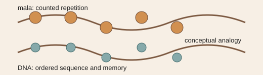

# Analogy A015 — Mala / DNA (repeated elements, sequence, memory)

**Mythological/cultural source:** The mala (string of prayer beads used for counting repetitions in
Indian spiritual practice) compared, in the source chats, with DNA's repeated, sequential
structure, as a shared image of ordered repeated elements encoding memory/pattern.
**Modern domain:** biology / information theory (conceptual only)
**📌 Status:** ANALOGY_ONLY

**Prior-project source:** `indian-mythology-modern-science/research/ANALOGY_MAP.md` ("Mala/DNA").

*Conceptual schematic: the shared property is sequence and repetition; no biological equivalence is claimed.*

> **⚪ Analogy-only sticker:** Sequence and repetition are the shared visual properties; no biological mechanism is proposed.

## 📖 The story / incident

A mala is a string of (traditionally 108) beads used to count repeated recitations; DNA is a long
sequential molecule encoding hereditary information through repeated/ordered units (base pairs).
Both are extended structures whose meaning/function depends on the sequence and repetition of
discrete elements along them.

## 🗺️ The mapping

| Mala/DNA element | Mapped concept |
|---|---|
| String of beads | A sequential, ordered structure |
| Counting repetitions | Encoding/accumulation via repeated elements |
| DNA base-pair sequence | Sequential information storage (biological analogue) |

## 💡 Why this analogy was proposed

To provide conceptual language for sequence, persistence, and memory when discussing
ordered/relational structures elsewhere in the research (e.g. the bead/string substrate, A006).

## ✅ What it helps explain / suggest

Conceptual sequence/persistence language used elsewhere in the archive (`research/ANALOGY_MAP.md`).

## ⚠️ What it does NOT explain

It does not establish biological or physical equivalence between a mala and DNA, or any specific
biological mechanism (`research/ANALOGY_MAP.md`).

## 🧪 Testable component

None identified; this is a purely illustrative cross-domain comparison.

## 🪞 Non-testable / metaphorical component

The entire mala/DNA comparison — it is descriptive language, not a mechanism.

## 🔬 Known-science connection

DNA sequence/structure is established molecular biology; the mala comparison adds no new
biological content.

## 📚 Used by (lines of thought)

- Not assigned. No testable component was identified in the source material; retained as descriptive cross-domain comparison only. See [Line-Of-Thoughts/README.md](../Line-Of-Thoughts/README.md#analogies-not-yet-assigned-to-a-line-of-thought).
