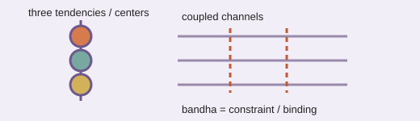

# Analogy A016 — 3 Gunas / Chakras / Bandhas / Anubandhas (multi-channel state language)

**Mythological/philosophical source:** Classical Indian frameworks describing multi-component
states and constraints: the three gunas (sattva/rajas/tamas) of Samkhya philosophy, the chakra
system of subtle-body energy centers, and bandhas/anubandhas (locks/bindings) from yogic tradition.
**Modern domain:** physics (multi-channel/multi-component state and constraint language —
conceptual only)
**📌 Status:** ANALOGY_ONLY

**Prior-project source:** `indian-mythology-modern-science/research/ANALOGY_MAP.md` ("3 gunas/
chakras/bandhas/anubandhas").

*Conceptual schematic: the terms provide historical state and constraint vocabulary, not a quantitative model.*

> **⚪ Analogy-only sticker:** The vocabulary can organize discussion of components and constraints but supplies no quantitative physics.

## 📖 The story / incident

Samkhya philosophy describes all phenomena as arising from the interplay of three gunas
(qualities/tendencies); the chakra system describes a sequence of energy centers along the body;
bandhas/anubandhas describe locks/bindings/constraints used in yogic practice to direct or
constrain energy.

## 🗺️ The mapping

| Element | Mapped concept |
|---|---|
| Three gunas | A three-component state descriptor |
| Chakras | A sequence of coupled "channels"/centers |
| Bandhas/anubandhas | Constraints/bindings applied to a multi-channel system |

## 💡 Why this analogy was proposed

To supply a historical, indigenous vocabulary for multi-channel/multi-component state and
constraint language, where such language entered the physics research discussion.

## ✅ What it helps explain / suggest

Provided historical conceptual vocabulary where used in the archive
(`research/ANALOGY_MAP.md`).

## ⚠️ What it does NOT explain

It does not provide a quantitative physical model — explicitly marked as lacking a quantitative
correspondence (`research/ANALOGY_MAP.md`).

## 🧪 Testable component

None identified in the source material.

## 🪞 Non-testable / metaphorical component

The entire analogy — retained only as descriptive/historical vocabulary.

## 🔬 Known-science connection

None established.

## 📚 Used by (lines of thought)

- Not assigned. No testable/quantitative component was identified in the source material; retained as historical vocabulary only. See [Line-Of-Thoughts/README.md](../Line-Of-Thoughts/README.md#analogies-not-yet-assigned-to-a-line-of-thought).
