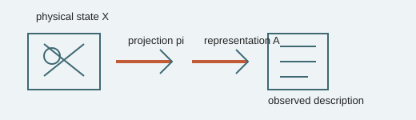

# Analogy A017 — Observer / Cinema / Audience (reality vs. representation)

**Mythological/philosophical source:** Framed via the cinema/audience metaphor and connected in the
source chats to Indian philosophical framings of the observer/witness (sākṣī) as distinct from
what is observed — the idea that observation and representation are not identical to the
underlying reality being observed.
**Modern domain:** physics/philosophy of physics (measurement, observer-dependence, reconstruction)
**📌 Status:** RECONSTRUCTION FRAMEWORK (distinct from, but related to, A003)

**Prior-project source:** \(indian-mythology-modern-science/research/ANALOGY_{MAP}.md\) ("Observer/
cinema/audience"); \(research/MATHEMATICAL_{MODELS}.md\) (\(X \rightarrow \pi(X) \rightarrow A(\pi(X))\));
\(research/FAILED_{AND}_ABANDONED_PATHS.md\) ("Observer creates physical reality").

*Conceptual schematic: the observer receives a representation; observation is not treated as creation of reality.*

> **🟠 Framework sticker:** The state-to-projection-to-representation distinction is useful, but observer creation of reality is rejected.

## 📖 The story / incident

An audience watching a film experiences a representation (the projected film) of events that were
recorded elsewhere; the audience's experience is not identical to, and does not create, the
original filmed events. This was used as a philosophical frame distinguishing a physical event from
an observer's representation of it.

## 🗺️ The mapping

| Cinema/audience element | Mapped concept |
|---|---|
| Filmed event | The underlying physical state `X` |
| Projection/reconstruction (\(\pi\)) | An observer's accessible projection of that state |
| Audience's interpretation (`A`) | A further representation/interpretation built on the projection |
| Audience does not create the filmed event | The observer does not create physical reality by observing it |

## 💡 Why this analogy was proposed

To separate three distinct stages explicitly — the physical event, the observer's accessible
projection, and the observer's representation — after noticing that "observer/audience" language
was being used ambiguously elsewhere in the research (risking the claim that observation creates
reality).

## ✅ What it helps explain / suggest

- Formalized as the chain \(X \rightarrow \pi(X) \rightarrow A(\pi(X))\) (state → projection → representation) in the
  branch-audit reconstruction (\(research/MATHEMATICAL_{MODELS}.md\)).
- Provided the basis for distinguishing physical interaction from observational readout
  (\(research/FAILED_{AND}_ABANDONED_PATHS.md\): "\(X \rightarrow \pi(X) \rightarrow A(\pi(X))\) distinction" is what survived).

## ⚠️ What it does NOT explain

- "Observer creates physical reality" was explicitly tested against this framework and found
  unsupported: "Not supported; physical interaction must be separated from readout"
  (\(research/FAILED_{AND}_ABANDONED_PATHS.md\)).
- It does not imply that VCR-style sequential coverage (A003) creates time; that specific claim is
  separately and explicitly rejected.

## 🧪 Testable component

The formal three-stage chain \(X \rightarrow \pi(X) \rightarrow A(\pi(X))\) is a testable structural model for observer maps
and coarse-graining, independent of the cinema framing (see also A009's hidden-state model).

## 🪞 Non-testable / metaphorical component

The audience/cinema framing itself, and any implied connection to consciousness "creating" observed
phenomena.

## 🔬 Known-science connection

Aligns with the standard measurement-theory distinction between a physical state and an observer's
description of it; does not introduce a new physical mechanism beyond this established distinction.

## 📚 Used by (lines of thought)

- [Line-Of-Thoughts/L001_ordered_coverage_observer_time.md](../Line-Of-Thoughts/L001_ordered_coverage_observer_time.md)
