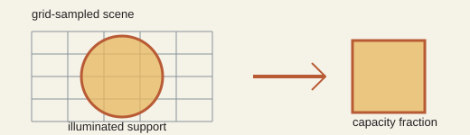

# Analogy A019 — Observation / Illumination as Observable Capacity

**Conceptual source:** The idea that what is "illuminated"/observed is only a fraction of an
underlying scene or state — connected in the source projects to the same
observer/access/witness framing used elsewhere (A017), here formalized quantitatively as V2's
illumination/observable-capacity experiment.
**Modern domain:** physics (observation, measurement, geometric capacity)
**📌 Status:** PASS (as a numerical convergence pretest only) — not evidence of new physics

**Prior-project source:**
`indian-philosophy-modern-physics/V2/RESEARCH_GRAPH.md`, sections 3 (A7 "Observation/
illumination") and 10 (V2.6 "Illumination / Observable Capacity");
`V2/experiments/V2.6-illumination-observable-capacity/`.

*Conceptual schematic: occupancy estimates an observable fraction; it does not establish a physical scale.*

> **🟢 Pretest sticker:** Grid occupancy converges numerically within the toy model; no absolute physical scale follows.

## 📖 The story / incident

Not a mythological story on its own; it formalizes the general observer/witness framing (shared
with A017) as: an underlying state has an index/access mechanism; a projection/measurement reveals
only the "illuminated"/accessible fraction of it as an observable.

## 🗺️ The mapping

| Illumination element | Mapped concept |
|---|---|
| Underlying scene/state | Full state to be (partially) observed |
| Illuminated/circular region | The accessible/observed fraction |
| Grid resolution | Sampling density of the observation |
| Occupancy fraction | Dimensionless observable-capacity quantity |

## 💡 Why this analogy was proposed

To test whether an "illuminated fraction of a scene" converges, under increasing sampling
resolution, to a well-defined dimensionless capacity quantity — a numerical pretest step before
asking whether such a capacity could carry physical content (V2 A7/V2.6).

## ✅ What it helps explain / suggest

- A normalized 2D scene with a circular illuminated region of radius `0.2` has exact area
  `C_A = π(0.2)² ≈ 0.1256637061`.
- Measured grid occupancy converged toward this value with increasing resolution: `0.1171875`
  (32×32), `0.1220703125` (64×64), `0.12353515625` (128×128), `0.1248779296875` (256×256),
  `0.1251220703125` (512×512) — at 512×512 the absolute error was ≈ `5.42×10⁻⁴` (relative ≈
  `0.43%`) (`V2/RESEARCH_GRAPH.md`, section 10).
- A packetization null test (same illumination distribution under different event/photon
  packetization) gave the same support/capacity apart from threshold/statistical effects
  (section 10).
- This result later fed into the cross-analogy convergence audit (V2.9) and the common
  transition/state invariant (V2.10) alongside the VCR (A003) and GW→EM (A004/A001) branches.

## ⚠️ What it does NOT explain

Explicitly **not established** by this pretest: an absolute physical area in m², an absolute
spatial scale, a "metre from photon count," physical time, a new photon law, or emergent spacetime
(`V2/RESEARCH_GRAPH.md`, section 10, "Not established" list). The result is a numerical
convergence pretest only.

## 🧪 Testable component

The occupancy-fraction convergence test itself, and its role as one of (at least) three branches
required for the "strong convergence criterion" (same invariant arising independently in three or
more branches) used in V2.9/V2.10.

## 🪞 Non-testable / metaphorical component

The general "illumination reveals only part of reality" framing, prior to its quantitative
formalization.

## 🔬 Known-science connection

Grid-occupancy convergence to a geometric area is elementary numerical geometry/measure theory;
the result is not new mathematics or physics by itself (`V2/RESEARCH_GRAPH.md`, section 10).

## 📚 Used by (lines of thought)

- [Line-Of-Thoughts/L003_coupled_oscillator_cosmic_mechanism.md](../Line-Of-Thoughts/L003_coupled_oscillator_cosmic_mechanism.md) — as one of the three convergence-audit branches (VCR, GW→EM, illumination).
