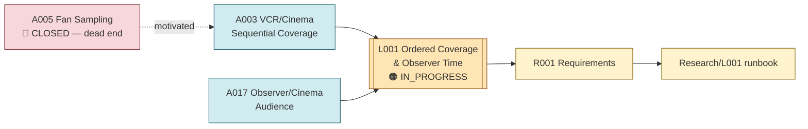

# Line of Thought L001 — Ordered Coverage and Observer Time

**Status:** IN_PROGRESS
**Domain:** physics (foundations of time, observation/reconstruction)

## Goal

Determine whether an observer's *sequential, ordered* access to spatially distributed information
(rather than instantaneous total access) can yield an operational, physically meaningful notion of
time — or whether it only ever produces a reconstruction convention with no independent physical
content.
## Flow diagram

## Analogies used

- [Analogies/A003_vcr_cinema_sequential_coverage.md](../Analogies/A003_vcr_cinema_sequential_coverage.md) — the core mechanism: sampling head, trajectory, coverage, ordering, reconstruction.
- [Analogies/A017_observer_cinema_audience.md](../Analogies/A017_observer_cinema_audience.md) — the observer/state/representation separation (\(X \rightarrow \pi(X) \rightarrow A(\pi(X))\)) needed to avoid conflating observation with physical creation of reality.
- [Analogies/A005_fan_sampling.md](../Analogies/A005_fan_sampling.md) — historical, closed precursor: the original (failed) attempt to derive an invariant speed from a sampling artifact. Retained as a documented dead end that motivated the more careful VCR formulation.

## Why these analogies were combined

The fan/sampling analogy (A005) first raised the question of whether an observer-sampling process
could generate a physically invariant quantity, but was closed because the microscopic rate and
sampling frequency have incompatible dimensions. The VCR/cinema analogy (A003) reopened the same
underlying question in a more disciplined form by explicitly separating *coverage* (the sample set)
from *ordering* (the sequence in which samples are acquired) — two observables that do not have to
carry the same information. The observer/audience analogy (A017) supplies the guard-rail needed to
keep this line from sliding into "observation creates physical reality": any candidate time-like
quantity must be an independently specified, reparameterization-invariant physical quantity, not a
relabeled scan parameter.

## Requirements

- [Requirements/R001_ordered_coverage_observer_time.md](../Requirements/R001_ordered_coverage_observer_time.md)

## Research

- [Research/L001_ordered_coverage_observer_time/runbook.md](../Research/L001_ordered_coverage_observer_time/runbook.md)

## Current status detail

**From `indian-philosophy-modern-physics/V2` (the most advanced work on this line):**

- Core question on record (\(V2/RESEARCH_{STATE}.md\)): "Can any of our original analogies provide a
  mathematically consistent and physically testable route toward quantum gravity and the
  relationship between gravity and the Standard Model?" — approached here specifically through the
  VCR/ordered-coverage mechanism.
- Starting result (\(V2/RESEARCH_{STATE}.md\), V2.1): a synthetic spatial-field test showed that
  changing the acquisition order changes the ordered record, while the reconstructed static
  spatial field is unchanged once spatial coordinates are restored. This establishes only a
  distinction between acquisition ordering and spatial reconstruction — **it does not establish
  physical time**.
- Explicit next test on record: introduce a physical propagation constraint and test
  reparameterization invariance, causal ordering, and whether any resulting quantity is an
  independently measurable invariant rather than a coordinate convention (\(V2/RESEARCH_{STATE}.md\)).
- A longer sequence of experiments exists under `V2/experiments/` extending this question,
  including `V2.1-vcr-ordered-coverage`, `V2.2-ramanujan-vcr-discrimination`,
  `V2.3-vcr-grinder-propagation`, `V2.4-time-free-relational-separation`,
  `V2.5-capacity-to-physical-scale`, `V2.6-illumination-observable-capacity`,
  `V2.7-gravitational-wave-em-coupling`, `V2.8-gw-em-polarization-invariant`,
  `V2.9-convergence-audit`, `V2.10-common-transition-invariant`,
  `V2.11-ramanujan-modular-discriminator` / `V2.11-ramanujan-modular-transition-invariant`,
  `V2.12-branch-native-ramanujan-test`, `V2.13-ramanujan-transition-invariant`,
  `V2.14-cross-level-round-robin-01`, `V2.15-cross-level-round-robin-02`, and
  `V2.16-relational-action-gate`. Per \(V2/CLAIMS_{STATUS}.md\), **no new physical claims have been
  established in V2 yet** — every claim from these experiments still requires being linked to a
  specific analogy component and to the tests that support or reject it before being cited as a
  result here.
- From the mythology-chat reconstruction (`indian-mythology-modern-science/research/
  S_INFINITY_B_INFINITY/experiments/E002_ordered_coverage_effective_time.md`): an ordered-coverage
  reconstruction attempt reported a partial/negative correlation result (\(\rho \approx -0.029\)), historical
  and requiring reproduction (\(research/REPRODUCTION_{QUEUE}.md\), R002).
- The explicit required boundary from A003 remains binding: do not assign the traversal/scan
  parameter `s = t` and then treat the outcome as emergent time.
- The newer S∞↔B∞ branch adds a second boundary: a stable frame ratio
  \(c_F=\Delta L/\Delta\tau\) is not physical time or invariant speed merely because it is
  numerically constant in a constructed toy model. It must emerge from a metric-free relational
  network and survive matched-scaling, shuffled, and null controls ([CHAT_0197](../../indian-philosophy-modern-physics/V3/chat_records/CHAT_0197_pga-i-think-the-frame-speed-test-gives-us-a-very-important-correction.md),
  [CHAT_0203](../../indian-philosophy-modern-physics/V3/chat_records/CHAT_0203_pga-lets-run-the-minimal-frame-speed-emergence-test-without-putting-eq-c-a-metric-or-physica.md)).

## What this line of thought must NOT claim

- "Ordered coverage/reconstruction has produced physical time" — not supported by any source
  material reviewed so far.
- "The VCR/cinema analogy proves observation creates reality" — explicitly rejected
  (\(indian-mythology-modern-science/research/FAILED_{AND}_ABANDONED_PATHS.md\): "Observer creates
  physical reality").
- Any specific numeric result from the `V2.*` experiment folders should not be quoted here as
  established until each has been individually reviewed against \(V2/CLAIMS_{STATUS}.md\) and
  \(V2/RESEARCH_{LOG}.md\) (not yet done as part of this Phase 2 reconstruction).
