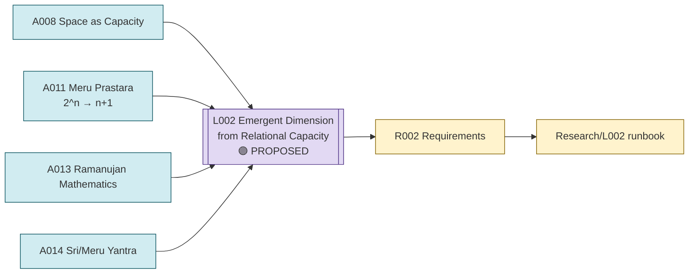

# Line of Thought L002 — Emergent Dimension from Relational Capacity

**Status:** PROPOSED
**Domain:** physics / mathematics (emergent geometry, combinatorics)

## Goal

Determine whether physical spatial dimension/geometry can be derived from a relational
"capacity" or combinatorial counting structure — rather than assumed as a primitive background —
using Indian combinatorial and modular-mathematics tools (Meru Prastara, Ramanujan/theta
structure) as the candidate counting mechanisms, and Sri/Meru Yantra as a candidate geometric
target.

## Flow diagram

## Analogies used

- [Analogies/A008_space_as_capacity.md](../Analogies/A008_space_as_capacity.md) — the core reframing: space as an accommodation/capacity principle rather than a pre-existing container.
- [Analogies/A011_meru_prastara.md](../Analogies/A011_meru_prastara.md) — an exact, established combinatorial compression mechanism (\(2^n \rightarrow n+1\) classes) proposed as a coarse-graining/counting law.
- [Analogies/A013_ramanujan_mathematics.md](../Analogies/A013_ramanujan_mathematics.md) — partition functions, theta functions, and modular structure proposed as tools for building/constraining a capacity-counting quantity.
- [Analogies/A014_sri_meru_yantra.md](../Analogies/A014_sri_meru_yantra.md) — a specific, highly symmetric traditional geometry proposed as a possible characterization target for whatever information-organization principle emerges.

## Why these analogies were combined

A008 supplies the guiding question (dimension as an emergent count of accommodated relations, not
a given). A011 supplies an exact, pre-existing Indian combinatorial device that already performs a
count-based compression from many microstates to few classes, making it a natural first candidate
mechanism to test. A013 supplies the more general mathematical toolkit (partitions, theta/modular
forms) that the source projects repeatedly used when trying to go beyond simple binomial counting
toward richer, potentially physically distinctive counting laws — and A013 also records the
existing discipline (established mathematics ≠ new physics) needed to keep this line honest. A014
was proposed as a candidate concrete geometric object whose information content a successful
capacity/counting law might need to reproduce or characterize.

## Requirements

- [Requirements/R002_emergent_dimension_relational_capacity.md](../Requirements/R002_emergent_dimension_relational_capacity.md)

## Research

- [Research/L002_emergent_dimension_relational_capacity/runbook.md](../Research/L002_emergent_dimension_relational_capacity/runbook.md)

## Current status detail

- "Physical spatial dimensions can emerge from state-space capacity/relations" is recorded as
  **OPEN**, with a conceptual principle but **no mathematical derivation yet**
  (\(indian-philosophy-modern-physics/V1/CLAIMS_{STATUS}.md\), C10).
- The Meru Prastara compression is an **exact, established** combinatorial identity
  (\(2^n\) histories → `n+1` classes), but using it to claim a physical dimensional origin remains
  unestablished (\(indian-mythology-modern-science/research/ANALOGY_{MAP}.md\),
  \(research/REPRODUCTION_{QUEUE}.md\) R005/R006).
- Ramanujan/theta/modular mathematics is explicitly recorded as a **mathematical tool**, not a
  source of physical prediction: "This is a mathematical-use claim, not a claim that Ramanujan
  predicted the theory" (\(V1/CLAIMS_{STATUS}.md\), C12).
- The Sri/Meru Yantra geometric-characterization task was **proposed, not completed**, in the
  source chats (`shared/test/PGA-8D.md`).
- V2's parallel "A6 Space = capacity / accommodation" branch records the same open status:
  "conceptual candidate; no independent numerical result yet"
  (`V2/analogies/V2.2-Ramanujan-three-branch-decomposition.md`).

## What this line of thought must NOT claim

- That the Meru Prastara count, by itself, explains why space has 3 dimensions.
- That any theta/modular identity constitutes new physics rather than an application of
  established mathematics (\(V1/CLAIMS_{STATUS}.md\), C16).
- That the Sri/Meru Yantra has been shown to correspond to any physical field or geometry — this
  has not been attempted yet in the reviewed source material.
