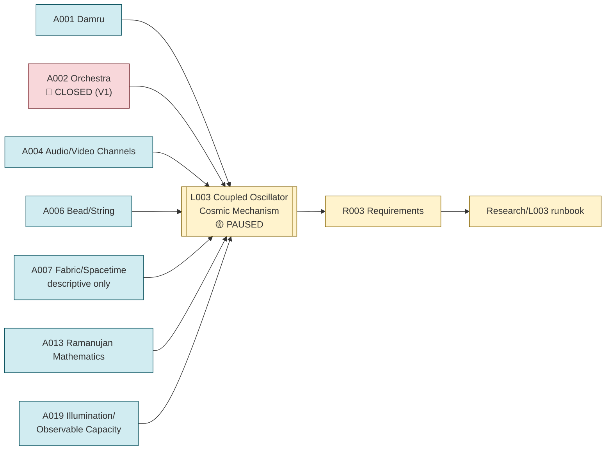

# Line of Thought L003 — Damru as Cosmic Phenomenon (Coupled Oscillator / GW–EM / Ramanujan Transition Line)

**Status:** PAUSED — FROZEN AT A DEFINED BOUNDARY (V2.13 designed, not executed); the *literal
new-mechanism* claim was separately CLOSED in V1
**Domain:** physics (coupled oscillators, curvature response, radiation, gravitational-wave/
electromagnetic coupling)

## Goal

Determine whether the Damru — treated not just as a mechanical toy but as a "cosmic" two-sided
oscillating/coupling phenomenon — connects, through a rigorous decomposition, to real physical
coupling between gravitational and electromagnetic sectors, and whether a Ramanujan/theta-derived
invariant can discriminate this coupling from generic mathematical alternatives. This line is
**more advanced and currently paused (not closed)** — correcting an earlier version of this
document that conflated it with V1's narrower, already-closed literal-mechanism claim.

## Flow diagram

## Analogies used

- [Analogies/A001_damru.md](../Analogies/A001_damru.md) — the primary mechanism candidate: two coupled lobes joined by a waist, driven by rhythmic oscillation, radiating into a surrounding field ("Cosmic Damru" in V2).
- [Analogies/A002_orchestra.md](../Analogies/A002_orchestra.md) — the coherence/constraint framing applied to coupled degrees of freedom (V1 only; closed).
- [Analogies/A004_audio_video_channels.md](../Analogies/A004_audio_video_channels.md) — the gravitational-wave/electromagnetic complementary-channel framing that V2 formalized into an actual GW→EM coupling test.
- [Analogies/A006_bead_string.md](../Analogies/A006_bead_string.md) — the localized-excitation-on-an-extended-structure picture used in the coupled substrate/lattice toy models.
- [Analogies/A007_fabric_spacetime.md](../Analogies/A007_fabric_spacetime.md) — descriptive language only, used to discuss backreaction/geometry; not independently testable.
- [Analogies/A013_ramanujan_mathematics.md](../Analogies/A013_ramanujan_mathematics.md) — theta/modular structure used as a candidate discriminator for whatever invariant this line converges on.
- [Analogies/A019_illumination_observable_capacity.md](../Analogies/A019_illumination_observable_capacity.md) — a second, independent branch (V2.6) used in the same convergence audit as the Damru/GW branch.

## Why these analogies were combined

V1 first tested Damru (A001) and Orchestra (A002) as literal new-mechanism claims and closed both
(see "V1 boundary" below). V2 *did not stop there*: it reopened Damru specifically as "A3 Cosmic
Damru" — lobes/membranes as spacetime, localized striker/particle, repeated interaction,
curvature/field response, propagating disturbance, light/photon as the intended observable output
— and pushed it through a disciplined pipeline alongside the audio/video-derived GW→EM analogy
(A004) and the illumination/capacity analogy (A019), explicitly to test for a **common
mathematical invariant across independent branches** (VCR ordering, GW→EM transition, and
illumination capacity), with Ramanujan/theta mathematics (A013) brought in as a candidate
discriminator once a common invariant was found. Bead/string (A006) and fabric/spacetime (A007)
remain supporting/descriptive analogies for the underlying coupled-substrate toy models, as in the
earlier version of this line.

## Requirements

- [Requirements/R003_coupled_oscillator_cosmic_mechanism.md](../Requirements/R003_coupled_oscillator_cosmic_mechanism.md)

## Research

- [Research/L003_coupled_oscillator_cosmic_mechanism/runbook.md](../Research/L003_coupled_oscillator_cosmic_mechanism/runbook.md)

## Current status detail

### V1 boundary (literal mechanism — CLOSED, and this closure stands)

- "Damru analogy supplies a new physical coupling mechanism" — **REJECTED**
  (\(indian-philosophy-modern-physics/V1/CLAIMS_{STATUS}.md\), C13); "Orchestra analogy supplies a new
  physical mechanism of coherence/constraint" — **REJECTED** (C14). Both retained only as
  analogy/explanatory metaphor (`V1/DECISIONS.md`, [A] and [B]).
- The mythology-chat reconstruction independently reports the same conclusion: coherent
  oscillation did not naturally transfer energy into the gravitational/tensor sector
  (\(indian-mythology-modern-science/research/FAILED_{AND}_ABANDONED_PATHS.md\), "Damru rhythm →
  gravity" — closed; "Collective coherence lens" is what survived).
- Reproduction status: the historical coupled-chain acoustic-like branch and mismatch-induced gap
  result requires full reproduction of lattice equations, parameters, boundary conditions, and
  spectra (\(research/REPRODUCTION_{QUEUE}.md\), R007).

### V2 "Cosmic Damru → GW/EM → Ramanujan" thread (PAUSED, not closed)

This is a substantially more developed sequence than the V1 result above, recorded in
\(indian-philosophy-modern-physics/V2/RESEARCH_{GRAPH}.md\) (the canonical V2 project-memory file):

- **V2.7 — GW→EM coupling:** decomposed as `source dynamics → GW perturbation → changing spacetime
  geometry → EM field/charged medium/magnetic field interaction → EM excitation/mode conversion →
  photons/EM spectrum`. Existing-physics audit found GW→EM conversion is already established
  theoretical physics in suitable environments (e.g. inverse Gertsenshtein-type, resonant
  conversion), so conversion itself is **not novel**. A reduced coupling \(A_{EM} \propto \kappa B L A_{GW}\) gives
  \(\omega_{EM} = \omega_{GW}\) for the simplest stationary linear case. **Decision: 🟢 known-physics bridge; no
  novel law established.**
- **V2.8 — GW/EM polarization invariant pretest:** a toy rotation of `(h_+, h_×) = (0.8, 0.6)`
  gives \(E_{x}² + E_{y}² = 1\) to within ≈ \(2.22×10⁻¹⁶\) — an ordinary rotational norm-preservation
  identity, **explicitly not new physics**.
- **V2.9 — Cross-analogy convergence audit:** asked whether the same invariant/mathematical object
  arises independently in at least three branches (VCR/A003, GW→EM/this line, illumination/A019).
  Conceptual convergence on `RELATIONAL STATE → PHYSICAL TRANSITION → OBSERVABLE STATE`: **yes**;
  mathematical invariant convergence: **not yet at that stage**; new-physics convergence: **not
  established**.
- **V2.10 — Common transition/state invariant:** using Fubini–Study fidelity
  \(F(S_{i},S_{j}) = |⟨S_{i},S_{j}⟩|²/(⟨S_{i},S_{i}⟩⟨S_{j},S_{j}⟩)\), numerical values were obtained for VCR
  (\(F \approx 0.7057743527816723\), \(d_{FS} \approx 0.5733218162216637\)), GW→EM (\(F \approx 0.869234279364794\),
  \(d_{FS} \approx 0.370000000000000\)), and photon/illumination (\(F \approx 0.9564415725333592\),
  \(d_{FS} \approx 0.21025220579102855\)), surviving representation/packetization null tests. **Decision: 🟢
  a common mathematical object (Fubini–Study/projective fidelity) was established across the three
  branches — but this is established mathematics, not new mathematics or new physics.**
- **V2.11 — Ramanujan/theta modular discriminator:** a quadratic theta family
  \(Theta_{2}(\beta) = √(\pi/\beta) \cdot Theta_{2}(\pi²/\beta)\) held to a residual ≈ \(2.22×10⁻¹⁶\) (p=2), versus much larger
  residuals for p=1, 3, 4 (up to ≈ 2.57, 0.314, 0.427 respectively). **Decision: 🟢 genuine
  mathematical theta/modular discriminator — physical relevance still OPEN.**
- **V2.12 — Branch-native Ramanujan/theta test:** applying the same theta-residual test using each
  branch's own mode weights (VCR, GW→EM, photon/illumination) gave large, non-vanishing residuals
  (≈ 0.278, 0.329, 0.559 respectively), and independent per-branch beta-fitting or branch-specific
  coefficients were explicitly rejected as ways to force a fit. **Decision: 🔴 FAIL — naive
  universal theta encoding does not work.** This failure is treated as informative: it rules out
  circular pattern-matching and identifies the missing ingredient (a physically grounded rule for
  building q-series structure from each branch, not an arbitrary fit).
- **V2.13 — Ramanujan E2/E4/E6 transition-invariant test:** a fully designed next test (using the
  Ramanujan differential system \(q dE2/dq = (E2²−E4)/12\), \(q dE4/dq = (E2E4−E6)/3\),
  \(q dE6/dq = (E2E6−E4²)/2\)) asking whether a single, unmodified, dimensionless transition
  invariant satisfies this closure across at least three branches without fitted transformations
  or branch-specific rules. **This test was designed but explicitly NOT executed.**
- **Project pause:** V2 records an explicit, deliberate pause after V2.13's design, for reasons
  unrelated to a scientific dead end (the researcher paused to work on an unrelated Electric
  Airborne Vehicle project) — \(V2/RESEARCH_{GRAPH}.md\), sections 17 and 21: "PROJECT PAUSED... this
  is a deliberate pause, not closure... When resumed, preserve all history and negative results.
  Start at V2.13."

## What this line of thought must NOT claim

- That Damru or Orchestra supply any new physical mechanism of coupling, curvature, or coherence in
  the literal V1 sense — this remains explicitly rejected.
- That GW→EM conversion itself, or the Fubini–Study convergence result (V2.10), constitute new
  physics — both are explicitly established/known-mathematics results, not novel findings.
- That V2.13 has been run, or that its outcome (if any) is known — it is designed only; treat as
  \(NOT_{EXECUTED}\), never as a result.
- That this line has been closed — the correct status is **PAUSED**, with an explicit, documented
  resume point (V2.13) and a preserved history of one negative result (V2.12) along the way.

