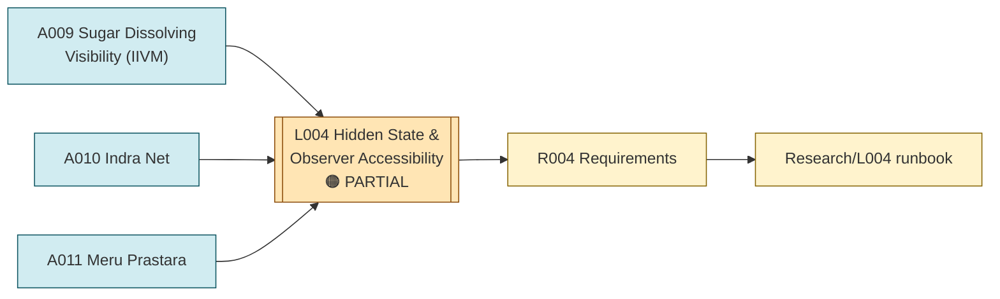

# Line of Thought L004 — Hidden State, Visibility, and Observer Accessibility

**Status:** PARTIAL — toy models completed, results require reproduction
**Domain:** physics / information theory (coarse-graining, hidden state, entropy)

## Goal

Characterize how an observer's accessible description of a system relates to its total underlying
state — specifically, whether coarse-graining/limited accessibility alone can account for
phenomena such as an effective arrow of time, using recursive relational propagation as a
supporting mechanism.

## Flow diagram

## Analogies used

- [Analogies/A009_sugar_dissolving_visibility.md](../Analogies/A009_sugar_dissolving_visibility.md) — the seed analogy and toy model (IIVM): a system's substance can persist while becoming unobservable at a given scale.
- [Analogies/A010_indra_net.md](../Analogies/A010_indra_net.md) — extends the same visibility question to a relational network, asking how a local perturbation propagates and reflects through mutual relations.
- [Analogies/A011_meru_prastara.md](../Analogies/A011_meru_prastara.md) — reused here (also in L002) as the specific combinatorial coarse-graining mechanism applied to the IIVM hidden-state model.

## Why these analogies were combined

The sugar/water analogy (A009) directly motivated the IIVM (Interacting Infinities & Visibility
Model) numerical toy tests distinguishing an observer's accessible description from the total
state. The Indra-Net analogy (A010) was introduced as a follow-on test of how a local perturbation
propagates recursively through a relational network — a natural extension once a hidden/visible
split had been established. Meru Prastara (A011) supplied the specific combinatorial compression
law used to move between the hidden and accessible descriptions in the IIVM tests
(`PGA-IIVM-6`, `IIVM-7`).

## Requirements

- [Requirements/R004_hidden_state_observer_accessibility.md](../Requirements/R004_hidden_state_observer_accessibility.md)

## Research

- [Research/L004_hidden_state_observer_accessibility/runbook.md](../Research/L004_hidden_state_observer_accessibility/runbook.md)

## Current status detail

- A reversible, finite hidden-state toy model (\(|\Omega| = 65,536\), 8-bit projection) reported observer
  entropy rising to about 7.18 bits after mixing, then fluctuating and reversing under inverse
  dynamics — a **historical reported result requiring reproduction**
  (\(indian-mythology-modern-science/research/REPRODUCTION_{QUEUE}.md\), R003).
- Observer capacities of 4, 8, and 12 bits reportedly produced different effective descriptions
  under the same underlying microtrajectory — also requiring reproduction (R004 in the
  reproduction queue).
- Explicit conclusion already reached and preserved: "The IIVM doesn't prove any of this physics"
  (source chat, reflected in `shared/test/` IIVM entries); coarse-graining alone was found **not**
  to produce a fundamental, monotonic arrow of time — entropy fluctuated and reversed under the
  inverse dynamics test (\(research/FAILED_{AND}_ABANDONED_PATHS.md\), "Coarse-graining alone →
  fundamental time arrow").
- The Indra-Net local-perturbation-propagation test (`PGA-IIVM-5`) remains a **historical toy
  analogy** with no independent physical-network evidence established
  (\(research/ANALOGY_{MAP}.md\)).

## What this line of thought must NOT claim

- That observer accessibility/coarse-graining, by itself, creates a fundamental arrow of time —
  explicitly rejected by the reversible finite-state test's own reversal behavior.
- That the Indra-Net toy propagation model constitutes evidence for a physical relational network
  in nature.
- Any of the specific numeric results above beyond "historical reported result — reproduction
  required" until independently rerun.
