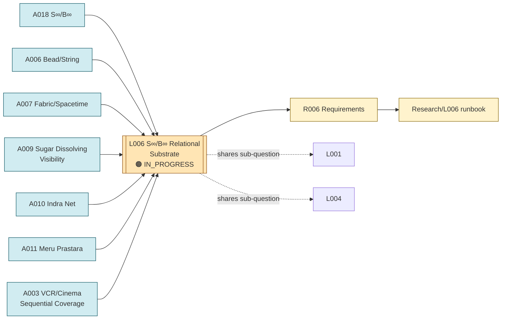

# Line of Thought L006 — S∞/B∞ Relational Substrate

**Status:** IN_PROGRESS — the most prominent/most developed line in the
`indian-mythology-modern-science` chat-archive reconstruction; several sub-questions (ordered
coverage, hidden state) are shared with L001 and L004 rather than being fully separate
**Domain:** physics (relational substrate, emergent geometry, persistence, observer reconstruction)

## Goal

Determine whether observable geometry, dynamics, persistent particle-like manifestations, and
(eventually) gravity can be understood as arising from a relational structure connecting a
small/localized process (S∞) to a larger background/relational context (B∞), while remaining
compatible with established physics — and to keep the layers of this hypothesis (substrate,
manifestation, information, observation) explicitly distinct rather than collapsed into one claim.

## Flow diagram

## Analogies used

- [Analogies/A018_s_infinity_b_infinity.md](../Analogies/A018_s_infinity_b_infinity.md) — the core hypothesis-pair and its accessibility hierarchy \(\Omega_{total} \supset \Omega_{accessible} \supset \Omega_{observed} \supset \Omega_{represented}\).
- [Analogies/A006_bead_string.md](../Analogies/A006_bead_string.md) — localized excitation (S∞) on an extended relational structure (B∞).
- [Analogies/A007_fabric_spacetime.md](../Analogies/A007_fabric_spacetime.md) — descriptive language for backreaction/geometry within the substrate.
- [Analogies/A009_sugar_dissolving_visibility.md](../Analogies/A009_sugar_dissolving_visibility.md) — the hidden-state/visibility sub-question within the accessibility hierarchy.
- [Analogies/A010_indra_net.md](../Analogies/A010_indra_net.md) — relational propagation of a local perturbation through the substrate.
- [Analogies/A011_meru_prastara.md](../Analogies/A011_meru_prastara.md) — the combinatorial coarse-graining mechanism connecting the total state space to accessible/observed classes.
- [Analogies/A003_vcr_cinema_sequential_coverage.md](../Analogies/A003_vcr_cinema_sequential_coverage.md) — the ordered-coverage/observer-reconstruction sub-question, shared with L001.

## Why these analogies were combined

S∞/B∞ (A018) is the umbrella hypothesis under which the mythology-chat archive organized nearly
all of its other analogies: bead/string (A006) and fabric (A007) supply the substrate/manifestation
picture; sugar/water (A009), Indra-Net (A010), and Meru Prastara (A011) supply the
accessibility/coarse-graining layer (\(\Omega_{total} \supset \Omega_{accessible} \supset ...\)); and VCR/ordered-coverage
(A003) supplies the observer-reconstruction/temporal-ordering layer. These were historically
explored together as different facets of the same S∞/B∞ question, which is why this line
cross-references L001 and L004 rather than duplicating their content.

## Relationship to other lines of thought

- **L001 (Ordered Coverage and Observer Time)** is the temporal-ordering sub-question of S∞/B∞,
  tested concretely via the E002 ordered-coverage experiment. Do not merge L001 into L006 or vice
  versa — the source material explores ordered coverage both as a general VCR mechanism (A003, in
  V2) and as a specific S∞/B∞ sub-test (in the mythology-chat archive); keep both entry points
  documented.
- **L004 (Hidden State, Visibility, and Observer Accessibility)** is the accessibility sub-question
  of S∞/B∞, sharing analogies A009, A010, and A011. Retained as a separate line because it was
  explored as its own IIVM toy-model track before being folded back into the broader S∞/B∞
  accessibility hierarchy.
- **L002 (Emergent Dimension from Relational Capacity)** shares the "geometry from relations"
  question but approaches it through Meru Prastara/Ramanujan/Yantra counting mechanisms (V2's "A6
  space as capacity" framing) rather than through the S∞/B∞ observer-reconstruction framing. Kept
  separate per the project rule against forcing convergence between independently-explored lines.

## Requirements

- [Requirements/R006_s_infinity_b_infinity_relational_substrate.md](../Requirements/R006_s_infinity_b_infinity_relational_substrate.md)

## Research

- [Research/L006_s_infinity_b_infinity_relational_substrate/runbook.md](../Research/L006_s_infinity_b_infinity_relational_substrate/runbook.md)

## Current status detail

Following \(indian-mythology-modern-science/research/S_{INFINITY}_B_INFINITY/HISTORY.md\) and
\(experiments/E001_s_infinity_b_infinity_origin.md\):

- **Origin:** motivated by a broader physics gap — whether an underlying structure could account
  for observable geometry, dynamics, persistent particle-like manifestations, physical quantities,
  and ultimately gravity while remaining compatible with established physics (E001, section 1).
- **Relational connectivity and dimensionality:** random/self-organizing relational networks did
  **not** robustly produce stable 3D geometry without additional assumptions or observer
  reconstruction (E001, section 4.1). *Lesson:* relational connectivity alone does not establish
  emergent 3D geometry.
- **Propagating localized excitations:** obtained in some nonlinear lattice/wave models, but
  localization/persistence was generally lost without an additional stabilizing mechanism (E001,
  section 4.2).
- **Coupled channels and normal modes:** a simple two-channel model produced one massless and one
  massive normal mode — a familiar consequence of coupled-field dynamics, not evidence for S∞/B∞
  itself (E001, section 4.3).
- **Observer reconstruction:** an early result reporting a pairwise-distance correlation
  \(\rho \approx 0.9966\) was later found unreliable because a spatial landmark configuration had already been
  supplied — it did **not** demonstrate that time generates space (E001, section 4.4).
- **Topological persistence:** known configurations such as the φ⁴ kink show persistence can arise
  from topology — an established field-theory mechanism, not evidence for S∞/B∞ (E001, section
  4.5).
- **Accessibility hierarchy:** \(\Omega_{total} \supset \Omega_{accessible} \supset \Omega_{observed} \supset \Omega_{represented}\) is the
  surviving formal structure (E001, section 5; \(research/MATHEMATICAL_{MODELS}.md\)).
- **Ordered-coverage test (E002):** the tested spectral-seriation reconstruction did **not**
  robustly recover the intended cyclic ordering — pairwise circular-distance rank correlation
  \(\rho \approx -0.029\) (effectively no useful recovery) for this configuration
  (\(experiments/E002_ordered_coverage_effective_time.md\)). This is a **negative/methodological**
  result for the tested implementation, not a falsification of the broader hypothesis.
- **Current surviving question (E001, section 7):** "Can an underlying relational/background
  system, through ordered dynamical coverage and observer-accessible channels, produce persistent
  observable manifestations while recovering the required limits of established physics?"

## What this line of thought must NOT claim

- That S∞ and B∞ are established physical entities — they are explicitly working conceptual labels
  (\(research/S_{INFINITY}_B_INFINITY/README.md\)).
- That relational connectivity alone produces 3D geometry, that localized propagation alone
  produces persistent particles, that a two-channel massless/massive mode split is evidence for
  S∞/B∞, or that observer reconstruction proves time generates space — all explicitly closed
  interpretations (E001, section 6).
- That the E002 negative result (\(\rho \approx -0.029\)) shows time cannot emerge, that space is produced by
  time, that S∞/B∞ is falsified, or that observer perception creates physical spacetime (E002,
  "What this does NOT show").
- Any claim of a proven, new, novel, unified, gravitational, or particle theory — none is supported
  by the archive (\(research/S_{INFINITY}_B_INFINITY/README.md\)).
