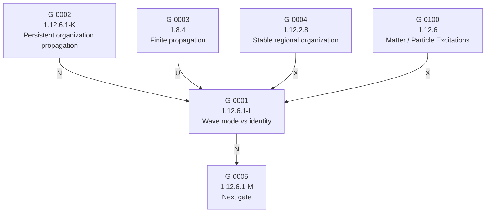

# RSG Bird-Eye Prototype

```mermaid
flowchart TD
    G0100["G-0100<br/>1.12.6<br/>Matter / Particle Excitations"]
    G0002["G-0002<br/>1.12.6.1-K<br/>Persistent organization propagation"]
    G0001["G-0001<br/>1.12.6.1-L<br/>Wave mode vs identity"]
    G0003["G-0003<br/>1.8.4<br/>Finite propagation"]
    G0004["G-0004<br/>1.12.2.8<br/>Stable regional organization"]
    G0005["G-0005<br/>1.12.6.1-M<br/>Next gate"]
    G0002 -->|N| G0001
    G0003 -->|U| G0001
    G0004 -->|X| G0001
    G0001 -->|N| G0005
    G0100 -->|X| G0001
```

Start at G-0001 and follow U, X and N.