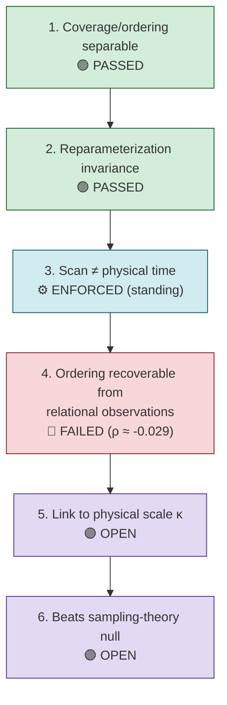

# Requirements R001 — Ordered Coverage and Observer Time

**Line of thought:** [Line-Of-Thoughts/L001_ordered_coverage_observer_time.md](../Line-Of-Thoughts/L001_ordered_coverage_observer_time.md)
**Status:** IN_PROGRESS

For ordered/sequential observation to be shown capable of producing an operational, physically
meaningful notion of time (rather than only a reconstruction convention), the following must hold.

## Flow diagram

## Requirement list

| # | Requirement | Type | Pass/fail condition | Status |
|---|---|---|---|---|
| 1 | Coverage (the sample set) and ordering (the acquisition sequence) must be shown to be mathematically separable observables. | computational | Reconstruction of the static spatial field is invariant to acquisition-order permutation while the ordered record itself changes. | PASSED — V2.1 synthetic-field test: ordered-record relative difference ≈ 1.46 with unchanged static spatial reconstruction (`indian-philosophy-modern-physics/V2/RESEARCH_GRAPH.md`, section 5). |
| 2 | Any candidate time-like quantity must survive reparameterization of the traversal path. | theoretical/computational | A monotonic relabeling of the traversal parameter (e.g. `u → u³`) must leave the candidate invariant numerically unchanged. | PASSED (for relational separation) — V2.4: relabeling produced zero numerical change in Fubini–Study/L2 separations (`V2/RESEARCH_GRAPH.md`, section 8). |
| 3 | The traversal/scan parameter must never be identified with physical time by definition. | theoretical (boundary condition, not a pass/fail test) | Any derivation that sets `s = t` and then reports "emergent time" is automatically rejected regardless of other results. | ENFORCED — required boundary in `Analogies/A003...` (V2.1-VCR.md). |
| 4 | An ordering must be recoverable from relational observations alone, without directly supplying the ordering labels to the reconstruction algorithm, under controlled conditions. | computational | Recovered-ordering correlation with the true generating ordering must exceed a preregistered threshold across shuffled observations, independent random observation maps, multiple noise levels, non-periodic trajectories, and multiple reconstruction methods, compared against a null relational process with no designed temporal sequence. | FAILED (current implementation) — E002 spectral-seriation reconstruction gave `ρ ≈ -0.029` (`indian-mythology-modern-science/research/S_INFINITY_B_INFINITY/experiments/E002_ordered_coverage_effective_time.md`). |
| 5 | Any surviving quantity must be connected to an independently measurable physical scale, not just a dimensionless relational distance. | theoretical/experimental | A physical scale factor (e.g. `κ` in `L = κ·d_FS`) must be independently derived or measured, not fitted after the fact. | OPEN — V2.4 found the scale factor `κ` is missing (`V2/RESEARCH_GRAPH.md`, section 8). |
| 6 | The candidate quantity must be compatible with established physics and yield a genuinely new, falsifiable quantitative prediction, not a relabeling of known sampling/reconstruction theory. | comparative | The result must be shown to differ measurably from what ordinary sampling theory and signal reconstruction already predict (the explicit null hypothesis of this line). | OPEN — null hypothesis not yet rejected (`Analogies/A003...`, V2.1-VCR-hypothesis.md, "Null hypothesis"). |

## Order of attack and reasoning

This follows the order already used historically: (1) separate coverage from ordering before
asking anything about time — a prerequisite, already passed; (2) confirm reparameterization
invariance for whatever candidate distance/invariant is used, otherwise any downstream result is an
artifact of parameterization choice; (3) treat the "no `s=t`" boundary as a standing constraint
checked at every step, not a one-time test; (4) only after (1)–(3), attempt ordering recovery from
relational observations under controls — this is the current bottleneck (requirement 4 failed in
its first implementation and needs the E003-style controls specified in E002's "Required next
test"); (5) once/if an ordering-recovery method passes, attach a physical scale; (6) finally test
against the null hypothesis and existing sampling theory.

## Definition of success for this line of thought

All six requirements above are met, the null hypothesis (requirement 6) is rejected under
controlled, reproducible tests, and the resulting invariant is independently measurable and
distinguishable from ordinary sampling/reconstruction theory.

## Definition of failure / abandonment

If, after implementing the full control battery from E002's "Required next test" across multiple
observation maps, noise levels, and reconstruction methods, no ordering-recovery method exceeds
the preregistered correlation threshold, and no independent scale factor can be derived, this line
should be marked `NEGATIVE` for the "ordered coverage produces physical time" claim, while
retaining the surviving separable-observables result (requirement 1) as valid mathematics.
