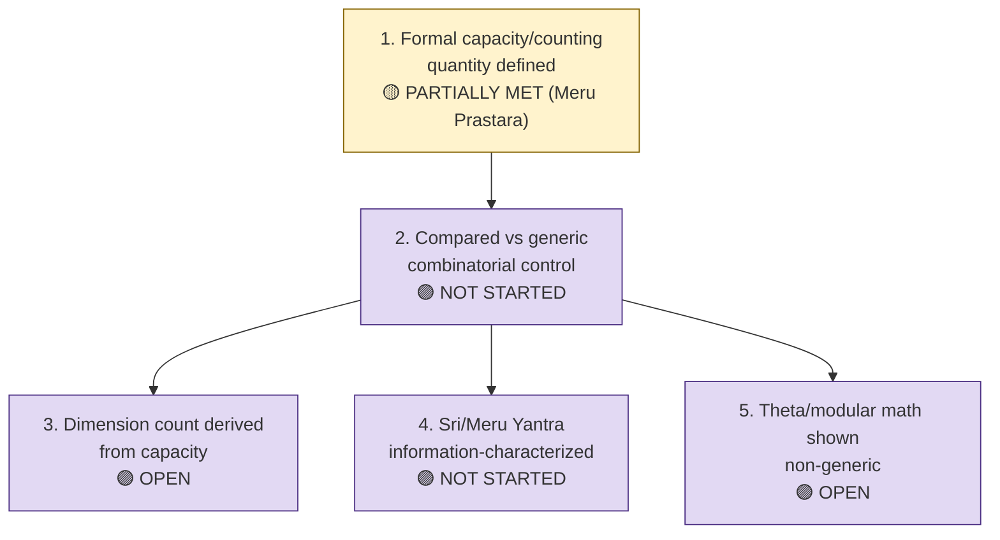

# Requirements R002 — Emergent Dimension from Relational Capacity

**Line of thought:** [Line-Of-Thoughts/L002_emergent_dimension_relational_capacity.md](../Line-Of-Thoughts/L002_emergent_dimension_relational_capacity.md)
**Status:** PROPOSED

For "space as capacity/accommodation" to evolve into a genuine derivation of physical dimension or
geometry, the following must hold.

## Flow diagram

## Requirement list

| # | Requirement | Type | Pass/fail condition | Status |
|---|---|---|---|---|
| 1 | A specific relational "capacity" or state-counting quantity must be formally defined (not just described conceptually). | theoretical | An explicit combinatorial/counting formula exists (e.g. built from Meru Prastara grouping or a Ramanujan/theta generating function) with stated assumptions. | PARTIALLY MET — Meru Prastara supplies an exact `2^n → n+1` grouping identity (`Analogies/A011_meru_prastara.md`); no dimension-emergence formula yet (`indian-philosophy-modern-physics/V1/CLAIMS_STATUS.md`, C10: OPEN). |
| 2 | The counting/capacity quantity must be compared against generic combinatorial growth laws to rule out that any generic count would do just as well. | comparative | The candidate quantity's growth/behavior must differ measurably from a matched generic (non-Ramanujan, non-Meru) combinatorial control under the same construction rule. | NOT STARTED — explicitly required but not yet attempted (`Analogies/A008_space_as_capacity.md`, "Required discrimination"). |
| 3 | A dimensional/geometric quantity (e.g. an effective dimension count) must be derived from the capacity quantity, not assumed. | theoretical/computational | A concrete procedure maps the capacity quantity to a number of independent dimensions/accommodations, and that number is tested against at least one non-trivial case. | OPEN — "conceptual candidate; no independent numerical result yet" (`indian-philosophy-modern-physics/V2/analogies/V2.2-Ramanujan-three-branch-decomposition.md`, "A6"). |
| 4 | If Sri/Meru Yantra geometry is used as a target, its information content/symmetry must be formally characterized. | mathematical | A stated geometric/information-theoretic description of the yantra's triangle arrangement exists and is computed, not merely proposed. | NOT STARTED — recorded only as a proposed task (`shared/test/PGA-8D.md`, referenced in `Analogies/A014_sri_meru_yantra.md`). |
| 5 | Any theta/modular mathematics used must be shown to add a non-generic constraint, not just a re-expression of known combinatorics. | mathematical | The theta/modular-derived quantity must fail to be reproducible by a generic Fourier/polynomial-ordering control under the same test (mirroring the discipline already used in L001/L003). | OPEN, cross-referenced from L001/L003 discipline (`Analogies/A013_ramanujan_mathematics.md`). |

## Order of attack and reasoning

Start from the one exact, already-available mechanism (Meru Prastara, requirement 1 partially met)
because it requires no new mathematics to state. Immediately pair it with requirement 2 (generic
comparison) before drawing any conclusion, since an uncompared exact identity proves nothing about
physical dimension. Only after a genuinely non-generic counting law is found should requirement 3
(deriving an actual dimension count) be attempted. Requirement 4 (Sri/Meru Yantra) and requirement
5 (theta/modular non-genericity) are lower priority side-investigations that can proceed in
parallel once requirement 2's comparison methodology exists, since they reuse the same
generic-vs-candidate discrimination method.

## Definition of success for this line of thought

A capacity/counting quantity is defined, shown to differ from generic combinatorial controls, and
shown to produce a specific, testable dimension count or geometric prediction that survives
independent computation.

## Definition of failure / abandonment

If the Meru Prastara/Ramanujan/theta counting quantities, once compared against generic
combinatorial controls, show no distinguishing behavior (i.e. any generic count reproduces the
same qualitative result), this line should be marked `NEGATIVE` for "capacity/counting derives
physical dimension," while retaining the exact combinatorial mathematics itself (which remains
valid regardless) as established mathematics, not physics.
