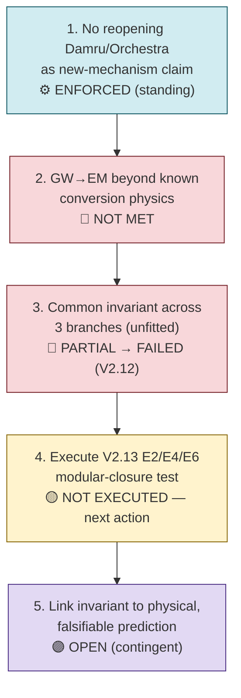

# Requirements R003 — Damru as Cosmic Phenomenon (Coupled Oscillator / GW–EM / Ramanujan Transition Line)

**Line of thought:** [Line-Of-Thoughts/L003_coupled_oscillator_cosmic_mechanism.md](../Line-Of-Thoughts/L003_coupled_oscillator_cosmic_mechanism.md)
**Status:** PAUSED

For this line to resume productively and eventually yield a genuine new physical consequence
(rather than remaining a set of known-physics bridges), the following must hold. This requirement
list follows the explicit "hard gates" already used by the source project
(\(indian-philosophy-modern-physics/V2/RESEARCH_{STATE}.md\): "Mathematical consistency → numerical
test → existing-physics audit → physical/falsifiable test → cross-analogy relevance →
quantum-gravity gate → gravity–Standard Model gate → new-prediction gate").

## Flow diagram

## Requirement list

| # | Requirement | Type | Pass/fail condition | Status |
|---|---|---|---|---|
| 1 | The literal Damru/Orchestra mechanism must not be reopened as a new physical coupling/coherence claim without a genuinely new, quantitative, falsifiable prediction absent from established physics. | theoretical (boundary condition) | Any reopening must cite a specific new prediction; otherwise the V1 closure stands. | ENFORCED — V1 \(CLAIMS_{STATUS}.md\) C13/C14 REJECTED; reopening condition stated in `V1/DECISIONS.md`. |
| 2 | GW→EM coupling must be shown to produce something beyond known conversion physics (inverse Gertsenshtein-type / resonant conversion). | comparative / existing-physics audit | A residual term must be identified that is not accounted for by the established \(A_{EM} \propto \kappa B L A_{GW}\) coupling and its known consequences. | NOT MET — V2.7 explicitly found this is a known-physics bridge with "no novel law established" (\(V2/RESEARCH_{GRAPH}.md\), section 11). |
| 3 | A common mathematical invariant must be found across at least three independent branches (VCR, GW→EM, illumination) using an unmodified, non-fitted construction. | mathematical / cross-analogy convergence | The same invariant/statistic must arise from each branch's own natively-derived quantities, without per-branch fitting. | PARTIALLY MET then FAILED at the next step — V2.10 found a common Fubini–Study fidelity object (🟢), but V2.12's naive universal theta-encoding version of the same idea FAILED (\(V2/RESEARCH_{GRAPH}.md\), sections 14, 16). |
| 4 | A Ramanujan/theta-derived transition invariant (the E2/E4/E6 modular closure) must be tested — not merely designed — across at least three branches. | mathematical / computational | Execute the V2.13 protocol: define a branch-native scalar transition coordinate (not called time), construct dimensionless transition observables, test the E2/E4/E6 closure, compare against generic non-Ramanujan controls, and run the nonlinear-relabeling and representation/packetization null tests. | NOT EXECUTED — V2.13 was fully designed but explicitly not run before the project paused (\(V2/RESEARCH_{GRAPH}.md\), sections 17, 21). **This is the immediate next action for this line.** |
| 5 | Any surviving invariant from requirement 4 must be connected to an independently measurable physical quantity and yield a new, falsifiable prediction. | theoretical/experimental | The invariant must not reduce to a known identity/conservation law, and must not depend on fitted coordinate transformations or branch-specific rules (V2.13 "Failure includes" list). | OPEN — contingent on requirement 4. |

## Order of attack and reasoning

The order is fixed by what the source project itself already established: do not reopen the
literal Damru/Orchestra claim (requirement 1, a standing constraint); do not re-claim GW→EM
coupling as novel (requirement 2, already closed as known physics); requirement 3 is already
partially done (a common mathematical object was found) but its naive extension already failed
(V2.12), so requirement 4 — executing the more careful, previously *designed but unexecuted*
V2.13 test — is the correct and only responsible next step, exactly as the source project's own
continuity note specifies ("Resume directly at V2.13" — \(V2/RESEARCH_{GRAPH}.md\), section 20).
Requirement 5 cannot be evaluated before requirement 4 produces a result.

## Definition of success for this line of thought

The V2.13 E2/E4/E6 transition-invariant protocol is executed, produces a residual smaller than
matched generic controls across all three branches, survives all specified null tests, uses the
same construction rule in every branch, and connects to an independently measurable physical
quantity with a new falsifiable prediction.

## Definition of failure / abandonment

If V2.13, once executed, produces a fitted closure, requires branch-specific rules, reduces to a
known identity/conservation law, or performs no better than generic controls (mirroring the
V2.12 failure mode), this line should be marked `NEGATIVE` for "Ramanujan transition invariant
unifies these branches," while retaining the established Fubini–Study convergence (V2.10) and the
known GW→EM physics bridge (V2.7) as valid, non-novel results.
