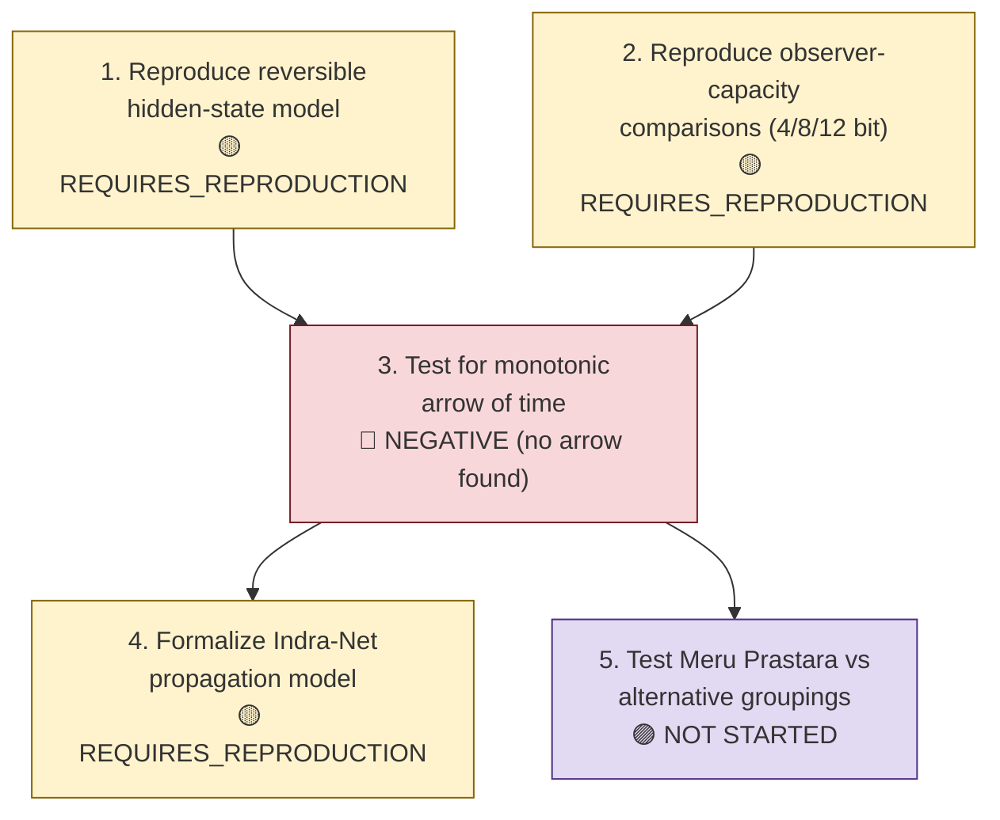

# Requirements R004 — Hidden State, Visibility, and Observer Accessibility

**Line of thought:** [Line-Of-Thoughts/L004_hidden_state_observer_accessibility.md](../Line-Of-Thoughts/L004_hidden_state_observer_accessibility.md)
**Status:** PARTIAL

For the IIVM hidden-state/visibility toy models to support any claim beyond "a coarse-graining toy
model was built," the following must hold.

## Flow diagram

## Requirement list

| # | Requirement | Type | Pass/fail condition | Status |
|---|---|---|---|---|
| 1 | The reversible finite hidden-state model (`|Ω| = 65,536`, 8-bit projection) must be independently reproduced. | computational | Rerun the permutation dynamics + restricted projection + entropy measurement and obtain entropy values consistent with the historical report (≈7.18 bits after mixing, reversal under inverse dynamics). | REQUIRES_REPRODUCTION (`indian-mythology-modern-science/research/REPRODUCTION_QUEUE.md`, R003). |
| 2 | Observer-capacity comparisons (4, 8, 12 bits) must be reproduced under an identical underlying microtrajectory. | computational | The three observer maps must be applied to the same trajectory and shown to produce different effective descriptions, consistent with the historical report. | REQUIRES_REPRODUCTION (`research/REPRODUCTION_QUEUE.md`, R004). |
| 3 | The reversible model's entropy behavior must be tested for whether it ever produces a monotonic (non-reversing) arrow of time under any reasonable variant. | theoretical/computational | If any variant of the model produces a fundamental (non-reversible-in-principle) arrow of time, that would overturn the current finding; absence of such a variant across a reasonable sweep supports the current negative conclusion. | NEGATIVE (current finding stands) — entropy fluctuated and reversed under inverse dynamics; coarse-graining alone did not produce a fundamental arrow of time (`research/FAILED_AND_ABANDONED_PATHS.md`). |
| 4 | The Indra-Net local-perturbation-propagation toy model must be formalized well enough to be independently rerun. | computational | A concrete graph, perturbation rule, and propagation metric must be specified and produce reproducible output. | REQUIRES_REPRODUCTION / underspecified — currently a "historical toy analogy" only (`Analogies/A010_indra_net.md`). |
| 5 | The Meru Prastara coarse-graining rule used in the IIVM tests must be shown to be more than an arbitrary choice of grouping (i.e. compared against alternative equally-valid groupings). | mathematical/comparative | Alternative grouping rules of the same `2^n` microstates must be tested and shown to give different (or the same) qualitative IIVM behavior, to determine whether Meru Prastara is doing real work or is interchangeable with any partition. | NOT STARTED. |

## Order of attack and reasoning

Reproduction (requirements 1–2) must come first since no interpretation is trustworthy until the
historical numbers are independently confirmed. Requirement 3 (searching for any arrow-of-time
variant) should follow immediately, since it is the central claim this line is currently most
tempted to overclaim. Requirement 4 (Indra-Net formalization) and requirement 5 (grouping-rule
comparison) are secondary refinements that only matter once the core reproduction is solid.

## Definition of success for this line of thought

Requirements 1 and 2 are independently reproduced with results consistent with the historical
reports, requirement 3's sweep finds no arrow-of-time-producing variant (confirming the current
negative result robustly, not just once), and requirements 4–5 are completed to formalize the
remaining toy models.

## Definition of failure / abandonment

If reproduction (requirements 1–2) fails to match the historical reports even approximately, the
historical numbers should be marked `HISTORICAL / NOT REPRODUCED` and this line's evidentiary base
downgraded accordingly, while the conceptual accessibility-hierarchy framework
(`Ω_total ⊃ Ω_accessible ⊃ Ω_observed ⊃ Ω_represented`) is retained as a still-valid organizing
structure independent of these specific numeric results.
