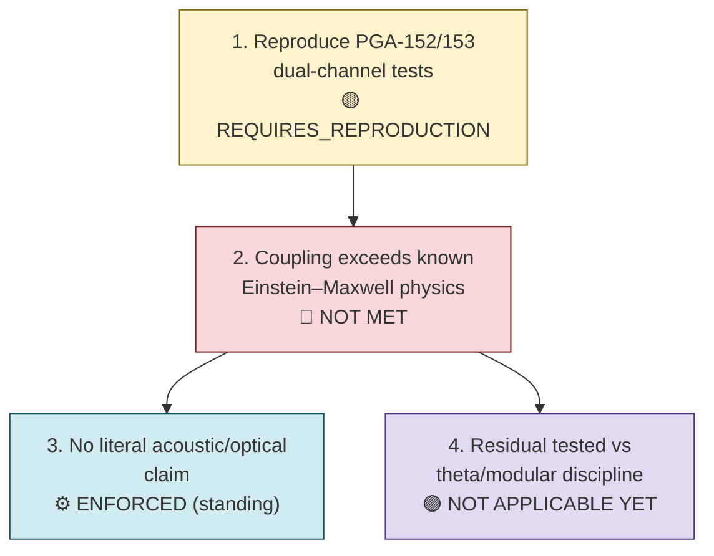

# Requirements R005 — Complementary-Channel Unification (Audio/Video, GW/EM)

**Line of thought:** [Line-Of-Thoughts/L005_complementary_channel_unification.md](../Line-Of-Thoughts/L005_complementary_channel_unification.md)
**Status:** OPEN

For the audio/video (GW/EM complementary-channel) analogy to reveal anything beyond known physics,
the following must hold. Note: this requirement set overlaps substantially with
[R003](R003_coupled_oscillator_cosmic_mechanism.md) requirements 2–3, since V2 formalized the same
underlying question inside the Cosmic Damru thread; this file states the requirement from the
audio/video analogy's own entry point.

## Flow diagram

## Requirement list

| # | Requirement | Type | Pass/fail condition | Status |
|---|---|---|---|---|
| 1 | The historical dual-channel/complementary-channel reconstruction tests (`PGA-152`, `PGA-153`) must be reproduced with explicit parameters. | computational | Rerun with recovered parameters and compare against the historical description. | REQUIRES_REPRODUCTION (\(indian-mythology-modern-science/research/REPRODUCTION_{QUEUE}.md\), R013). |
| 2 | Any observed GW/EM coupling must be shown to exceed what established Einstein–Maxwell theory and known GW→EM conversion processes predict. | existing-physics audit | A residual term, after subtracting known-physics predictions, must be nonzero and reproducible. | NOT MET — known physics already accounts for observed coupling; no confirmed residual term established (\(research/FAILED_{AND}_ABANDONED_PATHS.md\), "Direct Damru/VCR EM-GW novelty"). |
| 3 | The audio/video framing itself must not be used to imply that gravitational waves are literally sound or that EM/light is literally video. | theoretical (boundary condition) | Any formalization must operate on the abstract "two complementary channels" structure, not a literal acoustic/optical claim. | ENFORCED (\(Analogies/A004_audio_video_channels.md\)). |
| 4 | If a residual term (requirement 2) is found, it must be tested against the same Ramanujan/theta discriminator discipline used in R003 (requirements 3–4) before any novelty claim. | mathematical | The residual term's behavior under theta/modular discrimination must be compared against generic controls, exactly as required in R003. | NOT APPLICABLE YET — contingent on requirement 2. |

## Order of attack and reasoning

Reproduce the historical dual-channel tests first (requirement 1) since no further claim can be
evaluated without them. Requirement 2 (the existing-physics audit for a residual term) is the
actual scientific crux of this line and should be attempted next, reusing the already-existing
GW→EM known-physics baseline established in R003. Requirement 3 is a standing constraint checked
throughout. Requirement 4 only becomes relevant if requirement 2 succeeds.

## Definition of success for this line of thought

The historical dual-channel tests are reproduced, and a residual GW/EM coupling term is identified
that survives subtraction of known Einstein–Maxwell/GW→EM-conversion physics and passes the
Ramanujan/theta discrimination test from R003.

## Definition of failure / abandonment

If reproduction (requirement 1) confirms the historical description but no residual term
(requirement 2) survives subtraction of known physics, this line should be marked `NEGATIVE` for
"audio/video analogy reveals new GW/EM physics," while retaining the analogy as a valid conceptual
framing device only (\(ANALOGY_{ONLY}\), as already recorded in \(Analogies/A004_audio_video_channels.md\)).
