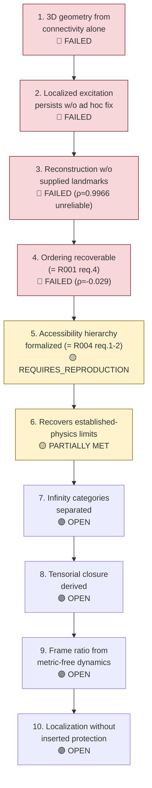

# Requirements R006 — S∞/B∞ Relational Substrate

**Line of thought:** [Line-Of-Thoughts/L006_s_infinity_b_infinity_relational_substrate.md](../Line-Of-Thoughts/L006_s_infinity_b_infinity_relational_substrate.md)
**Status:** IN_PROGRESS

For the S∞/B∞ hypothesis to move from a conceptual organizing question to a genuine physical
result, the following must hold, following the surviving question already stated in the source
material: "Can an underlying relational/background system, through ordered dynamical coverage and
observer-accessible channels, produce persistent observable manifestations while recovering the
required limits of established physics?"
(\(indian-mythology-modern-science/research/S_{INFINITY}_B_INFINITY/experiments/E001_s_infinity_b_infinity_origin.md\),
section 7).

## Flow diagram

## Requirement list

| # | Requirement | Type | Pass/fail condition | Status |
|---|---|---|---|---|
| 1 | A relational substrate must produce stable, extended 3D geometry without hand-supplied spatial assumptions. | computational | A relational graph/network model must yield emergent geometry that passes dimensionality/embedding tests without pre-supplied coordinates. | FAILED (as tested) — random/self-organizing relational networks did not robustly produce stable 3D geometry (E001, section 4.1). |
| 2 | A localized excitation on the substrate must persist and propagate as an identifiable pattern without an ad hoc stabilizing addition. | computational | A nonlinear lattice/wave model must show a localized excitation surviving propagation over a defined distance/time without added constraints. | FAILED (as tested) — localization/persistence was generally lost without an additional stabilizing mechanism (E001, section 4.2). |
| 3 | Observer reconstruction of relational structure must not depend on already-supplied spatial landmark information. | computational | A reconstruction test must recover relational/spatial structure starting from observations alone, with no pre-supplied coordinate landmarks, and be compared against a null/shuffled control. | FAILED (as tested) — the historical \(\rho \approx 0.9966\) result was found unreliable because landmark structure was already supplied (E001, section 4.4). |
| 4 | An effective ordering must be recoverable from relational observations under the full control battery (shared with [R001](R001_ordered_coverage_observer_time.md) requirement 4). | computational | See R001 requirement 4 — identical pass/fail condition, since this is the same E002 test. | FAILED (current implementation) — \(\rho \approx -0.029\) (E002). |
| 5 | The accessibility hierarchy \(\Omega_{total} \supset \Omega_{accessible} \supset \Omega_{observed} \supset \Omega_{represented}\) must be formalized well enough to make quantitative predictions (shared with [R004](R004_hidden_state_observer_accessibility.md)). | theoretical/computational | See R004 requirements 1–2 — identical underlying model. | REQUIRES_REPRODUCTION. |
| 6 | Any surviving result from requirements 1–5 must recover the required limits of established physics (e.g. known low-energy dispersion, known field-theory persistence mechanisms) rather than contradicting them. | existing-physics audit | Any emergent-geometry or persistence claim must reduce to established physics in the appropriate limit. | PARTIALLY MET — surviving toy-model ingredients (coupled-oscillator normal modes, φ⁴ kink topological persistence) are established physics used as controls, not as evidence of something new (E001, sections 4.3, 4.5). |
| 7 | Mathematical, physical, and perceived infinity must be defined as distinct categories before any physical mapping is claimed. | theoretical | A model must specify whether each infinity claim concerns a formal mathematical object (M∞), an unbounded physical structure (P∞), or observer-limited apparent multiplicity (O∞), and must not treat S∞/R∞/B∞ as this taxonomy. | OPEN — distinction recovered in historical chats, not independently formalized in this project ([CHAT_0204](../../indian-philosophy-modern-physics/V3/chat_records/CHAT_0204_now-i-want-to-return-back-to-infinity-can-u-summarize-what-we-discussed-about-infinity-its-n.md)). |
| 8 | A tensorial fabric branch must derive, rather than assume, a conserved geometric source equation. | theoretical/computational | Starting from an explicit actor-fabric action or update law, derive a symmetric tensor response that is divergence-free, recovers the weak-field/Newtonian limit, and passes the vacuum component test; fitting Gμν∝Tμν is not sufficient. | OPEN — the scalar H branch failed the full vacuum test; tensorial closure remains a proposal requiring reproduction ([CHAT_0159](../../indian-philosophy-modern-physics/V3/chat_records/CHAT_0159_pga-lets-run-the-einstein-tensor-closure-test-directly.md), [CHAT_0160](../../indian-philosophy-modern-physics/V3/chat_records/CHAT_0160_pga-we-now-move-from-the-scalar-eq-h-to-the-minimal-tensorial-fabric-model.md)). |
| 9 | A frame/propagation ratio must emerge from a metric-free relational model rather than being inserted as c or dt. | computational | A network containing only nodes, relations, interaction strengths, and update ordering must produce a stable ratio L(N)/τ(N); matched scaling tests and shuffled/null controls must distinguish derivation from construction. | OPEN — the historical matched-response toy kept c*=1 by design; asymmetric scaling destroyed invariance ([CHAT_0203](../../indian-philosophy-modern-physics/V3/chat_records/CHAT_0203_pga-lets-run-the-minimal-frame-speed-emergence-test-without-putting-eq-c-a-metric-or-physica.md)). |
| 10 | A persistent localized manifestation must not depend on an inserted restoring potential, topology, or measurement projection. | computational/comparative | Compare free evolution, feedback-only, repeated-interaction, and topology-emergence models under identical controls; persistence must be measured and any protection mechanism derived from the interaction. | OPEN — feedback-only localization failed; the historical topological toy inserted a double-well and QZE stabilizes an existing excitation rather than creating one ([CHAT_0192](../../indian-philosophy-modern-physics/V3/chat_records/CHAT_0192_pga-we-have-now-hit-the-first-genuinely-informative-failure-of-the-new-hypothesis.md), [CHAT_0196](../../indian-philosophy-modern-physics/V3/chat_records/CHAT_0196_pga-i-ran-the-topological-localization-test-this-gives-us-a-much-more-interesting-result-tha.md)). |

## Order of attack and reasoning

This requirement list intentionally reuses R001 requirement 4 and R004 requirements 1–2 rather
than duplicating them, since E001/E002 (S∞/B∞) and the ordered-coverage/hidden-state lines share
the same underlying experiments. The order follows the historical exploration order recorded in
E001: geometry from connectivity (requirement 1) was tried and failed first; persistence of
localized excitations (requirement 2) next; observer reconstruction (requirement 3) next, which
led directly to the ordered-coverage test (requirement 4); the accessibility hierarchy
(requirement 5) generalizes the observer-reconstruction question; requirement 6 (known-physics
recovery) is a standing check applied throughout. The newly recovered chat branch adds the
taxonomy boundary (7) before testing tensorial gravity (8), metric-free frame emergence (9), or
autonomous localization (10), because each downstream claim depends on definitions and
mechanisms not being smuggled in.

## Definition of success for this line of thought

At least one of requirements 1–3 is met by a new implementation (not just the failed historical
attempts), requirement 4 passes under the full E002 control battery, requirement 5 is
independently reproduced, and requirement 6 continues to hold (no contradiction with established
physics) throughout. Requirements 7–10 must also be satisfied without definitional shortcuts.

## Definition of failure / abandonment

If requirements 1–4 or 8–10 continue to fail under improved implementations with proper controls
(i.e. the negative results are robust, not artifacts of a specific weak implementation), this line
should be marked `NEGATIVE` for the corresponding geometry, persistence, time, or gravity claim,
while retaining the infinity taxonomy, accessibility hierarchy, and explicit
substrate/manifestation/information distinctions as valid organizing language for future work.
