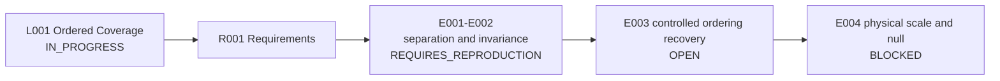

# Runbook - L001 Ordered Coverage and Observer Time - v1

**Line of thought:** [Line-Of-Thoughts/L001_ordered_coverage_observer_time.md](../../Line-Of-Thoughts/L001_ordered_coverage_observer_time.md)
**Requirements:** [Requirements/R001_ordered_coverage_observer_time.md](../../Requirements/R001_ordered_coverage_observer_time.md)
**Status:** IN_PROGRESS

## Research boundary

The research question is whether ordered access can yield an independently measurable time-like quantity. The scan parameter is an ordering variable only; it must never be renamed physical time. The null hypothesis is that all surviving behavior is ordinary sampling and reconstruction.

## Research map

## Plan

| Step | Analogy / requirement tested | Reasoning | Experiment ID | Expected result | Actual result |
|---|---|---|---|---|---|
| 1 | [Requirements/R001...](../../Requirements/R001_ordered_coverage_observer_time.md) #1; [Analogies/A003...](../../Analogies/A003_vcr_cinema_sequential_coverage.md) | Establish that coverage and acquisition order are distinct before interpreting order physically. | `experiments/E001_coverage_order_separation/` | Same spatial reconstruction after order permutation, while ordered records differ. | [results/E001_coverage_order_separation.md](results/E001_coverage_order_separation.md) |
| 2 | R001 #2 and #3 | Remove parameterization artifacts and enforce the no-scan-equals-time boundary. | `experiments/E002_reparameterization_boundary/` | Relational separations remain unchanged under monotonic relabeling; no physical time claim follows. | [results/E002_reparameterization_boundary.md](results/E002_reparameterization_boundary.md) |
| 3 | R001 #4 | Test ordering recovery without supplying labels, coordinates, or a physical clock. | `experiments/E003_controlled_order_recovery/` | Pre-registered recovery metric exceeds the threshold across maps, noise levels, trajectories, methods, and nulls. | OPEN - next experiment; historical spectral-seriation attempt did not pass. |
| 4 | R001 #5 and #6 | Only after ordering recovery, derive an independent scale and compare with ordinary sampling theory. | `experiments/E004_physical_scale_and_null/` | Independently measured scale and a prediction that beats the sampling-theory null. | BLOCKED until step 3 passes. |

## Current interpretation

Steps 1 and 2 support mathematical separation and reparameterization invariance within tested models. They do not establish physical time. The historical ordering-recovery implementation returned rho approximately -0.029 and therefore does not satisfy R001 #4.

## Next step

Implement E003 with shuffled observations, independent random observation maps, multiple noise levels, non-periodic trajectories, multiple reconstruction methods, a no-sequence relational null, and a pre-registered ordering metric and threshold.

## Version history

### v1 (initial)

Initial Phase 4 runbook assembled from the Phase 1-3 records, `indian-mythology-modern-science` E002, and the V2 VCR/reconstruction history. Historical results remain provisional until their computation is reproduced.
