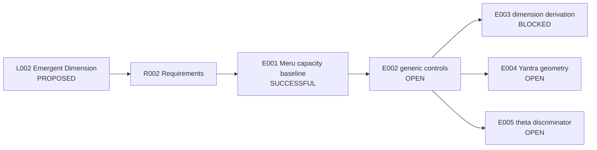

# Runbook - L002 Emergent Dimension from Relational Capacity - v1

**Line of thought:** [Line-Of-Thoughts/L002_emergent_dimension_relational_capacity.md](../../Line-Of-Thoughts/L002_emergent_dimension_relational_capacity.md)
**Requirements:** [Requirements/R002_emergent_dimension_relational_capacity.md](../../Requirements/R002_emergent_dimension_relational_capacity.md)
**Status:** PROPOSED

## Research boundary

Meru Prastara, partition functions, theta functions, and Sri/Meru Yantra are mathematical inputs or characterization targets. None is evidence that physical dimension emerges from counting.

## Research map

## Plan

| Step | Requirement tested | Reasoning | Experiment ID | Expected result | Actual result |
|---|---|---|---|---|---|
| 1 | R002 #1; A011 | Establish the exact capacity/counting baseline before interpreting it physically. | `experiments/E001_meru_capacity_baseline/` | Reproduce `2^n` binary histories grouped into `n+1` weight classes and document assumptions. | [results/E001_meru_capacity_baseline.md](results/E001_meru_capacity_baseline.md) |
| 2 | R002 #2 | Compare the candidate against matched generic grouping and growth laws. | `experiments/E002_generic_capacity_controls/` | Identify behavior that is not reproduced by generic combinatorics. | OPEN - not started. |
| 3 | R002 #3 | Define a map from capacity to independent dimension without assuming the answer. | `experiments/E003_dimension_from_capacity/` | A procedure predicts a non-trivial dimension on held-out cases. | BLOCKED until step 2 passes. |
| 4 | R002 #4 | Characterize Sri/Meru Yantra geometry and information content. | `experiments/E004_yantra_geometry_characterization/` | Explicit triangle arrangement, symmetry, and information measures are computed. | OPEN - source task only. |
| 5 | R002 #5; A013 | Test whether theta/modular structure adds a non-generic constraint. | `experiments/E005_theta_generic_discriminator/` | Candidate discriminator beats matched Fourier/polynomial controls without fitting. | OPEN - not started. |

## Current interpretation

The exact Meru count is established mathematics. The physical dimension claim remains open because no generic-control comparison or dimension derivation exists.

## Next step

Run E002 with pre-registered generic controls before attempting geometry or physical interpretation.

## Version history

### v1 (initial)

Initial Phase 4 runbook assembled from A008, A011, A013, A014, V1 C10/C12/C16, and the source chat tasks.
