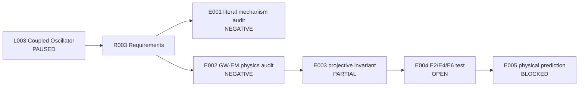

# Runbook - L003 Coupled Oscillator Cosmic Mechanism - v1

**Line of thought:** [Line-Of-Thoughts/L003_coupled_oscillator_cosmic_mechanism.md](../../Line-Of-Thoughts/L003_coupled_oscillator_cosmic_mechanism.md)
**Requirements:** [Requirements/R003_coupled_oscillator_cosmic_mechanism.md](../../Requirements/R003_coupled_oscillator_cosmic_mechanism.md)
**Status:** PAUSED

## Research boundary

The literal Damru/Orchestra new-mechanism claim remains closed. The paused V2 branch may resume only at the designed E2/E4/E6 transition-invariant test, with generic controls and no fitted branch-specific transformations.

## Research map

## Plan

| Step | Requirement tested | Reasoning | Experiment ID | Expected result | Actual result |
|---|---|---|---|---|---|
| 1 | R003 #1; A001/A002 | Preserve the V1 closure and identify which mechanisms are ordinary coupled dynamics. | \(experiments/E001_literal_mechanism_audit/\) | No new Damru/Orchestra mechanism is accepted without a new prediction. | [results/E001_literal_mechanism_audit.md](results/E001_literal_mechanism_audit.md) |
| 2 | R003 #2; A004 | Audit GW-EM conversion against established Einstein-Maxwell processes. | \(experiments/E002_gw_em_known_physics_audit/\) | Any residual must survive the known-physics baseline. | [results/E002_gw_em_known_physics_audit.md](results/E002_gw_em_known_physics_audit.md) |
| 3 | R003 #3 | Check whether the common Fubini-Study object is only mathematical convergence. | \(experiments/E003_common_projective_invariant/\) | A common object is useful only if it is non-fitted and physically discriminating. | [results/E003_common_projective_invariant.md](results/E003_common_projective_invariant.md) |
| 4 | R003 #4 | Execute the already-designed V2.13 E2/E4/E6 protocol. | \(experiments/E004_e2_e4_e6_transition_invariant/\) | Same unmodified closure across at least three native branches, beating generic controls and null tests. | OPEN - designed but not executed. |
| 5 | R003 #5 | Connect any surviving invariant to an independent measurable prediction. | \(experiments/E005_physical_prediction_gate/\) | New, non-identity, independently measurable prediction. | BLOCKED until step 4 passes. |

## Current interpretation

Known coupled-oscillator and GW-EM behavior is not novel by itself. V2.12 is a negative precedent for naive universal theta encoding. The line is paused, not closed, at the V2.13 design boundary.

## Next step

Resume with E004 only after recovering the exact V2.13 protocol and recording its branch-native inputs and generic controls.

## Version history

### v1 (initial)

Initial Phase 4 runbook assembled from V1 closures, V2.7-V2.13, and the Damru/GW-EM chat audit.
