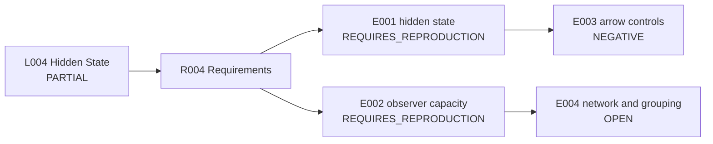

# Runbook - L004 Hidden State and Observer Accessibility - v1

**Line of thought:** [Line-Of-Thoughts/L004_hidden_state_observer_accessibility.md](../../Line-Of-Thoughts/L004_hidden_state_observer_accessibility.md)
**Requirements:** [Requirements/R004_hidden_state_observer_accessibility.md](../../Requirements/R004_hidden_state_observer_accessibility.md)
**Status:** PARTIAL

## Research boundary

The accessibility hierarchy is a coarse-graining model. It must not be interpreted as observer-created reality or as a fundamental arrow of time unless irreversibility survives an explicit reversal/control test.

## Research map

## Plan

| Step | Requirement tested | Reasoning | Experiment ID | Expected result | Actual result |
|---|---|---|---|---|---|
| 1 | R004 #1; A009 | Reproduce the finite reversible hidden-state model before interpreting its entropy. | \(experiments/E001_reversible_hidden_state/\) | Match the historical entropy scale and reversal under inverse dynamics. | [results/E001_reversible_hidden_state.md](results/E001_reversible_hidden_state.md) |
| 2 | R004 #2 | Apply observer maps of 4, 8, and 12 bits to one underlying trajectory. | \(experiments/E002_observer_capacity_comparison/\) | Different effective descriptions from the same microtrajectory. | [results/E002_observer_capacity_comparison.md](results/E002_observer_capacity_comparison.md) |
| 3 | R004 #3 | Test whether coarse-graining creates a monotonic arrow under reasonable variants. | \(experiments/E003_arrow_of_time_controls/\) | A robust non-reversing arrow would overturn the current negative finding. | [results/E003_arrow_of_time_controls.md](results/E003_arrow_of_time_controls.md) |
| 4 | R004 #4 and #5 | Formalize Indra-Net propagation and compare Meru grouping with alternatives. | \(experiments/E004_network_and_grouping_controls/\) | Reproducible propagation plus a non-arbitrary grouping effect. | OPEN - not started. |

## Current interpretation

The hierarchy \(Omega_{total} superset Omega_{accessible} superset Omega_{observed} superset Omega_{represented}\) is a useful formal distinction. Historical entropy behavior reversed under inverse dynamics, so coarse-graining alone did not establish a fundamental arrow.

## Next step

Reproduce E001 and E002 from the source parameters. Until then, preserve their status as historical reports.

## Version history

### v1 (initial)

Initial Phase 4 runbook assembled from the IIVM/PGA records, the reproduction queue, and the failed-path audit.
