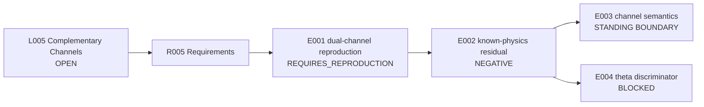

# Runbook - L005 Complementary-Channel Unification - v1

**Line of thought:** [Line-Of-Thoughts/L005_complementary_channel_unification.md](../../Line-Of-Thoughts/L005_complementary_channel_unification.md)
**Requirements:** [Requirements/R005_complementary_channel_unification.md](../../Requirements/R005_complementary_channel_unification.md)
**Status:** OPEN

## Research boundary

Audio/video is an abstract complementary-channel analogy. Gravitational waves are not sound, and electromagnetic waves are not video. Any novelty claim must be a residual after an established Einstein-Maxwell/GW-EM baseline.

## Research map

## Plan

| Step | Requirement tested | Reasoning | Experiment ID | Expected result | Actual result |
|---|---|---|---|---|---|
| 1 | R005 #1 | Reproduce the historical dual-channel tests before interpreting them. | `experiments/E001_dual_channel_reproduction/` | Exact parameters and outputs recover the historical descriptions. | [results/E001_dual_channel_reproduction.md](results/E001_dual_channel_reproduction.md) |
| 2 | R005 #2 | Subtract known GW-EM conversion and Einstein-Maxwell predictions. | `experiments/E002_known_physics_residual/` | A nonzero reproducible residual remains. | [results/E002_known_physics_residual.md](results/E002_known_physics_residual.md) |
| 3 | R005 #3 | Enforce the abstract-channel boundary throughout. | `experiments/E003_channel_semantics_audit/` | No literal acoustic/optical identity is used. | OPEN - standing constraint. |
| 4 | R005 #4 | Apply theta/modular discrimination only if step 2 succeeds. | `experiments/E004_residual_theta_discriminator/` | Residual beats generic controls under the R003 discipline. | BLOCKED until step 2 passes. |

## Current interpretation

Historical work provides a channel analogy and known-physics bridges, but no confirmed residual term. The line remains open only as a reproduction and residual-audit question.

## Next step

Recover PGA-152/PGA-153 parameters, then perform the known-physics residual comparison.

## Version history

### v1 (initial)

Initial Phase 4 runbook assembled from A004, PGA-152/PGA-153, V2.7/V2.8, and the failed-path audit.
