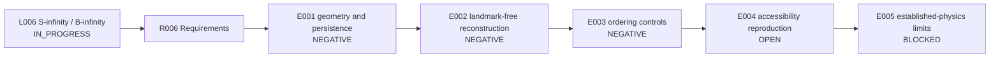

# Runbook - L006 S-infinity / B-infinity Relational Substrate - v1

**Line of thought:** [Line-Of-Thoughts/L006_s_infinity_b_infinity_relational_substrate.md](../../Line-Of-Thoughts/L006_s_infinity_b_infinity_relational_substrate.md)
**Requirements:** [Requirements/R006_s_infinity_b_infinity_relational_substrate.md](../../Requirements/R006_s_infinity_b_infinity_relational_substrate.md)
**Status:** IN_PROGRESS

## Research boundary

S-infinity and B-infinity are working labels, not established entities. This umbrella line must not absorb L001 or L004 results without linking to their dedicated runbooks. Substrate, manifestation, information, and observation remain distinct layers.

## Research map

## Plan

| Step | Requirement tested | Reasoning | Experiment ID | Expected result | Actual result |
|---|---|---|---|---|---|
| 1 | R006 #1 and #2 | Establish whether blind relational connectivity yields stable 3D geometry or persistent localized modes. | \(experiments/E001_geometry_and_persistence_audit/\) | Geometry and persistence survive without hand-supplied structure or ad hoc stabilization. | [results/E001_geometry_and_persistence_audit.md](results/E001_geometry_and_persistence_audit.md) |
| 2 | R006 #3 | Audit observer reconstruction for supplied landmarks and hidden spatial assumptions. | \(experiments/E002_landmark_free_reconstruction/\) | Reconstruction succeeds without supplied coordinates or landmarks and beats a null. | [results/E002_landmark_free_reconstruction.md](results/E002_landmark_free_reconstruction.md) |
| 3 | R006 #4; shared with L001 | Test ordered recovery under the full control battery. | \(experiments/E003_ordered_coverage_controls/\) | Recovered ordering exceeds the preregistered threshold across controls. | [results/E003_ordered_coverage_controls.md](results/E003_ordered_coverage_controls.md) |
| 4 | R006 #5; shared with L004 | Reproduce the accessibility hierarchy and observer-capacity comparisons. | \(experiments/E004_accessibility_reproduction/\) | Historical hidden-state and capacity outputs are independently reproduced. | OPEN - depends on L004 reproduction. |
| 5 | R006 #6 | Check low-energy and established-physics limits for any surviving construction. | \(experiments/E005_established_physics_limits/\) | Candidate reduces to known limits without contradiction and produces a distinct prediction. | BLOCKED until earlier steps produce a candidate. |

## Current interpretation

Historical tests did not establish geometry, persistent particles, landmark-free reconstruction, or ordered recovery. The surviving contribution is a layered formal question and a queue of controlled reproductions.

## Next step

Run the shared L001/L004 reproduction work without claiming that a negative implementation result falsifies the broader conceptual hypothesis.

## Version history

### v1 (initial)

Initial Phase 4 runbook assembled from the S-infinity/B-infinity history, E001/E002 source records, chat archive audits, and the shared L001/L004 requirements.
