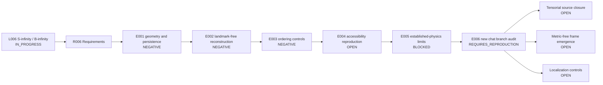

# Runbook - L006 S-infinity / B-infinity Relational Substrate - v2

**Line of thought:** [Line-Of-Thoughts/L006_s_infinity_b_infinity_relational_substrate.md](../../Line-Of-Thoughts/L006_s_infinity_b_infinity_relational_substrate.md)
**Requirements:** [Requirements/R006_s_infinity_b_infinity_relational_substrate.md](../../Requirements/R006_s_infinity_b_infinity_relational_substrate.md)
**Status:** IN_PROGRESS / E006 REQUIRES_REPRODUCTION

## Research boundary

S-infinity and B-infinity are working labels, not established entities. This umbrella line must not absorb L001 or L004 results without linking to their dedicated runbooks. Substrate, manifestation, information, and observation remain distinct layers. The newly recovered chat branch adds tensorial closure, metric-free frame emergence, and localization as separate gates; none is promoted to a result without reproduction.

## Research map

## Plan

| Step | Requirement tested | Reasoning | Experiment ID | Expected result | Actual result |
|---|---|---|---|---|---|
| 1 | R006 #1 and #2 | Establish whether blind relational connectivity yields stable 3D geometry or persistent localized modes. | \(experiments/E001_geometry_and_persistence_audit/\) | Geometry and persistence survive without hand-supplied structure or ad hoc stabilization. | [results/E001_geometry_and_persistence_audit.md](results/E001_geometry_and_persistence_audit.md) |
| 2 | R006 #3 | Audit observer reconstruction for supplied landmarks and hidden spatial assumptions. | \(experiments/E002_landmark_free_reconstruction/\) | Reconstruction succeeds without supplied coordinates or landmarks and beats a null. | [results/E002_landmark_free_reconstruction.md](results/E002_landmark_free_reconstruction.md) |
| 3 | R006 #4; shared with L001 | Test ordered recovery under the full control battery. | \(experiments/E003_ordered_coverage_controls/\) | Recovered ordering exceeds the preregistered threshold across controls. | [results/E003_ordered_coverage_controls.md](results/E003_ordered_coverage_controls.md) |
| 4 | R006 #5; shared with L004 | Reproduce the accessibility hierarchy and observer-capacity comparisons. | \(experiments/E004_accessibility_reproduction/\) | Historical hidden-state and capacity outputs are independently reproduced. | OPEN - depends on L004 reproduction. |
| 5 | R006 #6 | Check low-energy and established-physics limits for any surviving construction. | \(experiments/E005_established_physics_limits/\) | Candidate reduces to known limits without contradiction and produces a distinct prediction. | BLOCKED until earlier steps produce a candidate. |
| 6 | R006 #7–#10 | Audit the newly recovered chats and convert their taxonomy, tensorial, frame, and localization claims into reproducible queues without promoting historical outputs. | \(experiments/E006_new_chat_branch_reproduction/\) | Source claims are separated from reproduced evidence and each new gate has an executable follow-up. | [results/E006_new_chat_branch_reproduction.md](results/E006_new_chat_branch_reproduction.md) |
| 7 | R006 #8 | Derive tensorial actor-fabric closure from an explicit action/update law. | \(experiments/E007_tensorial_source_closure/\) | Divergence-free response, weak-field limit, vacuum components, and source coupling pass without inserting Einstein's equation. | OPEN; create only after E006 reproduction setup. |
| 8 | R006 #9 | Test frame/propagation ratio from a metric-free relational network. | \(experiments/E008_metric_free_frame_emergence/\) | Stable ratio survives controls and is distinguished from a chosen matched transformation. | OPEN; create only after E006 reproduction setup. |
| 9 | R006 #10 | Test localization under free, feedback-only, repeated-interaction, and topology-emergence controls. | \(experiments/E009_localization_controls/\) | Persistence is reproduced without inserted protection, or the claim is marked negative for the tested class. | OPEN; create only after E006 reproduction setup. |

## Current interpretation

Historical tests did not establish geometry, persistent particles, landmark-free reconstruction, ordered recovery, tensorial Einstein closure, or autonomous localization. The surviving contribution is a layered formal question and a queue of controlled reproductions. The new chat material also corrects the infinity vocabulary: M∞/P∞/O∞ are categories, while S∞/R∞/B∞ are proposed structures within one physical hypothesis.

## Next step

Run E006's reproduction queue, beginning with definitions and source preservation, then split any executable follow-up into immutable E007–E009 experiments. Continue the shared L001/L004 reproduction work without claiming that a negative implementation result falsifies the broader conceptual hypothesis.

## Version history

### v1 (initial)

Initial Phase 4 runbook assembled from the S-infinity/B-infinity history, E001/E002 source records, chat archive audits, and the shared L001/L004 requirements.

### v2 (new chat branch)

Added after conversion of CHAT_0158–CHAT_0246. Preserved the prior negative results and added
E006 as a source-derived reproduction queue for the corrected infinity taxonomy, tensorial gravity
closure, metric-free frame emergence, and localization controls. No historical chat output was
upgraded to independently reproduced evidence.
