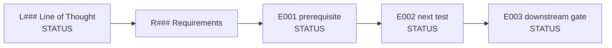

# Runbook — L### <short name> — v1

**Line of thought:** [Line-Of-Thoughts/L###_short-name.md](../Line-Of-Thoughts/L###_short-name.md)
**Requirements:** [Requirements/R###_short-name.md](../Requirements/R###_short-name.md)
**Status:** IN_PROGRESS

## Research map

Keep this map synchronized with the plan below. Show the current evidence status for each recorded
experiment and the blocking gate for each planned step. Use ASCII labels in Mermaid where possible.

## Plan

Step-by-step, in the order they should be run. Each step should connect one analogy/requirement to
one experiment, and explain *why* this is the next test rather than some other one.

| Step | Analogy / requirement tested | Reasoning | Experiment ID | Expected result | Actual result |
|---|---|---|---|---|---|
| 1 | <Analogies/A###...> / <Requirements/R###... item #1> | <why this test, why now> | \(experiments/E001_short-name/\) | <what would count as pass/fail> | [results/E001_short-name.md](../Research/L###_short-name/results/E001_short-name.md) |
| 2 | ... | ... | \(experiments/E002_short-name/\) | ... | ... |

## Current interpretation

<What do the results so far mean for this line of thought? Distinguish tested facts from remaining
speculation.>

## Next step

<What should be run next, and why — this becomes the next row added above, not a new document.>

---

## Version history

### v1 (initial)

<Date/context this runbook was first written, and the reasoning behind the original step order.>

<When you bump to v2, copy this file's current "Plan" and "Current interpretation" into a new
"### v1" entry here (if not already done), then update the sections above for v2, and record here
why the plan changed.>
